# Ecommerce — Test Playbook

> 站点：https://shop.lpm1.top
> 身份数：1
> 每个身份列出：操作步骤 → 验证 → 截图 → 选择器

---

## 游客/消费者（唯一身份）

**凭据**: `无需登录（此形态无 auth 模块）`

**案例数**: 21

### 浏览内容中心

**步骤**:

1. 直接打开首页

**验证**: 内容卡片 + 分类 tab + 搜索框

**截图**: 

### 分类筛选

**步骤**:

1. 点击"教程"分类 tab

**验证**: 列表缩至仅教程类

**截图**: 

### 搜索

**步骤**:

1. 输入 ISR
2. 点击搜索

**验证**: 命中 ISR 教程

**截图**: 

### 查看内容详情

**步骤**:

1. 点击内容卡片

**验证**: 详情页完整

**截图**: 

### 购物车页面

**步骤**:

1. 点击导航 Cart

**验证**: mock 商品 + Order Summary + Checkout 按钮

**截图**: 

### 订单页面

**步骤**:

1. 点击导航 Orders

**验证**: mock 订单列表 + 状态筛选

**截图**: 

### 首页全景（2026-09-12 补拍）

**步骤**:

1. 直接打开首页，等待 SPA 渲染

**验证**: 导航 5 项 + 6 个分类 tab + 2 张内容卡片 + 页脚技术栈

**截图**: 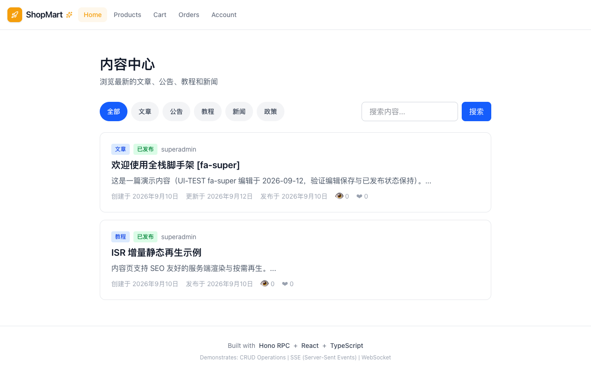

### 分类筛选后列表

**步骤**:

1. 点击"教程" tab
2. 等待列表刷新

**验证**: 教程 tab 高亮，列表仅剩 1 张 ISR 教程卡

**截图**: 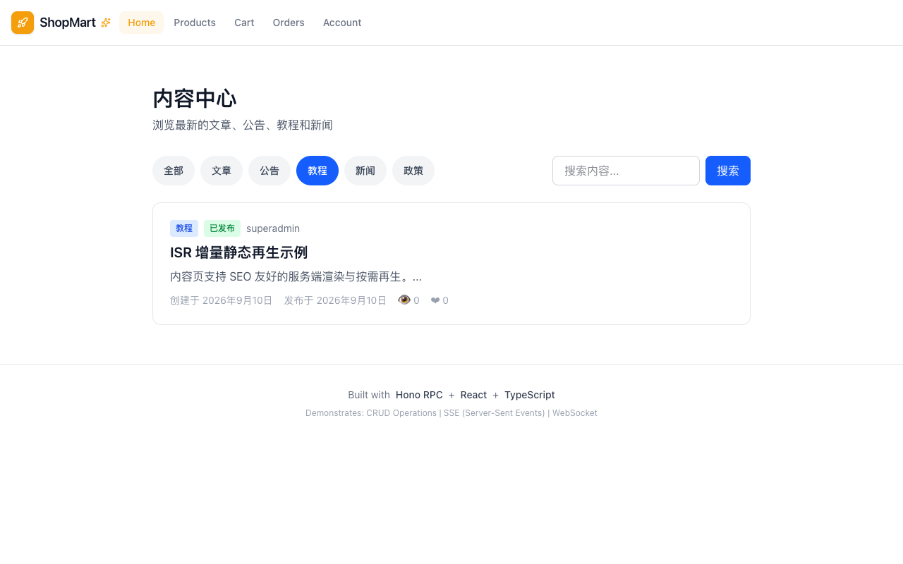

**选择器**:
| 元素 | 选择器 |
|---|---|
| 分类tab容器 | `.flex.gap-2.flex-wrap button:nth-of-type(4)` |

### 搜索关键词结果

**步骤**:

1. 输入 ISR
2. 点击搜索

**验证**: 1 卡命中，关键词保留在输入框

**截图**: 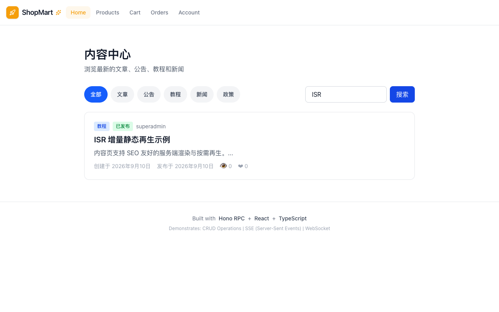

**选择器**:
| 元素 | 选择器 |
|---|---|
| 搜索输入框 | `input.px-4` |
| 搜索按钮 | `form > button` |

### 内容详情页（逆向：导航高亮错乱）

**步骤**:

1. 点开 ISR 教程进入 /content/content-2

**验证**: ⚠ BUG：顶部导航 Account 被错误点亮（SSR 直出即带错）

**截图**: 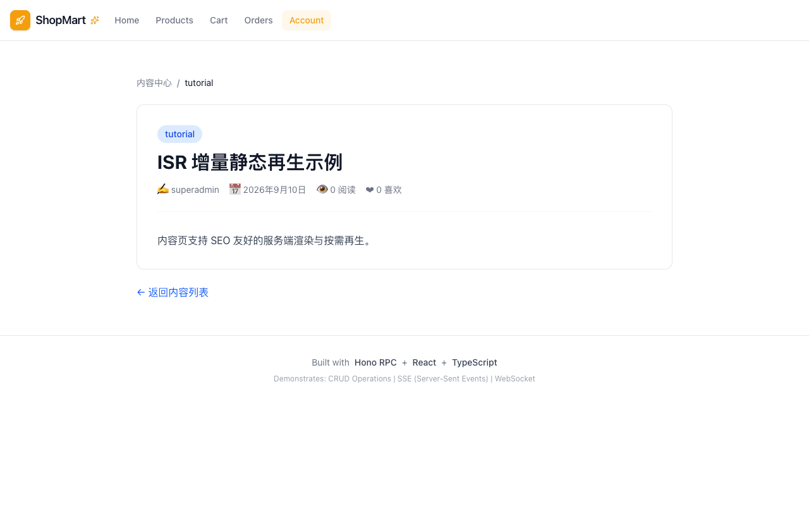

**选择器**:
| 元素 | 选择器 |
|---|---|
| 详情链接 | `main a[href="/content/content-2"]` |

### 购物车实况（数据漂移：非空态）

**步骤**:

1. 点击导航 Cart

**验证**: 3 行 4 件 mock 商品，Total $188.96，Checkout 可点

**截图**: 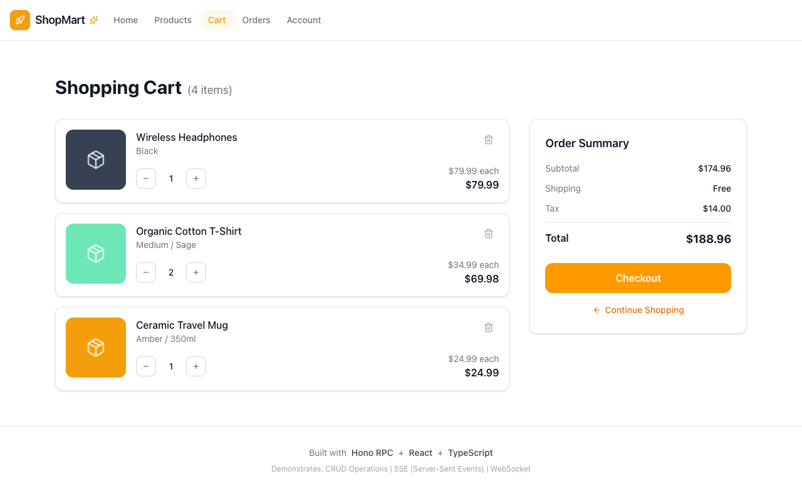

### 加入购物车（逆向：入口缺失）

**步骤**:

1. 在购物车页与详情页全量扫描加购/购买按钮

**验证**: ⚠ BUG：全站无任何加购/购买入口，电商闭环断裂

**截图**: 

### 订单页实况（数据漂移：非空态）

**步骤**:

1. 点击导航 Orders

**验证**: 5 张 mock 订单（ORD-2024-001..005），状态 chips 可筛选

**截图**: 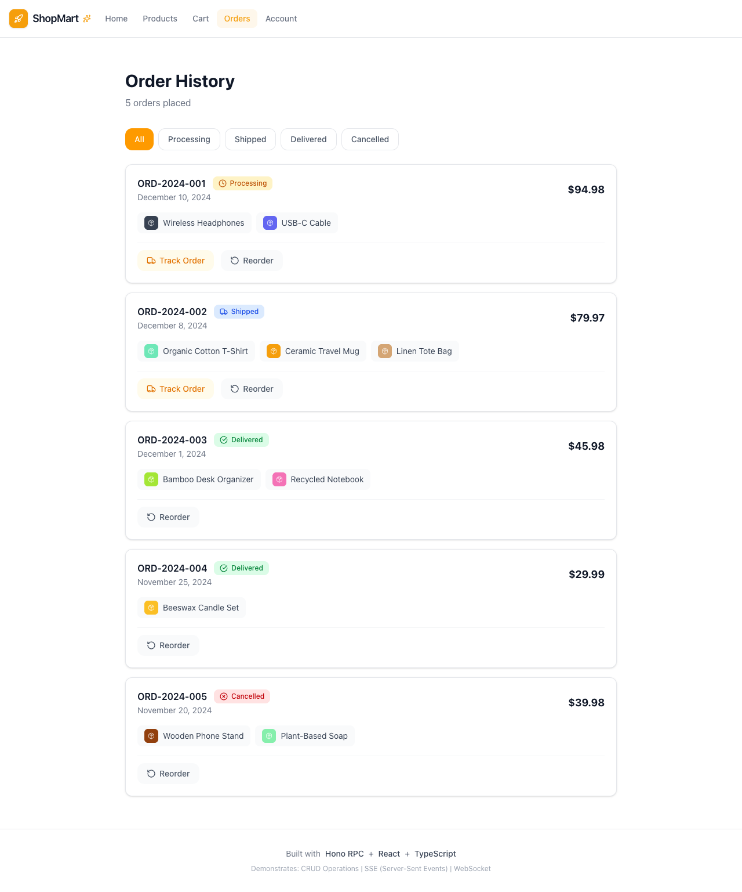

### 404 兜底（逆向：soft-404）

**步骤**:

1. 直接访问 /nonexistent

**验证**: ⚠ BUG：HTTP 200 纯文本 404，无返回首页 CTA

**截图**: 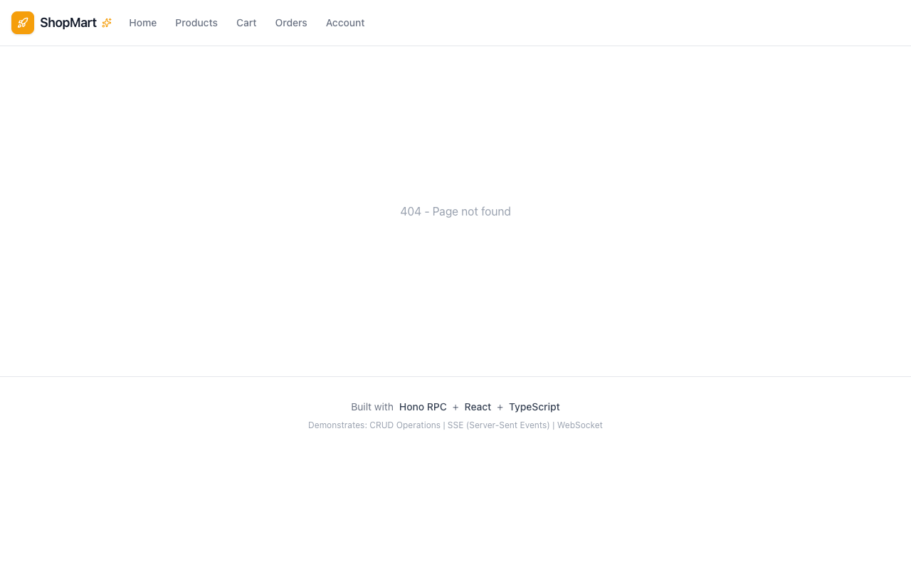

### 详情页滚动到底（互动区探测）

**步骤**:

1. 在详情页滚动到页面底部

**验证**: 页面无滚动余量：无评论/推荐/点赞互动区

**截图**: 

### 搜索无结果空态

**步骤**:

1. 搜索乱码词 zzqqxx

**验证**: 0 卡，居中"暂无内容"，关键词保留

**截图**: 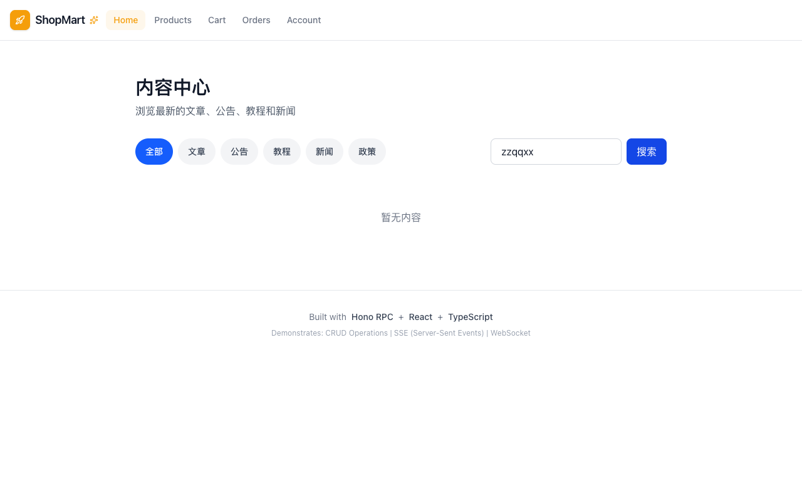

### 详情页硬加载（SSR 验证）

**步骤**:

1. 在详情页按 F5 立即截图
2. 等 2s 截稳定帧对照

**验证**: 两帧一致：SSR 直出无白屏无骨架屏

**截图**: 

### 移动端首页（375px）

**步骤**:

1. 切 375x667 视口
2. 打开首页

**验证**: 顶部导航收起，底部 tab 栏（Home/Products/Cart/Orders/Me）

**截图**: 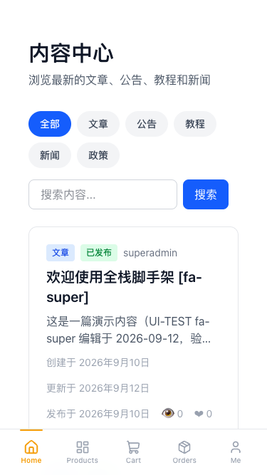

### 移动端详情页（逆向：双高亮）

**步骤**:

1. 375px 打开详情页

**验证**: ⚠ BUG：Home 与 Me 同时高亮（home 恒高亮硬编码）；meta 中文拆行

**截图**: 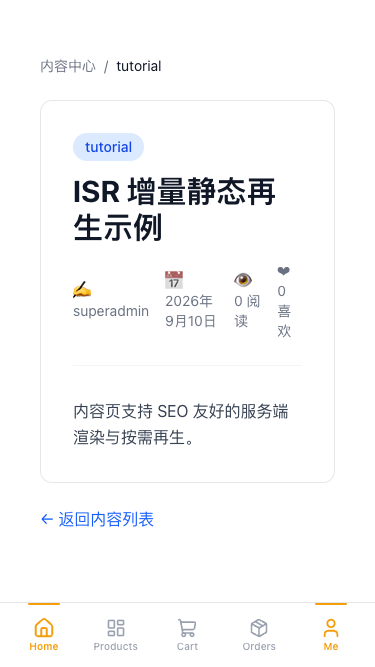

### 移动端购物车（底部 tab 导航）

**步骤**:

1. 点击 bottom-tab-cart

**验证**: 购物车完整渲染，qty 步进器可用；Home 仍恒高亮

**截图**: 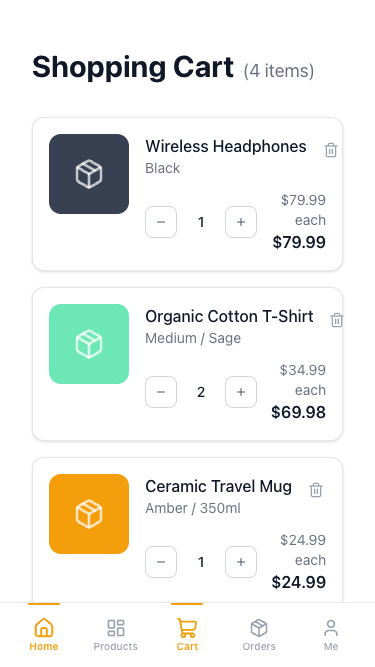

**选择器**:
| 元素 | 选择器 |
|---|---|
| 底部tab购物车 | `[data-testid='bottom-tab-cart']` |

### 移动端导航形态实证

**步骤**:

1. 点击 bottom-tab-orders

**验证**: ⚠ BUG 实证：home tab inline style 恒高亮（computed style 双橙）

**截图**: 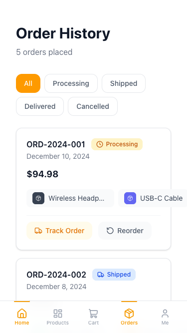

**选择器**:
| 元素 | 选择器 |
|---|---|
| 底部tab订单 | `[data-testid='bottom-tab-orders']` |

---
