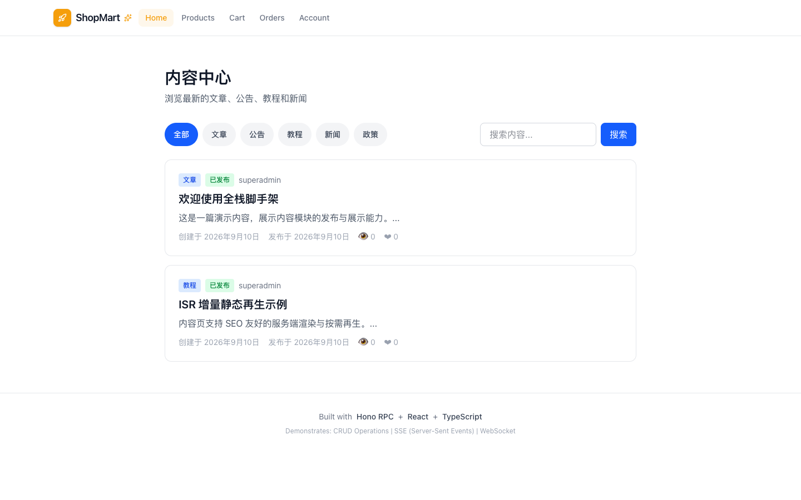
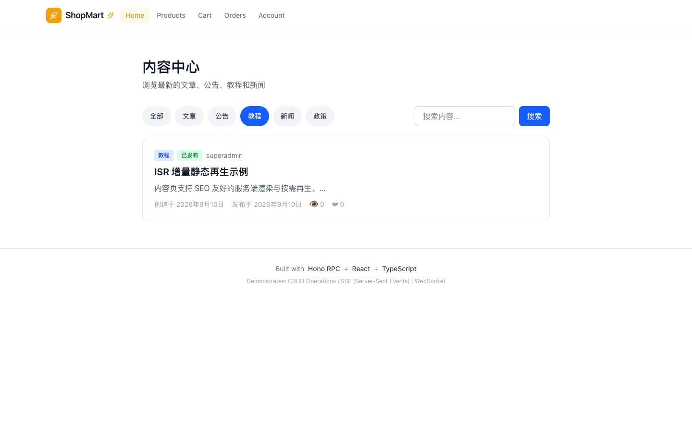
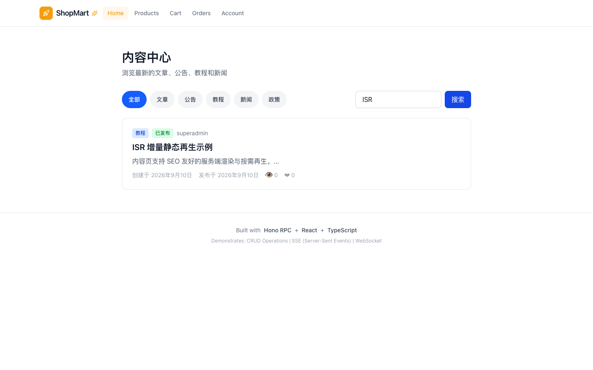
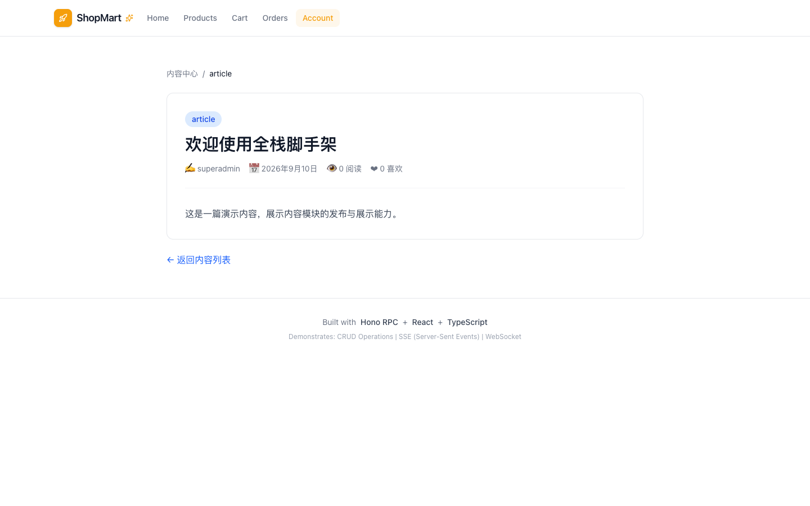
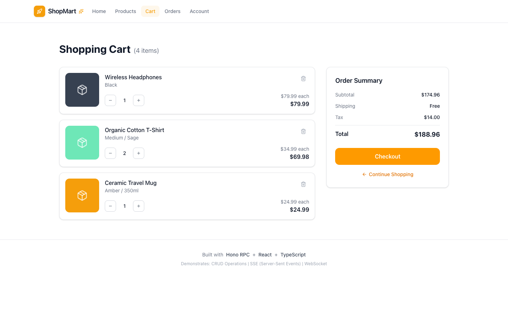
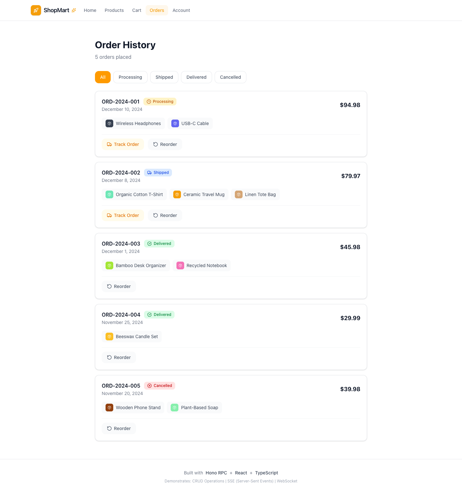

# Ecommerce — Test Playbook

> 站点：https://shop.lpm1.top
> 身份数：1
> 每个身份列出：操作步骤 → 验证 → 截图 → 选择器

---

## 游客/消费者（唯一身份）

**凭据**: `无需登录（此形态无 auth 模块）`

**案例数**: 6

### 浏览内容中心

**步骤**:

1. 直接打开首页

**验证**: 内容卡片 + 分类 tab + 搜索框

**截图**: 

### 分类筛选

**步骤**:

1. 点击"教程"分类 tab

**验证**: 列表缩至仅教程类

**截图**: 

### 搜索

**步骤**:

1. 输入 ISR
2. 点击搜索

**验证**: 命中 ISR 教程

**截图**: 

### 查看内容详情

**步骤**:

1. 点击内容卡片

**验证**: 详情页完整

**截图**: 

### 购物车页面

**步骤**:

1. 点击导航 Cart

**验证**: mock 商品 + Order Summary + Checkout 按钮

**截图**: 

### 订单页面

**步骤**:

1. 点击导航 Orders

**验证**: mock 订单列表 + 状态筛选

**截图**: 

---
