# Ecommerce — Test Playbook

> 站点：https://shop.lpm1.top
> 身份数：1
> 每个身份列出：操作步骤 → 验证 → 截图 → 选择器

---

## 游客/消费者（唯一身份）

**凭据**: `无需登录（此形态无 auth 模块）`

**案例数**: 44

### 浏览内容中心

**步骤**:

1. 直接打开首页

**验证**: 内容卡片 + 分类 tab + 搜索框

**截图**: 

### 分类筛选

**步骤**:

1. 点击"教程"分类 tab

**验证**: 列表缩至仅教程类

**截图**: 

### 搜索

**步骤**:

1. 输入 ISR
2. 点击搜索

**验证**: 命中 ISR 教程

**截图**: 

### 查看内容详情

**步骤**:

1. 点击内容卡片

**验证**: 详情页完整

**截图**: 

### 购物车页面

**步骤**:

1. 点击导航 Cart

**验证**: mock 商品 + Order Summary + Checkout 按钮

**截图**: 

### 订单页面

**步骤**:

1. 点击导航 Orders

**验证**: mock 订单列表 + 状态筛选

**截图**: 

### 首页全景（2026-09-12 补拍）

**步骤**:

1. 直接打开首页，等待 SPA 渲染

**验证**: 导航 5 项 + 6 个分类 tab + 2 张内容卡片 + 页脚技术栈

**截图**: 

### 分类筛选后列表

**步骤**:

1. 点击"教程" tab
2. 等待列表刷新

**验证**: 教程 tab 高亮，列表仅剩 1 张 ISR 教程卡

**截图**: 

**选择器**:
| 元素 | 选择器 |
|---|---|
| 分类tab容器 | `.flex.gap-2.flex-wrap button:nth-of-type(4)` |

### 搜索关键词结果

**步骤**:

1. 输入 ISR
2. 点击搜索

**验证**: 1 卡命中，关键词保留在输入框

**截图**: 

**选择器**:
| 元素 | 选择器 |
|---|---|
| 搜索输入框 | `input.px-4` |
| 搜索按钮 | `form > button` |

### 内容详情页（逆向：导航高亮错乱）

**步骤**:

1. 点开 ISR 教程进入 /content/content-2

**验证**: ⚠ BUG：顶部导航 Account 被错误点亮（SSR 直出即带错）

**截图**: 

**选择器**:
| 元素 | 选择器 |
|---|---|
| 详情链接 | `main a[href="/content/content-2"]` |

### 购物车实况（数据漂移：非空态）

**步骤**:

1. 点击导航 Cart

**验证**: 3 行 4 件 mock 商品，Total $188.96，Checkout 可点

**截图**: 

### 加入购物车（已补建·正向复验）

**步骤**:

1. 打开内容详情
2. 点击购买条"加入购物车"

**验证**: ✅ 已补建（第四轮）：详情页购买条（价格+加购按钮）→ 按钮变绿"已加入购物车" → Cart 页出现真实条目

**截图**: 

### 订单页实况（数据漂移：非空态）

**步骤**:

1. 点击导航 Orders

**验证**: 5 张 mock 订单（ORD-2024-001..005），状态 chips 可筛选

**截图**: 

### 404 兜底（逆向：soft-404）

**步骤**:

1. 直接访问 /nonexistent

**验证**: ⚠ BUG：HTTP 200 纯文本 404，无返回首页 CTA

**截图**: 

### 详情页滚动到底（互动区探测）

**步骤**:

1. 在详情页滚动到页面底部

**验证**: 页面无滚动余量：无评论/推荐/点赞互动区

**截图**: 

### 搜索无结果空态

**步骤**:

1. 搜索乱码词 zzqqxx

**验证**: 0 卡，居中"暂无内容"，关键词保留

**截图**: 

### 详情页硬加载（SSR 验证）

**步骤**:

1. 在详情页按 F5 立即截图
2. 等 2s 截稳定帧对照

**验证**: 两帧一致：SSR 直出无白屏无骨架屏

**截图**: 

### 移动端首页（375px）

**步骤**:

1. 切 375x667 视口
2. 打开首页

**验证**: 顶部导航收起，底部 tab 栏（Home/Products/Cart/Orders/Me）

**截图**: 

### 移动端详情页（逆向：双高亮）

**步骤**:

1. 375px 打开详情页

**验证**: ⚠ BUG：Home 与 Me 同时高亮（home 恒高亮硬编码）；meta 中文拆行

**截图**: 

### 移动端购物车（底部 tab 导航）

**步骤**:

1. 点击 bottom-tab-cart

**验证**: 购物车完整渲染，qty 步进器可用；Home 仍恒高亮

**截图**: 

**选择器**:
| 元素 | 选择器 |
|---|---|
| 底部tab购物车 | `[data-testid='bottom-tab-cart']` |

### 移动端导航形态实证

**步骤**:

1. 点击 bottom-tab-orders

**验证**: ⚠ BUG 实证：home tab inline style 恒高亮（computed style 双橙）

**截图**: 

**选择器**:
| 元素 | 选择器 |
|---|---|
| 底部tab订单 | `[data-testid='bottom-tab-orders']` |

### 加购→下单→订单生成（正向闭环）

**步骤**:

1. 详情页加入购物车
2. Cart 页点击 Checkout
3. 导航切换到 Orders

**验证**: 生成 ORD-2026-xxxxxx 新订单（Processing 状态），购物车清空，旧 ORD-2024 mock 全部下线

**截图**: 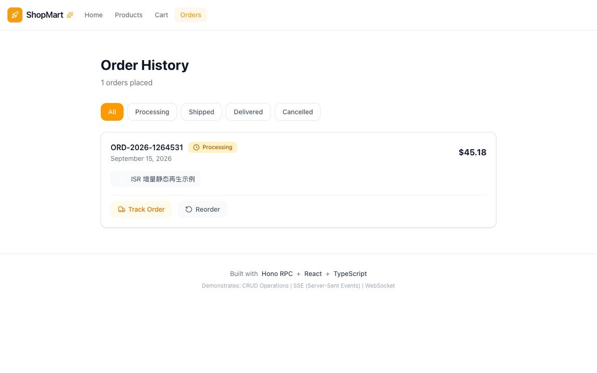

### 订单状态筛选

**步骤**:

1. Orders 页点击 Processing 筛选 chip

**验证**: 新订单在 Processing 下可见，Delivered 筛选下隐藏并显示空态

**截图**: 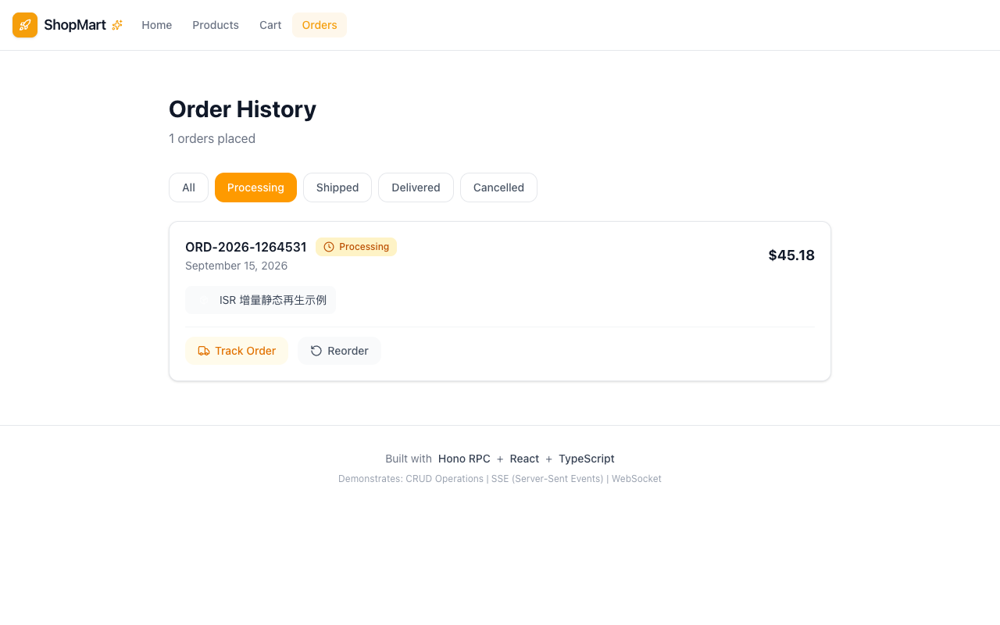

### 空购物车 Checkout 无效（逆向）

**步骤**:

1. 清空购物车后尝试 Checkout

**验证**: 无 Checkout 入口或点击无效果，不产生空订单

**截图**: 

### 详情页返回列表（正向）

**步骤**:

1. 打开 ISR 教程详情 /content/content-2
2. 点击"← 返回内容列表"

**验证**: 回到内容中心，列表与筛选状态不丢

**截图**: 

**选择器**:
| 元素 | 选择器 |
|---|---|
| 返回链接 | `find text '← 返回内容列表'` |

### 搜索 + 分类筛选组合（正向）

**步骤**:

1. 点击"教程"分类 tab
2. 在搜索框输入 ISR 并搜索

**验证**: 组合条件下仅命中 ISR 教程卡，无跨类结果

**截图**: 

**选择器**:
| 元素 | 选择器 |
|---|---|
| 搜索输入框 | `input.px-4` |
| 搜索按钮 | `form > button` |

### 分类连续切换（正向）

**步骤**:

1. 依次点击 文章 → 教程 → 全部 tab

**验证**: 每次切换列表即时刷新且 tab 高亮正确，切回全部恢复 2 卡

**截图**: 

### 刷新后购物车状态保持（正向）

**步骤**:

1. 进入 Cart 记录行数与 Total
2. 按 F5 硬刷新

**验证**: 刷新后仍 3 行 4 件、Total $188.96（mock 态持久），布局不乱

**截图**: 

### 购物车 qty 步进器加减（正向深化）

**步骤**:

1. 在 Cart 对任一行点击 qty +1
2. 观察小计与 Total
3. 再点击 qty -1 恢复

**验证**: 数量/小计/Total 随步进正确增减后复原

**截图**: 

### Products 导航同源验证（正向边界）

**步骤**:

1. 点击导航 Products

**验证**: /products 渲染同一内容中心且 Products 高亮（与首页同源）

**截图**: 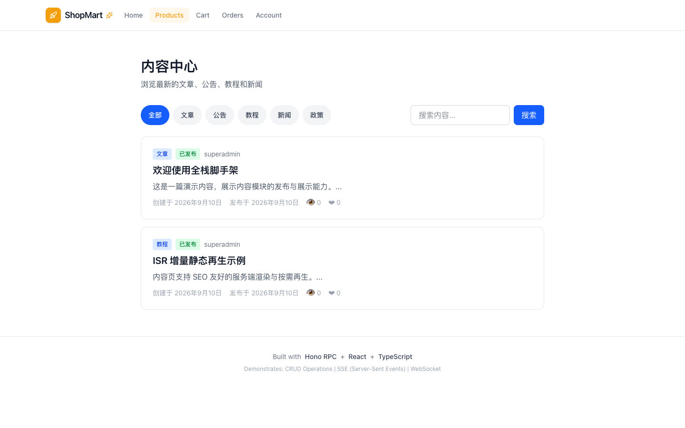

**选择器**:
| 元素 | 选择器 |
|---|---|
| 导航Products | `[data-testid='nav-products-button']` |

### 订单状态筛选切换（正向）

**步骤**:

1. Orders 页依次点击 Shipped → Delivered → All 筛选 chip

**验证**: 每个筛选下订单集合正确（5 张 mock 单分布合理），All 恢复全量

**截图**: 

### 订单 Reorder 按钮探测（正向实勘）

**步骤**:

1. 在 Delivered 订单上点击 Reorder

**验证**: 实勘：记录跳转/反馈行为（不 500 不白屏），作为基线记录

**截图**: 

### 移动端搜索结果页（正向边界）

**步骤**:

1. 切 375x667 视口，搜索 ISR

**验证**: 结果单卡纵向堆叠正常无横向溢出

**截图**: 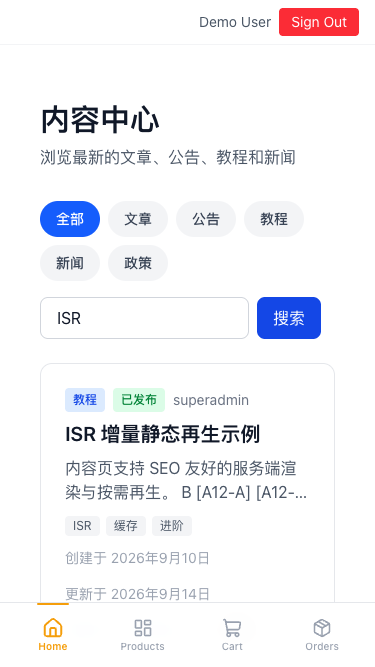

### 购物车 qty=-1（逆向）

**步骤**:

1. 在 Cart 将某行 qty 连续点 - 至最小值
2. 尝试注入 -1（若输入框可编辑）

**验证**: 数量不为负（min 1 或步进禁用），Total 永不为负

**截图**: 

### 购物车 qty=9999 超大数量（逆向）

**步骤**:

1. 将某行 qty 调至 9999（步进连点或输入）

**验证**: 实勘：接受则 Total 大数正常显示不溢出；有上限则被钳制——记录行为

**截图**: 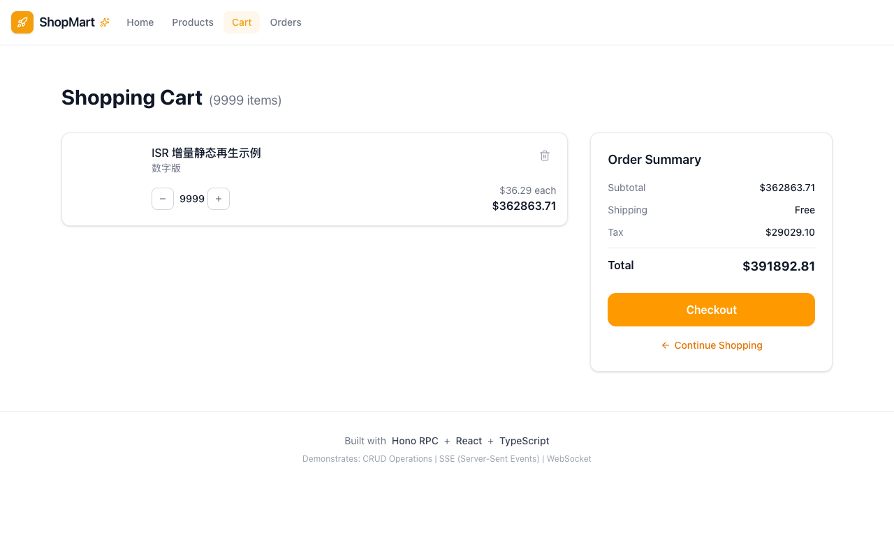

### 搜索框 XSS 注入（逆向）

**步骤**:

1. 搜索框输入  并搜索

**验证**: 关键词按文本处理不执行（无弹窗），呈现空结果态

**截图**: 

**选择器**:
| 元素 | 选择器 |
|---|---|
| 搜索输入框 | `input.px-4` |
| 搜索按钮 | `form > button` |

### 搜索纯空格关键词（逆向）

**步骤**:

1. 搜索框输入多个空格并提交

**验证**: 不触发假搜索或显示空态，列表不闪空，无报错

**截图**: 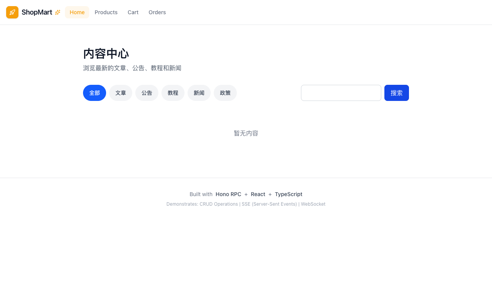

### 搜索超长关键词（逆向）

**步骤**:

1. 粘贴 256+ 字符长串搜索

**验证**: 输入框/结果区不撑破布局，空态正常

**截图**: 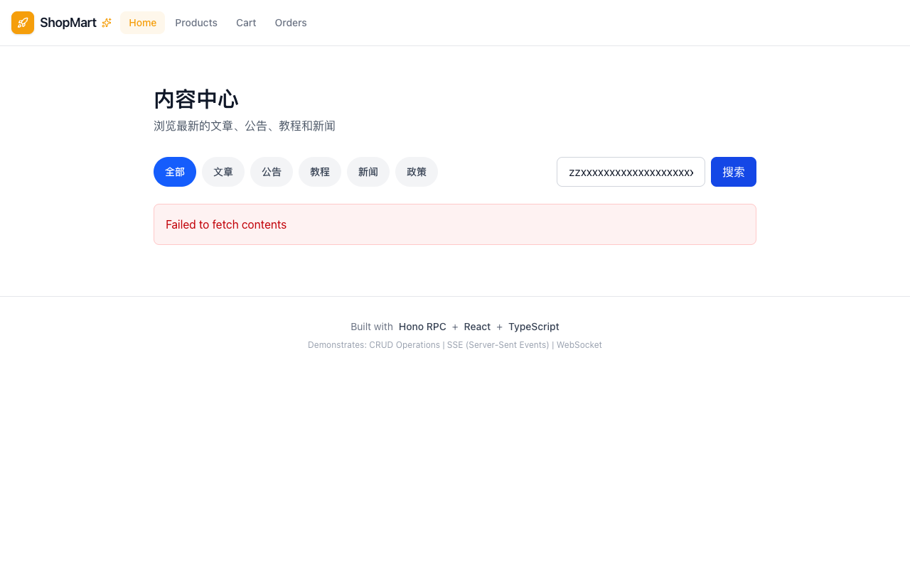

### 详情 URL 不存在 id（逆向·IDOR 面）

**步骤**:

1. 直接访问 /content/content-999

**验证**: 空态/404 文案渲染，HTTP 状态记录（soft-404 已知），不暴露他人资源

**截图**: 

### Account 死链导航（逆向·已知缺陷）

**步骤**:

1. 点击导航 Account

**验证**: ⚠ 已知缺陷：Account 为死链，渲染 404 - Page not found

**截图**: 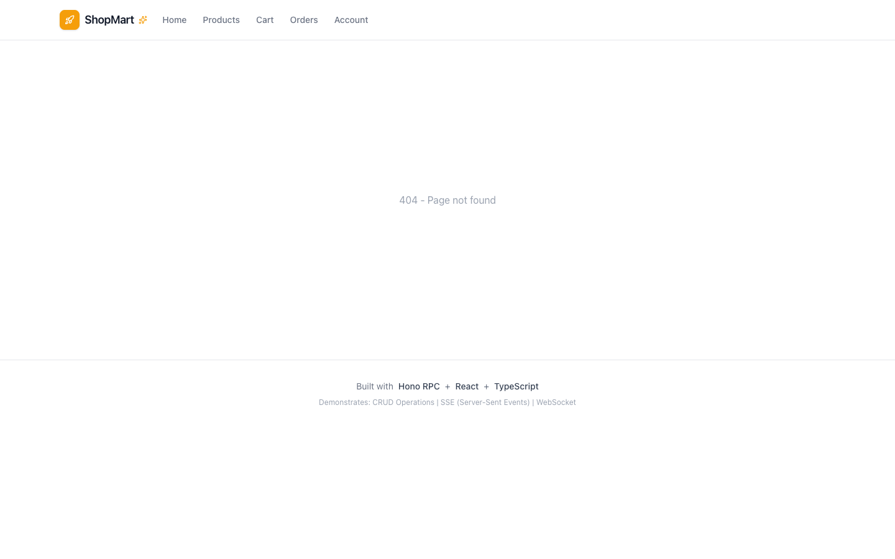

**选择器**:
| 元素 | 选择器 |
|---|---|
| 导航Account | `[data-testid='nav-account-button']` |

### 双击 Checkout 重复下单（逆向）

**步骤**:

1. 在 Cart 快速双击 Checkout

**验证**: 实勘：仅生成 1 笔订单（若重复记录为缺陷），购物车状态一致

**截图**: 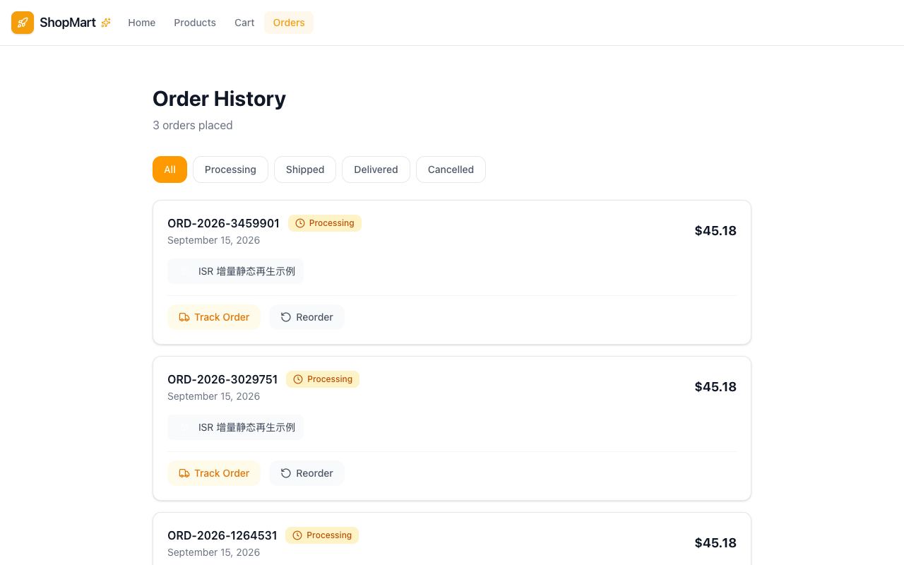

### Checkout 后空购物车刷新保持（正向闭环深化）

**步骤**:

1. 完成 Checkout 进入 Cart
2. 按 F5 硬刷新

**验证**: 实勘：清空态保持不回填 mock 商品（若回填记录为缺陷）

**截图**: 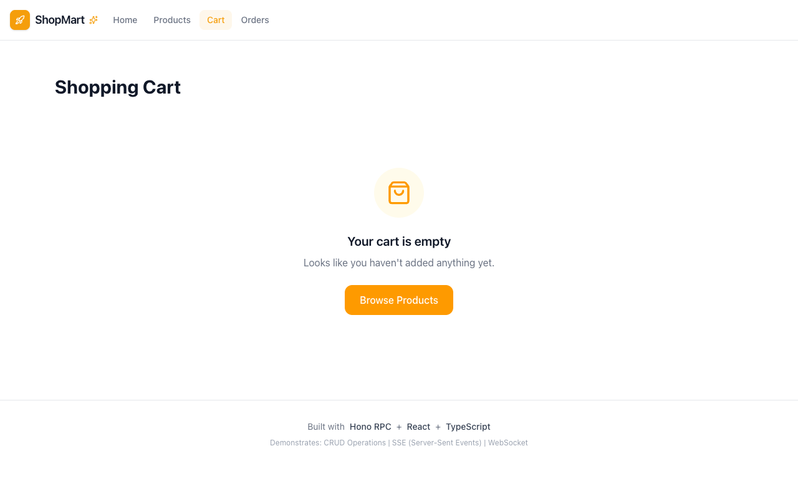

### 伪造 token 调订单写接口（逆向·API 级）

**步骤**:

1. curl -X POST -H "Authorization: Bearer fake-token123" https://shop.lpm1.top/api/orders

**验证**: 实勘：此形态无鉴权模块（公开站为预期）——记录写接口是否开放，若开放记录为风险

**截图**: 

### 分类 tab 快速连点（逆向·竞态）

**步骤**:

1. 快速连续点击多个分类 tab（文章/教程/公告连点）

**验证**: 最终停在最后点击的分类，列表与高亮一致，无竞态错乱

**截图**: 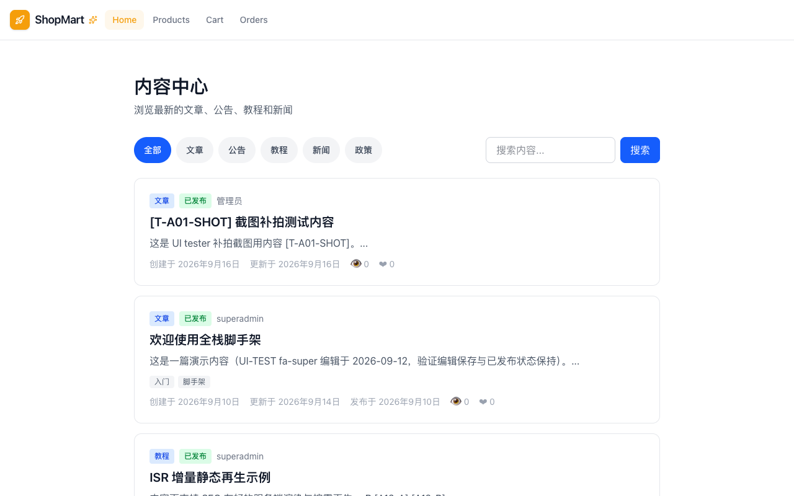

---
