# Forum — Test Playbook

> 站点：https://forum.lpm1.top
> 身份数：3
> 每个身份列出：操作步骤 → 验证 → 截图 → 选择器

---

## 管理员

**凭据**: `superadmin / 123456`

**案例数**: 15

### 内容新建/编辑/发布

**步骤**:

1. 登录管理后台
2. 进入内容管理
3. 新建内容 → 填写 → 发布

**验证**: 内容状态变为 published

**截图**: 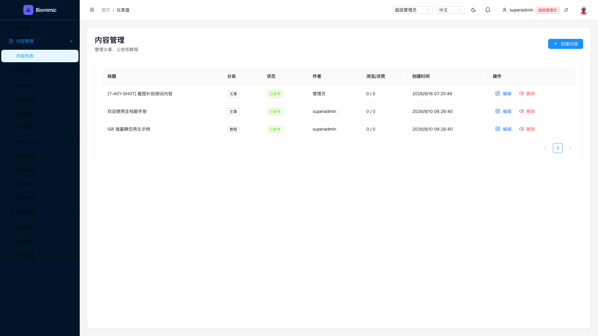

### 用户管理

**步骤**:

1. 进入用户管理页

**验证**: 用户列表正常渲染

**截图**: 

### 系统设置

**步骤**:

1. 进入系统设置页

**验证**: 表单带出真实配置值

**截图**: 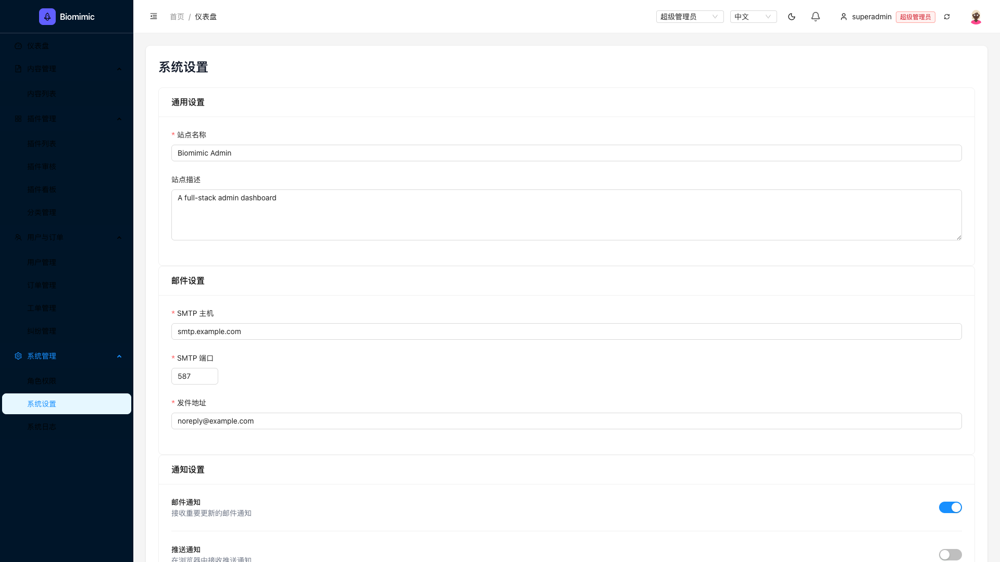

### 空标题内容创建被拒（逆向）

**步骤**:

1. 登录管理后台内容管理
2. 新建内容不填标题直接提交

**验证**: 校验拦截并提示必填，不产生脏数据

**截图**: 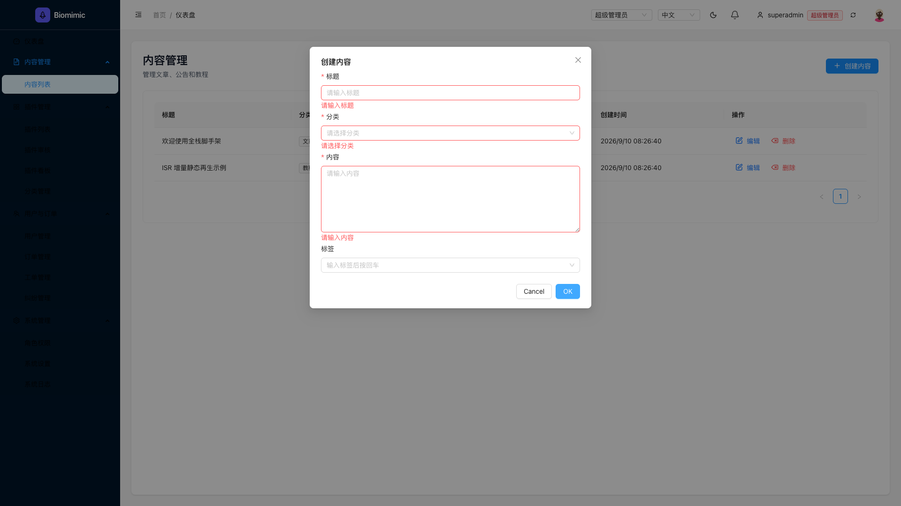

### 未登录访问管理 API（逆向）

**步骤**:

1. 不带 Authorization 请求管理端接口

**验证**: 返回 401

**截图**: 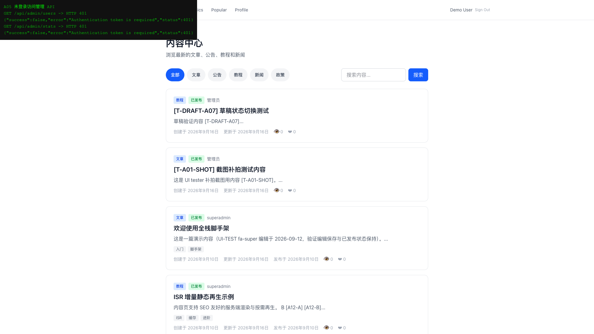

### 编辑内容后还原（正向链）

**步骤**:

1. 打开 https://forum.lpm1.top/admin 登录 superadmin / 123456，进入内容管理
2. 编辑 content-1，标题末尾追加 [T-EDIT] 保存
3. 打开前台 /content/content-1 确认标题已带 [T-EDIT]
4. 返回管理后台再次编辑，移除 [T-EDIT] 还原

**验证**: 前台标题两阶段变化并可完整还原；还原后前台与后台列表均无测试残留（断言以变化前后对照为准，content-1 标题含历史测试残留 {fa-super} 勿锚定纯文本）

**截图**: 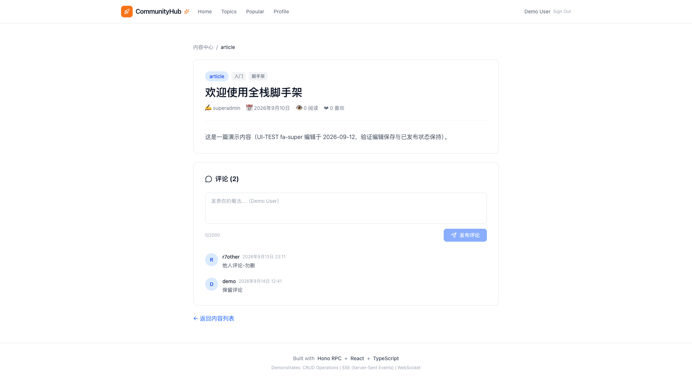

### 草稿→发布状态切换（正向）

**步骤**:

1. 管理后台内容管理新建内容（标题含 [T-DRAFT] 标记，存为草稿/draft）
2. 打开前台首页确认该内容不出现在列表
3. 管理端将其状态切换为 published
4. 刷新前台首页确认出现

**验证**: 实勘：前台列表只显示 published 内容、草稿不可见；发布后可见（若前台无草稿过滤则记录为缺陷）

**截图**: 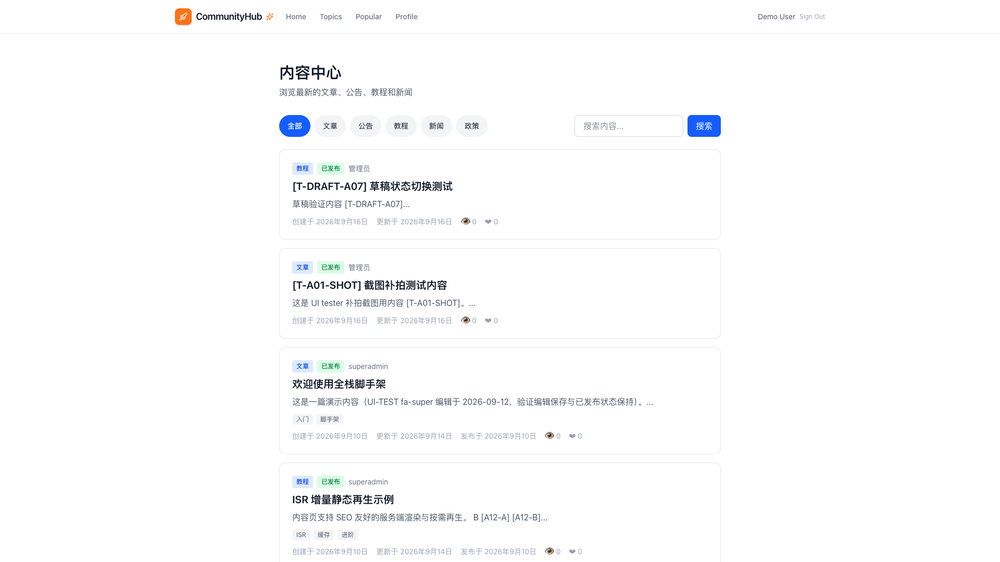

### 新建内容→删除回收链（正向）

**步骤**:

1. 新建内容 [T-DEL-回收测试] 并发布
2. 前台确认可见后，管理端删除该内容
3. 前台首页列表与 /content/<id> 直访复查

**验证**: 删除后首页列表不再出现，直访返回 404 兜底页；种子内容 content-1/content-2 不受影响

**截图**: 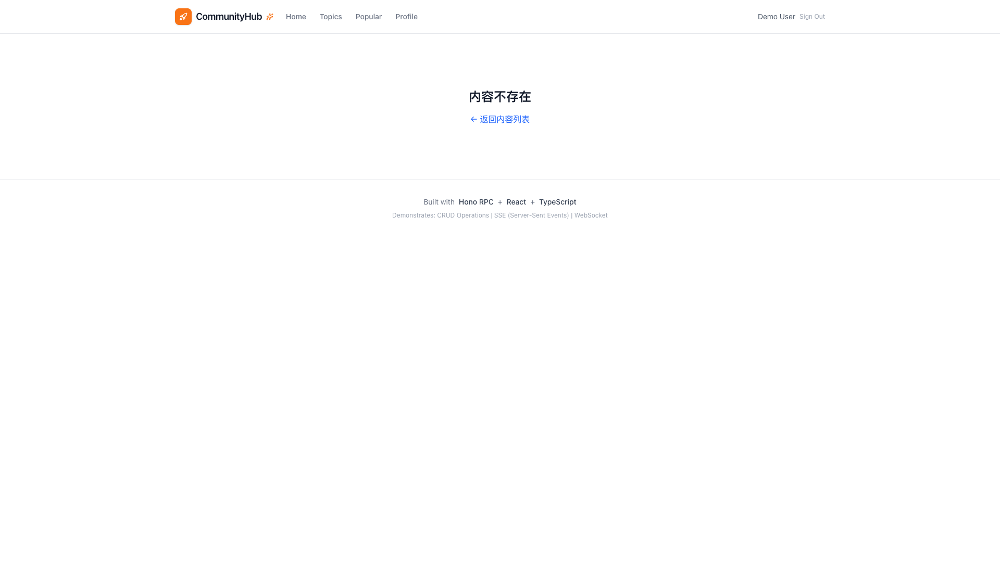

### 分类管理新建分类（正向·实勘）

**步骤**:

1. 管理后台进入 内容管理→分类管理
2. 查看现有分类列表
3. 新建分类 [T-分类] 保存
4. 打开前台首页观察筛选胶囊区

**验证**: 实勘：分类列表渲染正常；前台筛选胶囊当前固定 6 个（全部/文章/公告/教程/新闻/政策），新分类是否映射到前台胶囊待勘（不映射则记录前后端不同步）

**截图**: 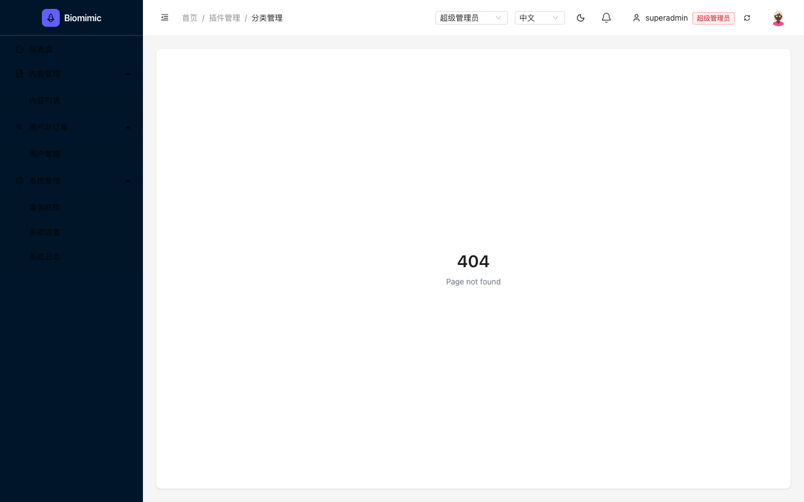

### 用户管理搜索过滤（正向）

**步骤**:

1. 管理后台进入用户管理（/admin/users）
2. 在搜索框输入 superadmin
3. 清空搜索恢复全表

**验证**: 搜索后表格仅剩 superadmin 行；清空后恢复完整列表且行数与初始一致

**截图**: 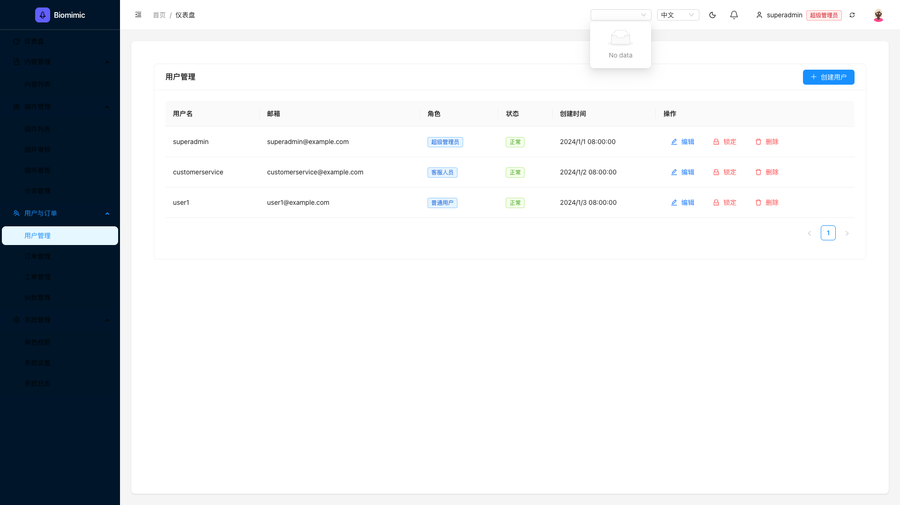

### 管理后台硬刷新会话保持（正向）

**步骤**:

1. 登录管理后台到达 /admin/dashboard
2. 按 F5 硬刷新
3. 再直接访问 /admin/users 子路由

**验证**: 刷新后仍停留 dashboard 不回登录页；子路由直访正常渲染（实勘 token 存储位置与有效期）

**截图**: 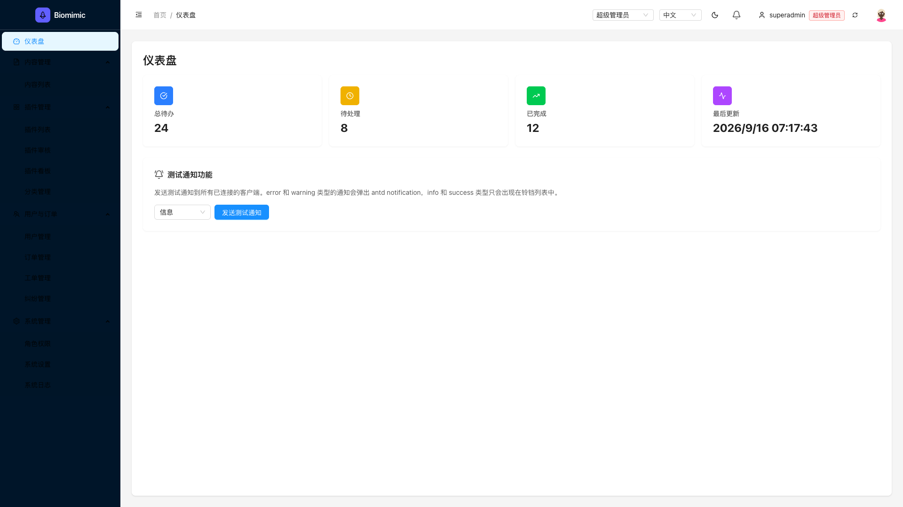

### 同一内容连续两次编辑（连续操作）

**步骤**:

1. 编辑 content-2 摘要追加 A → 保存
2. 立即再次编辑追加 B → 保存
3. 打开前台 /content/content-2 对照最终内容

**验证**: 前台显示两次编辑叠加后的最终内容，无中间态丢失或字段回滚

**截图**: 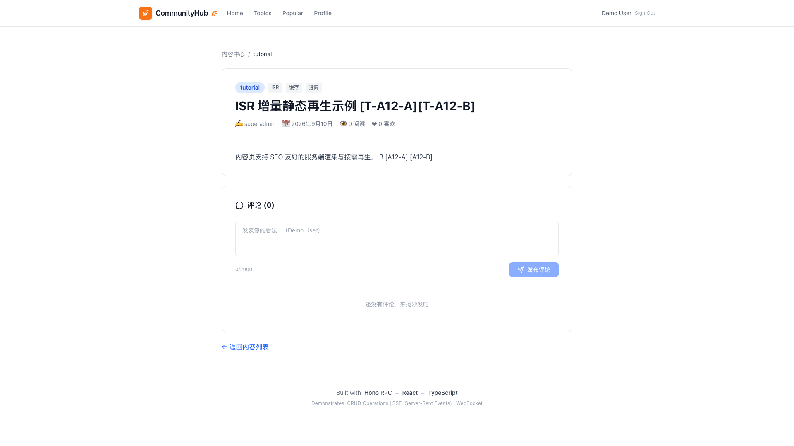

### 错误密码登录管理后台（逆向）

**步骤**:

1. /admin 登录页输入 superadmin / wrong-pass-123
2. 点击登录

**验证**: 提示凭据错误并停留登录页；地址栏不进入 /admin/dashboard，无任何管理数据渲染

**截图**: 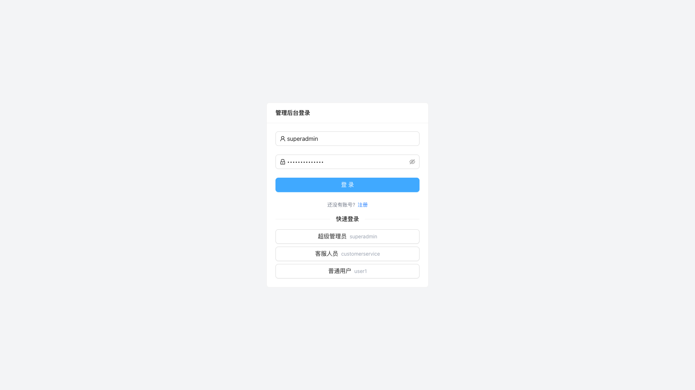

### 超长+HTML 注入内容标题（逆向）

**步骤**:

1. 新建内容，标题填 256+ 字符并在末尾拼 
2. 提交保存
3. 打开前台首页与该内容详情页

**验证**: 超长被校验拒绝或安全截断；脚本串以纯文本转义显示、无 alert 执行；首页列表布局不破版

**截图**: 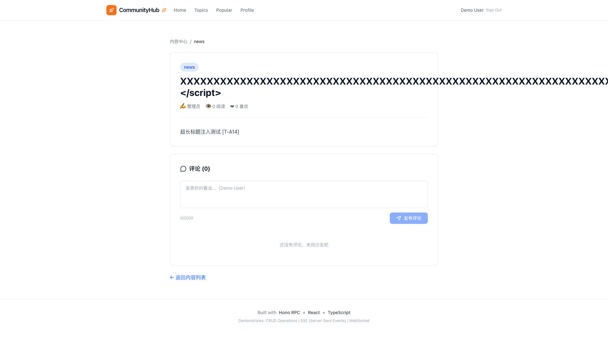

### 无 token / 普通用户 token 调管理 API（逆向·身份交叉）

**步骤**:

1. 无 Authorization 请求 GET /api/admin/users 与 /api/admin/stats
2. 用前台注册用户（round2verify@t.com / Test1234!）登录取 JWT 后带 Bearer 重复请求

**验证**: 无 token 一律 401；普通用户 token 403（实勘 forum 后端角色校验，若放行记 P1 越权）

**截图**: 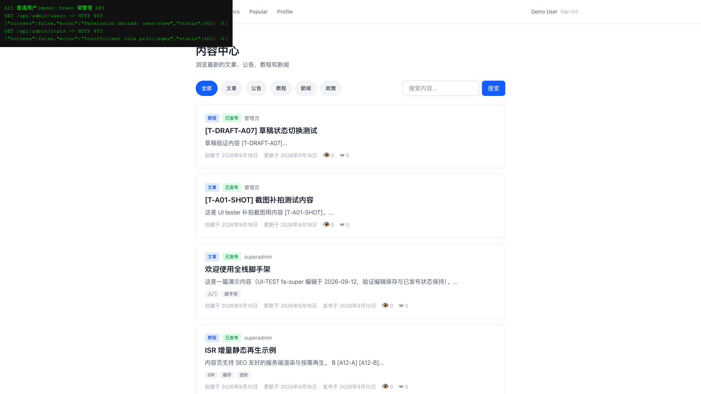

---

## 注册用户

**凭据**: `member@community.dev（预填，直接点 Sign In）`

**案例数**: 30

### 注册/登录

**步骤**:

1. 打开 /register
2. 填写表单
3. 提交
4. 登录

**验证**: 注册→登录成功

**截图**: 

### 浏览全部内容

**步骤**:

1. 打开首页

**验证**: 全部已发布内容可见

**截图**: 

### 分类筛选

**步骤**:

1. 点击"文章"筛选胶囊

**验证**: 列表缩至仅文章类

**截图**: 

### 搜索

**步骤**:

1. 输入 ISR
2. 点击搜索

**验证**: 命中 ISR 教程

**截图**: 

### 查看内容详情

**步骤**:

1. 点击内容卡片

**验证**: 详情页完整（面包屑/正文/返回）

**截图**: 

### 登录后首页身份展示（2026-09-12 补拍）

**步骤**:

1. /login 点 Sign In（预填凭据）
2. 回到首页

**验证**: navbar 显示 Demo User + Sign Out，2 卡正常

**截图**: 

**选择器**:
| 元素 | 选择器 |
|---|---|
| 登出按钮 | `button.text-xs` |

### 登录后详情页评论区探测

**步骤**:

1. 登录态打开内容详情页

**验证**: ⚠ 缺口：评论区整体不存在（无输入框/无评论文案）

**截图**: 

### Profile 登录后内容（逆向：硬编码）

**步骤**:

1. 登录态访问 /profile

**验证**: ⚠ BUG：与游客态相同的 Jane Doe 硬编码档案，与登录身份无关

**截图**: 

### 登录落地死路（逆向）

**步骤**:

1. 在 /login 点击 Sign In 观察跳转

**验证**: ⚠ P1 BUG：登录成功跳 /todos → forum preset 无此路由 404

**截图**: 

### 硬刷新详情页（SSR 水合验证）

**步骤**:

1. 详情页 F5
2. 300ms 与 1200ms 双探针

**验证**: 300ms 内容完整无白屏；**SSR_DATA** 水合后移除

**截图**: 

### 登出后首页

**步骤**:

1. 点击 Sign Out

**验证**: navbar 变 Login，列表内容不受影响

**截图**: 

### 发表评论

**步骤**:

1. 登录态打开内容详情
2. 输入评论并发布

**验证**: 评论出现在列表且计数 +1，F5 后持久

**截图**: 

### 删除自己的评论

**步骤**:

1. 在自己评论旁点击删除

**验证**: 评论移除、计数 -1，他人评论不受影响

**截图**: 

### 删除他人评论被拒（逆向）

**步骤**:

1. 尝试删除他人评论（UI 无按钮；API 层 DELETE 他人评论）

**验证**: UI 无入口；API 层 403，仅作者与 super_admin 可删

**截图**: 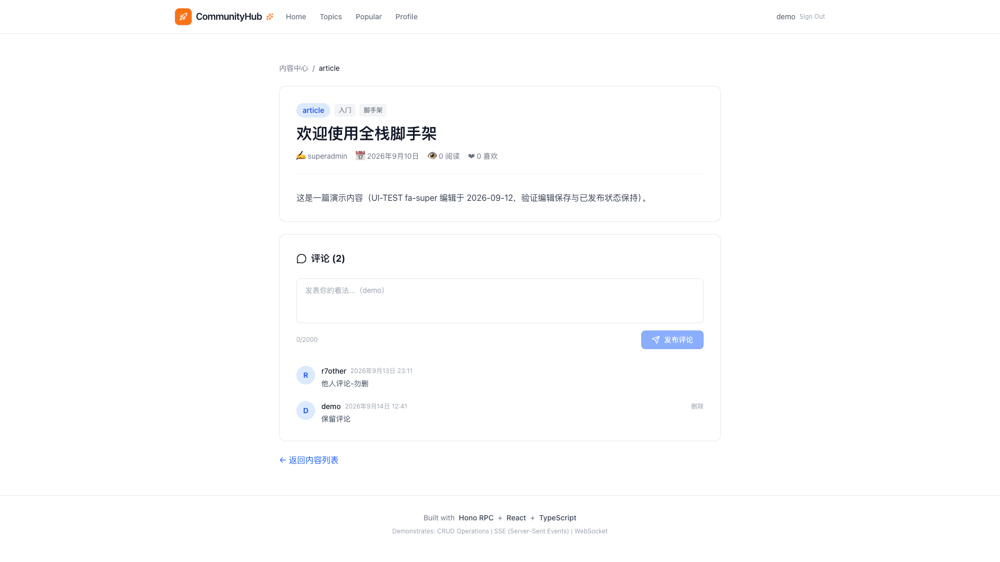

### 三入口到达同一内容详情（入口交叉）

**步骤**:

1. 登录后首页点击 ISR 教程卡（a[href="/content/content-2"]）进详情
2. 返回后从导航 Topics（[data-testid="nav-topics-button"]）点击同一内容链接（/topics/content-2 风格）
3. 再从 Popular 页点击同一内容

**验证**: 三个入口均渲染完整详情页（标题/正文/评论区一致）；Topics 的 /topics/content-N 路由不 404（v9 起该路由渲染完整详情）

**截图**: 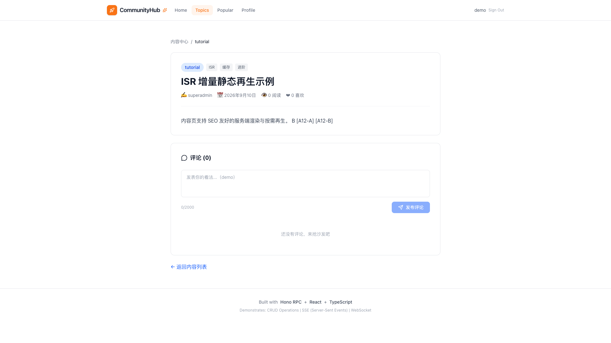

### 搜索+分类组合查询（正向深化）

**步骤**:

1. 点击"教程"胶囊过滤出 ISR 教程
2. 保持筛选，在搜索框输入 ISR 并点搜索
3. 切回"全部"胶囊观察结果

**验证**: 教程+ISR 组合仅命中 ISR 教程卡；切回全部后符合组合语义（实勘：搜索与分类是否正交——已知 v4 观察为搜索不重置分类，若行为相反记回归）

**截图**: 

### 刷新状态保持双向（登录保持/登出不复活）

**步骤**:

1. 登录后首页按 F5 硬刷新，确认右上角仍为登录用户名 + Sign Out
2. 点击 Sign Out 后再次 F5
3. 检查 localStorage 的 auth-token 是否保持登出态

**验证**: 登录态刷新身份不变；登出后硬刷新 navbar 保持 Login、auth store 不自动恢复（v8 修复复验，若复活记 P1 回归）

**截图**: 

### 登录落地页 /topics 断言（v8 复验）

**步骤**:

1. /login 使用 round2verify@t.com / Test1234! 点 [data-testid="login-submit"]
2. 观察跳转目标（0s / 2s 双帧）

**验证**: 登录成功落地 /topics（h1 Topics 聚合视图）；历史缺陷"跳 /todos 404"与"停留 /"均不复现

**截图**: 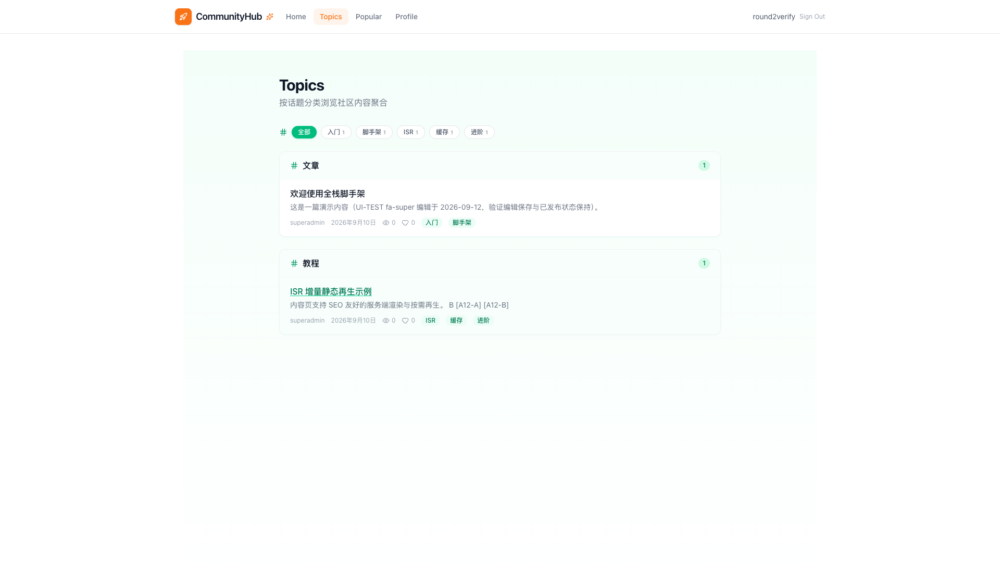

### emoji/中英混合评论提交（正向）

**步骤**:

1. 登录态打开 /content/content-1 评论区（[data-testid="comment-section"]）
2. 在 [data-testid="comment-input"] 输入 "Great! 🚀 中英混合 test 123"
3. 点 [data-testid="comment-submit"]，随后 F5 刷新

**验证**: 发布成功：评论计数 +1、列表插入且 emoji/中英原样显示、0/2000 计数器工作；F5 后评论持久（服务端持久化）

**截图**: 

### 接近 2000 字长评论边界（正向边界）

**步骤**:

1. 评论区输入 1999 字符中英混合长文本
2. 发布成功后再输入超限文本，观察计数器与提交按钮状态

**验证**: 1999 字符可发布且完整显示；超限输入被计数器/禁用态拦截或截断（实勘 2000 上限的具体截断行为）

**截图**: 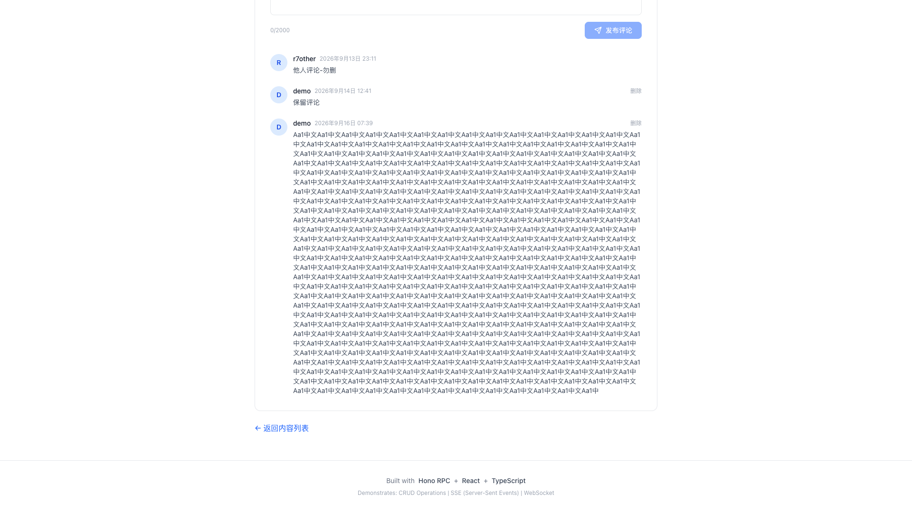

### 连续发 3 删 2 计数链（连续操作）

**步骤**:

1. 连续发布评论 A、B、C 三条
2. 删除 B、C（仅自己评论渲染 [data-testid="comment-delete"]，无确认弹窗）
3. F5 刷新核对剩余内容

**验证**: 计数 N→N+3→N+1 逐步正确；剩余 A 位置顺序保持；刷新后与服务端一致

**截图**: 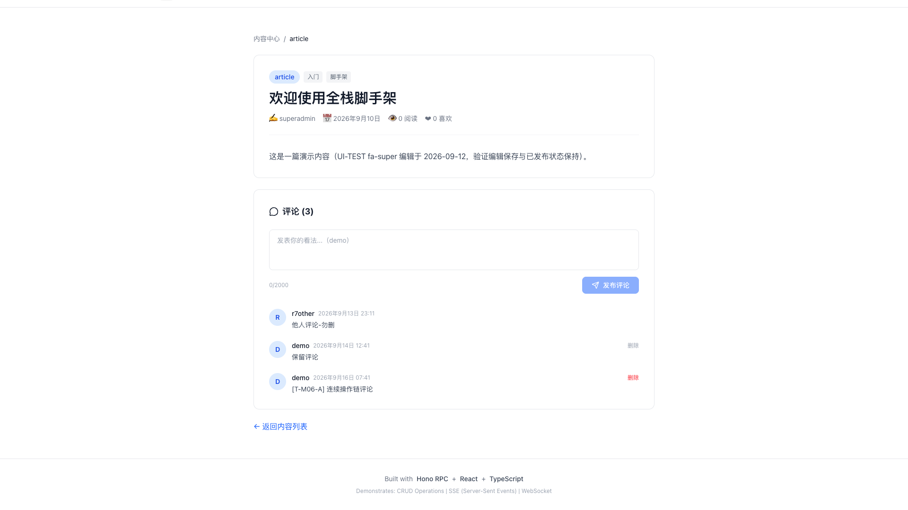

### 双击重复提交评论（逆向）

**步骤**:

1. 输入一条正常评论
2. 快速双击发布按钮

**验证**: 仅产生 1 条评论（计数 +1），无重复条目（若 +2 记录缺陷，后端幂等性实勘）

**截图**: 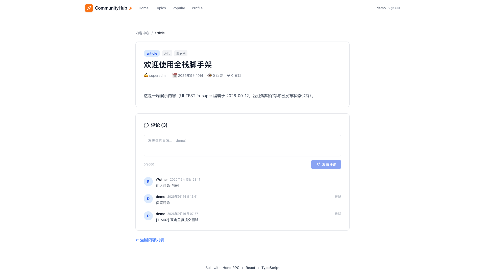

### 纯空格评论被拒（逆向）

**步骤**:

1. 评论框只输入空格（如 5 个空格）
2. 观察提交按钮状态并尝试提交

**验证**: 按钮呈 disabled 禁用态或提交被拦截；计数不变、不产生空白评论

**截图**: 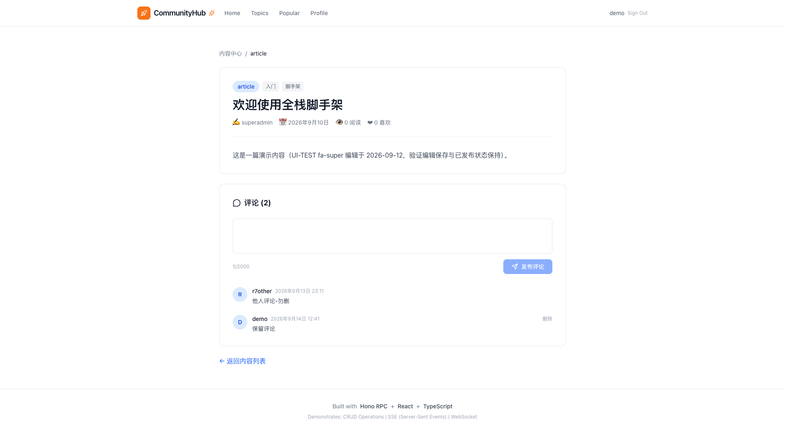

### HTML/script 注入评论（逆向）

**步骤**:

1. 提交评论 ""
2. 再提交 ""

**验证**: 无任何 alert 执行；评论区以转义纯文本渲染；控制台无意外报错

**截图**: 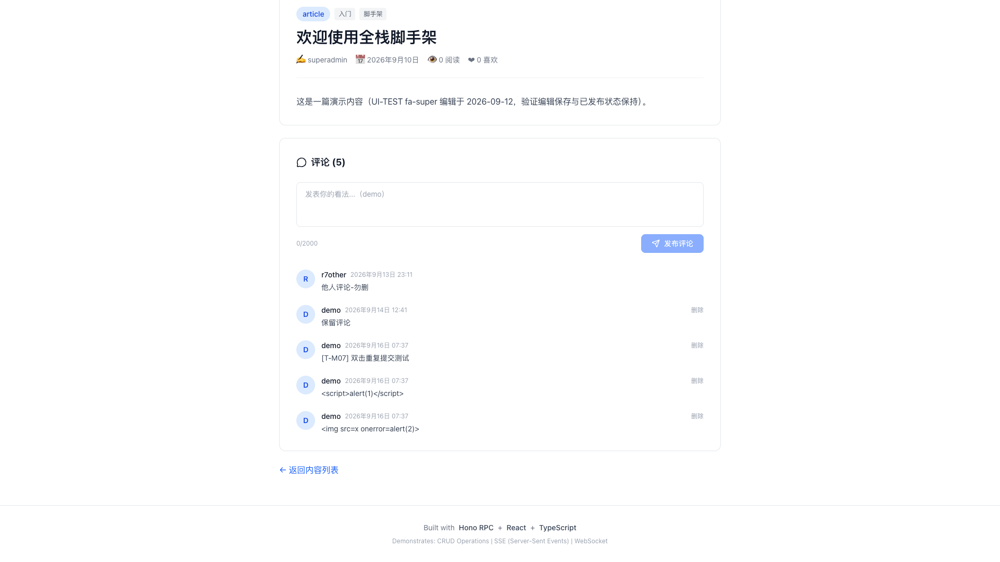

### 注册密码 5 位被拒（逆向）

**步骤**:

1. /register 填写 username/email，密码填 abc12（5 位）
2. 点 Create Account（form button[type="submit"]）

**验证**: min 6 chars 校验拦截（原生 validationMessage 或红字提示）；不跳转 /login、不产生账号

**截图**: 

### 注册已存在邮箱被拒（逆向）

**步骤**:

1. /register 使用已存在邮箱 r7other@t.com 与新用户名注册
2. 提交

**验证**: 服务端报错（实勘具体文案），停留注册/登录页且不产生重复账号；r7other 原账号仍可正常登录

**截图**: 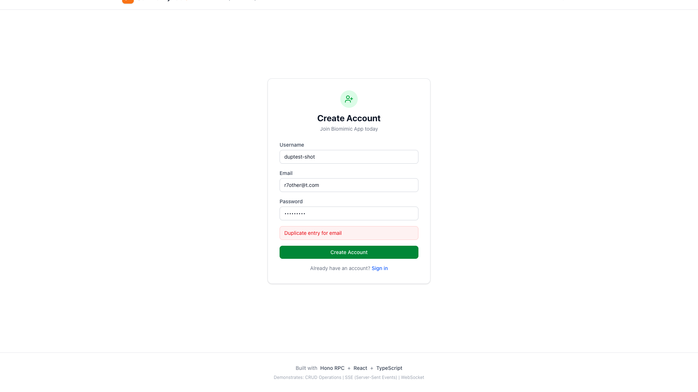

### 错误密码登录（逆向）

**步骤**:

1. /login 填 round2verify@t.com / WrongPass!
2. 点 [data-testid="login-submit"]

**验证**: [data-testid="login-error"] 显示 Invalid credentials、停留 /login 不跳转；连续 3 次失败后仍明确报错（实勘是否有限流/锁定）

**截图**: 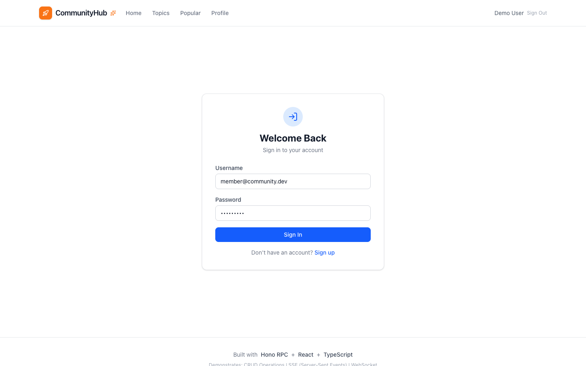

### 删除他人评论 API 403（IDOR·身份交叉）

**步骤**:

1. demo（demo@biomimic.app/demo123）与 r7other（r7other@t.com / Test1234!）分别登录各发一条评论，记下双方评论 id
2. 以 demo 身份在 UI 确认他人评论无删除按钮
3. 用 demo 的 JWT 直接 DELETE 他人评论 id（实勘 /api/comments/<id> 路由形态）

**验证**: UI 无越权入口（删除按钮按作者渲染，v10 双向实测）；API 层 403、他人评论仍存在；作者本人与 super_admin 可删为已知白名单

**截图**: 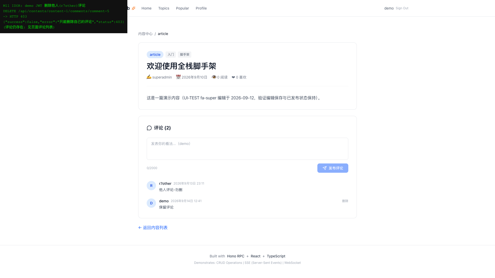

### 伪造 Bearer token 调发布评论 API（逆向·实勘）

**步骤**:

1. 构造无签名 token（Authorization: Bearer fake123）POST 评论发布接口
2. 对照：带真实 JWT 请求同一接口

**验证**: 实勘：mock 后端历史上曾接受任意 user-token 自动登录——若 fake123 被放行记 P1（mock 认证旁路），若 401 则记录通过

**截图**: 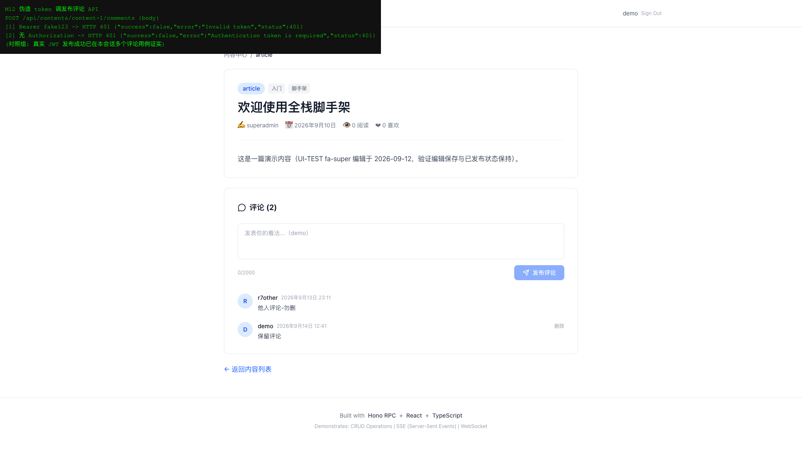

### Profile 渲染真实登录身份（v8 复验·正向）

**步骤**:

1. 登录 round2verify 后访问 /profile
2. 对照 localStorage 中 user.username

**验证**: 头像为用户名首字母、h1 为 round2verify；无 Jane Doe 硬编码残留（历史 P2 已修，复验防回归）

**截图**: 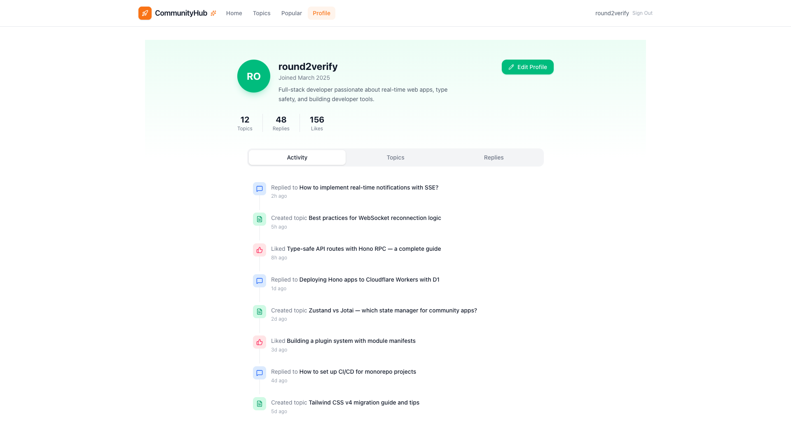

---

## 游客（未登录）

**凭据**: `无需登录`

**案例数**: 31

### 浏览内容列表

**步骤**:

1. 直接打开首页

**验证**: 公开内容可见

**截图**: 

### 发帖/评论被拒

**步骤**:

1. 尝试发帖或评论（需登录）

**验证**: 被要求登录

**截图**: 

### 首页全景（2026-09-12 补拍）

**步骤**:

1. 直接打开首页，等待渲染

**验证**: 标题/筛选胶囊/搜索框/2 张卡片完整

**截图**: 

### 筛选"文章"类

**步骤**:

1. 点击第 2 个筛选胶囊

**验证**: 胶囊高亮，仅 1 卡（欢迎文章）

**截图**: 

**选择器**:
| 元素 | 选择器 |
|---|---|
| 筛选胶囊 | `div.flex.gap-2.flex-wrap button:nth-of-type(2)` |

### 搜索 ISR

**步骤**:

1. 先点回"全部"再搜索 ISR（搜索不重置分类）

**验证**: 仅 ISR 教程卡

**截图**: 

### 详情页全貌

**步骤**:

1. 点开欢迎文章进详情

**验证**: 面包屑/徽标/正文完整；徽标显示原始 key 未本地化（已知）

**截图**: 

### Topics 页

**步骤**:

1. 导航点击 Topics

**验证**: ⚠ 与首页完全相同（复用内容中心，无独立话题视图）

**截图**: 

### Popular 页

**步骤**:

1. 导航点击 Popular

**验证**: ⚠ 与首页完全相同，数据全 0 排序无可见效果

**截图**: 

### Profile 无鉴权守卫（逆向）

**步骤**:

1. 登出后访问 /profile

**验证**: ⚠ BUG：无守卫直接渲染 Jane Doe 硬编码档案

**截图**: 

### 登录页（逆向：假报错）

**步骤**:

1. 直接打开 /login 不做任何操作

**验证**: ⚠ P1 BUG：加载即显示 Invalid credentials（未提交过）

**截图**: 

### 注册页表单

**步骤**:

1. 从登录页点 Sign up 链接

**验证**: Create Account 表单完整（min 6 chars 校验提示）

**截图**: 

**选择器**:
| 元素 | 选择器 |
|---|---|
| 注册链接 | `[data-testid='login-register-link']` |

### 404 路由兜底

**步骤**:

1. 访问 /no-such-page-xyz

**验证**: HTTP 200 灰字 404；P3：无返回首页链接

**截图**: 

### 移动端首页（375px）

**步骤**:

1. 切 375x812 视口
2. 打开首页

**验证**: 胶囊换行/搜索堆叠/无横向溢出；⚠ 移动端无登录登出入口

**截图**: 

### 移动端详情页

**步骤**:

1. 375px 打开详情

**验证**: 纵向堆叠正常，底部 tab 正常

**截图**: 

### 移动端登录页（假报错复现）

**步骤**:

1. 375px 打开 /login

**验证**: ⚠ 同桌面：加载即 Invalid credentials

**截图**: 

### 登录横幅桌面复现 + 成功登录对照

**步骤**:

1. 桌面打开 /login 截假报错
2. 同凭据点 Sign In

**验证**: 假报错存在但手动登录成功（自动鉴权尝试失败泄入 UI）

**截图**: 

### 空分类筛选空态

**步骤**:

1. 点击"公告"胶囊

**验证**: 显示"暂无内容"空态文案

**截图**: 

### 游客态无评论管理按钮（逆向）

**步骤**:

1. 登出后打开内容详情评论区

**验证**: 可见评论列表但无任何删除按钮，显示"登录后参与讨论"引导

**截图**: 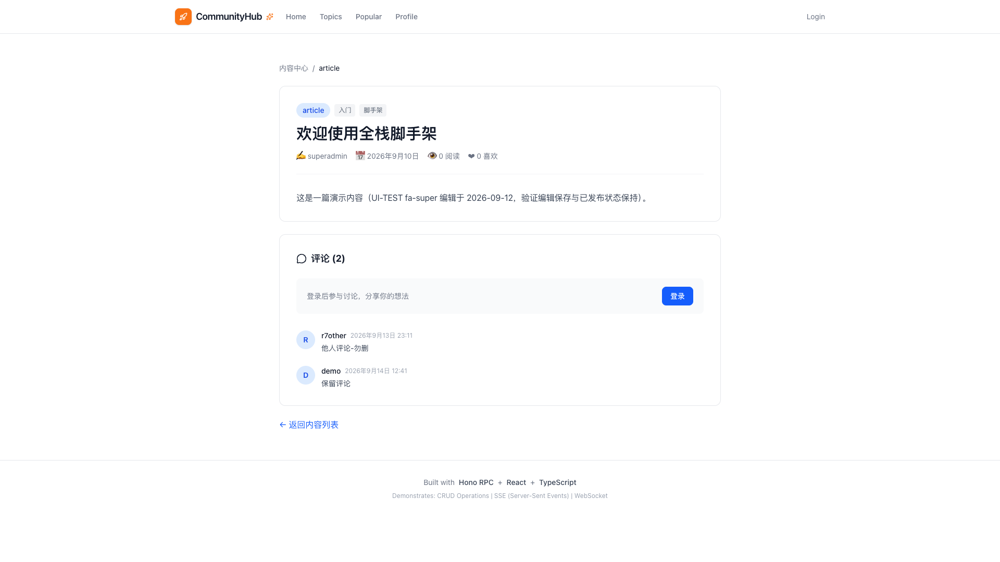

### 真游客态工艺链（前置·自动登录怪癖）

**步骤**:

1. 全新会话打开首页（mock 后端会自动写入 auth-token/Demo User）
2. eval 写入 localStorage.setItem("auth-token", JSON.stringify({state:{token:null,isAuthenticated:false,user:null},version:0})) 后 reload
3. 依次打开首页与内容详情确认身份

**验证**: navbar 稳定显示 Login（键存在则不再自动登录，v9 实测工艺）；详情页评论区出现游客灰条——本用例为后续游客逆向用例的统一前置

**截图**: 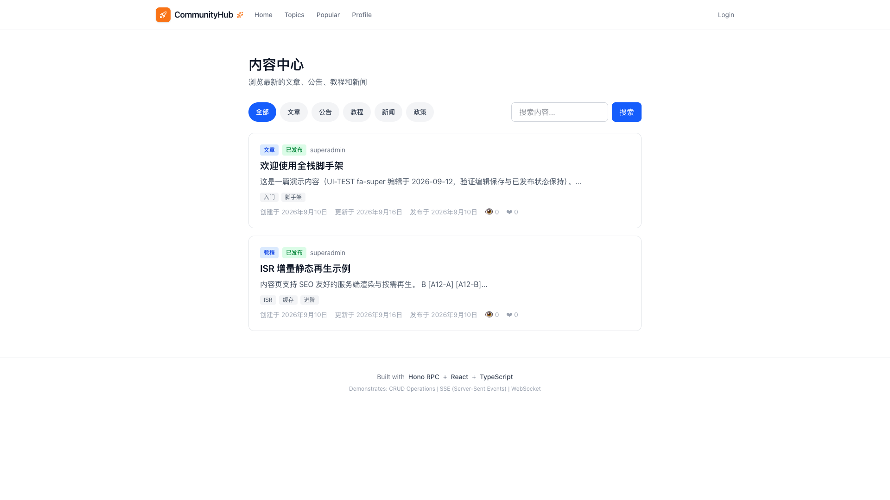

### 游客评论区只读态（v9 复验扩展）

**步骤**:

1. 真游客态打开 /content/content-1
2. 滚动到 [data-testid="comment-section"]
3. 点击灰条内的登录按钮

**验证**: 无输入框无发布按钮；灰条"登录后参与讨论，分享你的想法"+登录按钮，点击跳转 /login；评论条目可见但 0 个删除按钮

**截图**: 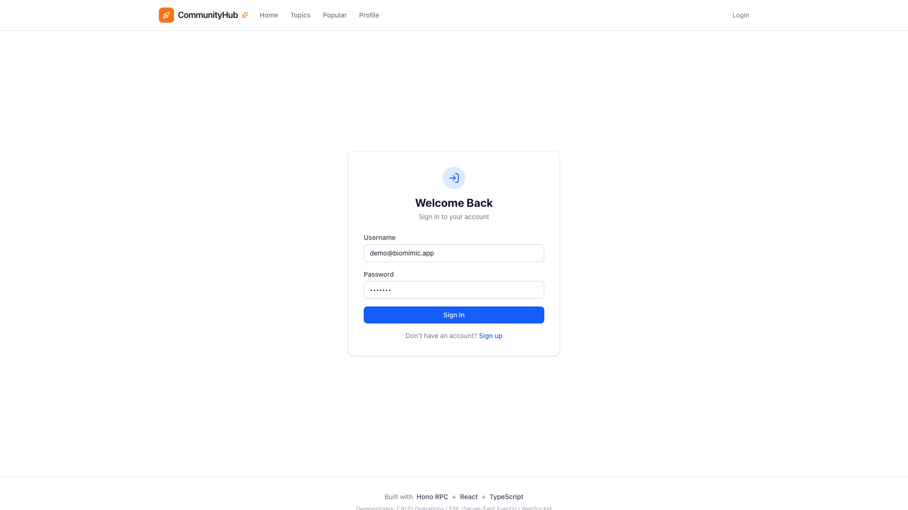

### 分类胶囊 6 连切遍历（正向遍历）

**步骤**:

1. 依次点击 6 个筛选胶囊：全部→文章→公告→教程→新闻→政策→全部

**验证**: 高亮跟随点击；文章=1 卡、教程=1 卡（ISR）、公告=暂无内容空态、新闻/政策=空态（实勘）、回到全部恢复 2 卡

**截图**: 

### 搜索大小写与中英混合（正向深化）

**步骤**:

1. 搜索小写 isr
2. 清空后搜索"教程"
3. 清空后搜索"欢迎"（content-1 标题词）

**验证**: 实勘：小写 isr 是否命中 ISR 教程（大小写不敏感则命中）；中文关键词是否覆盖标题/正文；无结果时显示暂无内容空态且关键词保留在输入框

**截图**: 

### 搜索后切换分类（组合语义边界）

**步骤**:

1. 搜索 ISR 得到 1 卡
2. 点击"公告"胶囊观察结果
3. 点击"全部"胶囊观察结果
4. 再次点击搜索按钮重搜

**验证**: 实勘组合语义：切公告后是否空态、切回全部是否保留 ISR 关键词结果（已知 v4 观察"搜索不重置分类"，若行为相反记回归）；全程无 500/白屏

**截图**: 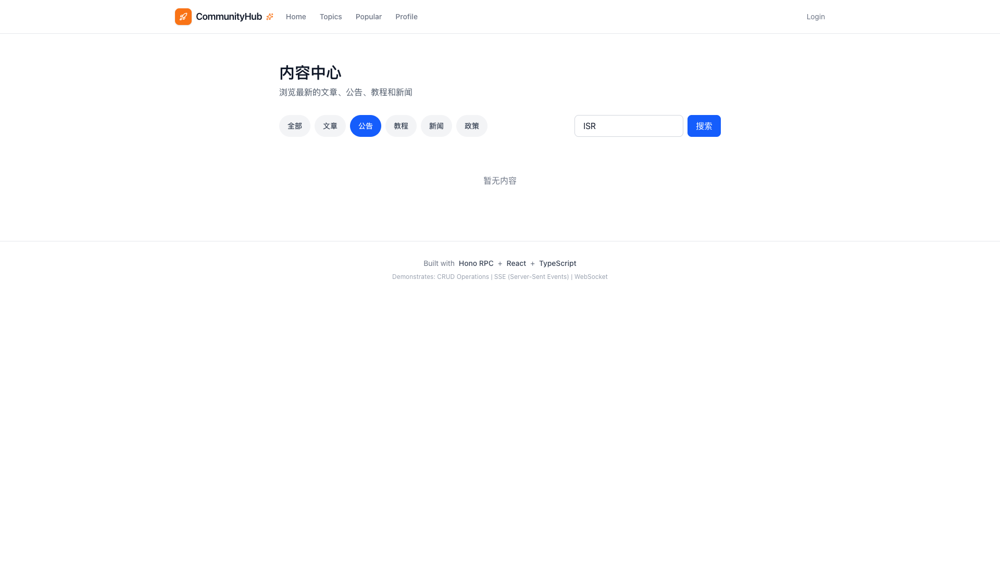

### 空搜索直接提交（逆向边界）

**步骤**:

1. 不输入任何内容直接点击搜索按钮
2. 输入后再清空，再次提交

**验证**: 实勘：无提交动作或回退全列表；不出现 500/白屏，列表状态可恢复正常操作

**截图**: 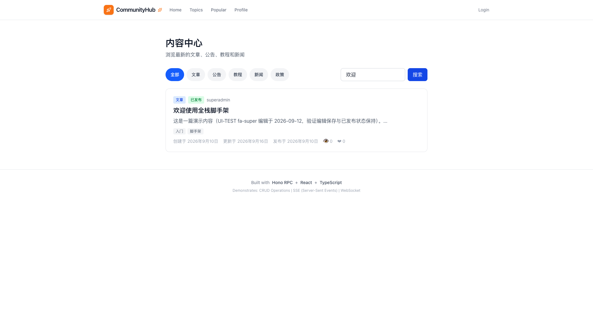

### 超长搜索词 256+（逆向）

**步骤**:

1. 在搜索框粘贴 300 字符无意义字符串并提交

**验证**: 不崩溃：显示空态或 0 结果；输入框无异常行为；提交后页面可继续正常搜索与筛选

**截图**: 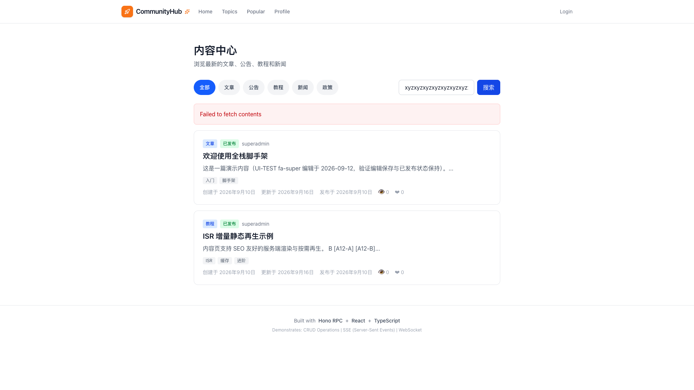

### 搜索 XSS/SQL 注入串（逆向）

**步骤**:

1. 搜索  并提交
2. 再搜索 ' OR 1=1 -- 并提交

**验证**: 关键词在空态文案中转义显示、无脚本执行；服务端不 500（防注入）；清空后列表恢复正常

**截图**: 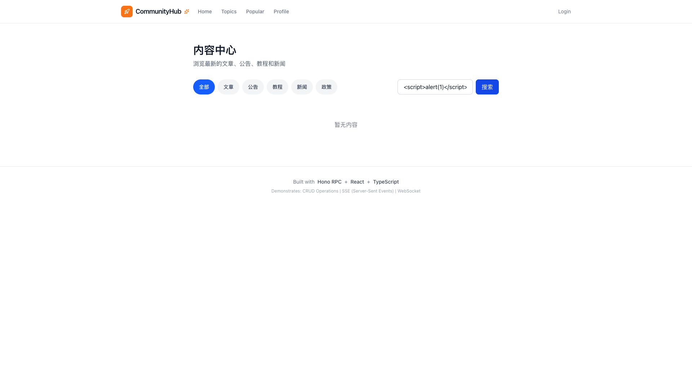

### 游客直访 /topics 与 /popular（入口正向）

**步骤**:

1. 地址栏直接打开 /topics
2. 再直接打开 /popular

**验证**: Topics 渲染独立聚合视图（h1 Topics、组头 "# 分类名"+绿色计数徽章）；Popular 渲染排行列表（排名徽章+🔥热度+热度条，热度 0 时条宽 0%）——v9 改版后两者均非首页复刻

**截图**: 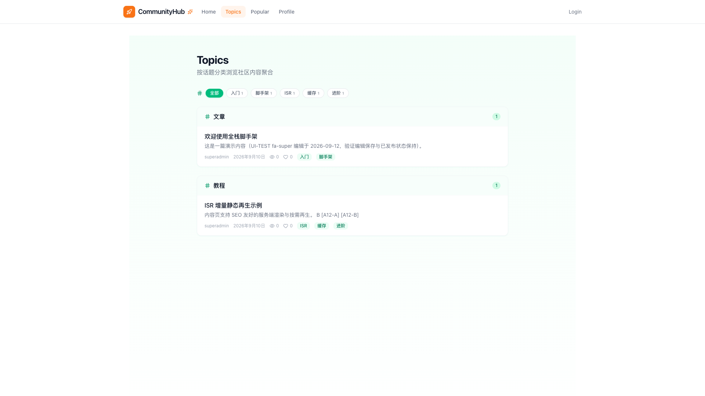

### 登录页假报错冷验回归（逆向·v7 修复防回归）

**步骤**:

1. 清空 localStorage 全新冷开 /login，静置 2s
2. 检查 [data-testid="login-error"] 与页面全部文本

**验证**: 无 Invalid credentials 横幅（v6 旧缺陷见历史截图对照）；未提交任何表单前 error 区不渲染

**截图**: 

### 404 页游客态导航完整性（边界）

**步骤**:

1. 访问 /no-such-page-xyz
2. 检查 navbar/footer 与页面内容

**验证**: HTTP 200 灰字 404 兜底；navbar/footer 正常可点击回首页；已知 P3：无"返回首页"链接（保持记录）

**截图**: 

### 移动端底部 tab 遍历+游客登录条（375px）

**步骤**:

1. 375x812 视口打开内容首页
2. 依次点底部 tab Home/Topics/Popular/Profile
3. 观察导航下方 [data-testid="mobile-auth-bar"]，点击 Sign In 进入 /login 后返回首页

**验证**: bottom-tab-home 落 /topics；各 tab 可达无 404；mobile-auth-bar 游客态显示 Sign In/Sign Up（v8 round4 冷验通过）；桌面导航在 375px 隐藏为已知

**截图**: 

### 游客伪造 token 调写 API（身份交叉·实勘）

**步骤**:

1. 真游客态（auth-token 置 null）直接 POST /api/contents 与评论发布接口（不带 Authorization）

**验证**: 实勘：预期 401（写操作需登录/管理员）；若 mock 放行记 P1——该 mock 后端存在任意 token 放行的历史怪癖

**截图**: 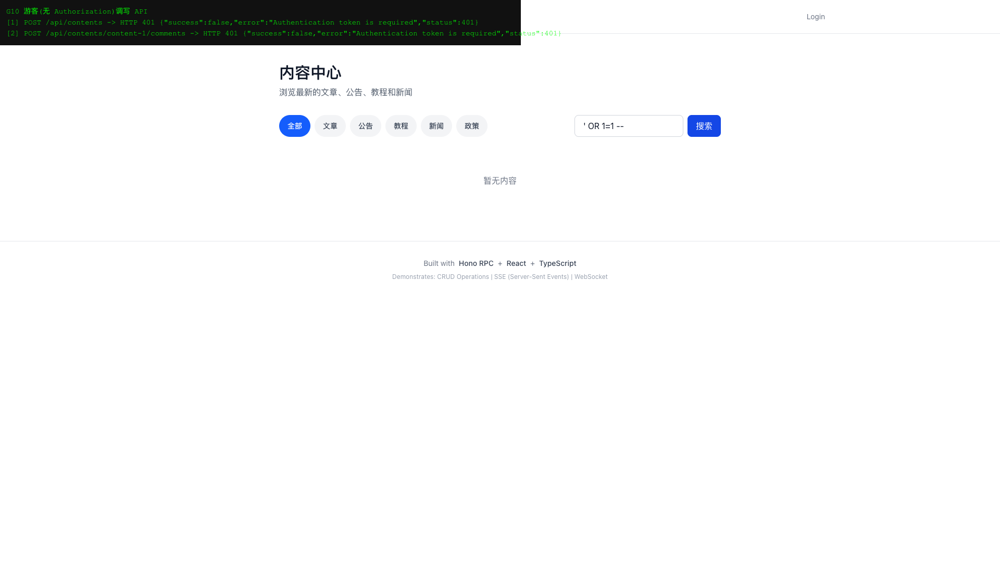

---
