# Forum — Test Playbook

> 站点：https://forum.lpm1.top
> 身份数：3
> 每个身份列出：操作步骤 → 验证 → 截图 → 选择器

---

## 管理员

**凭据**: `superadmin / 123456`

**案例数**: 3

### 内容新建/编辑/发布

**步骤**:

1. 登录管理后台
2. 进入内容管理
3. 新建内容 → 填写 → 发布

**验证**: 内容状态变为 published

### 用户管理

**步骤**:

1. 进入用户管理页

**验证**: 用户列表正常渲染

### 系统设置

**步骤**:

1. 进入系统设置页

**验证**: 表单带出真实配置值

---

## 注册用户

**凭据**: `member@community.dev（预填，直接点 Sign In）`

**案例数**: 11

### 注册/登录

**步骤**:

1. 打开 /register
2. 填写表单
3. 提交
4. 登录

**验证**: 注册→登录成功

**截图**: 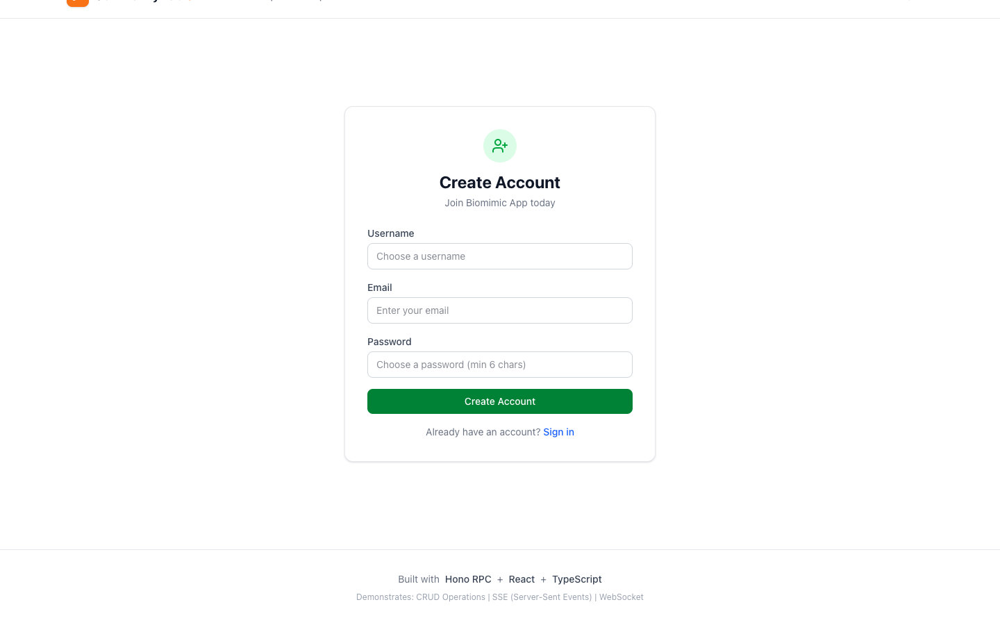

### 浏览全部内容

**步骤**:

1. 打开首页

**验证**: 全部已发布内容可见

**截图**: 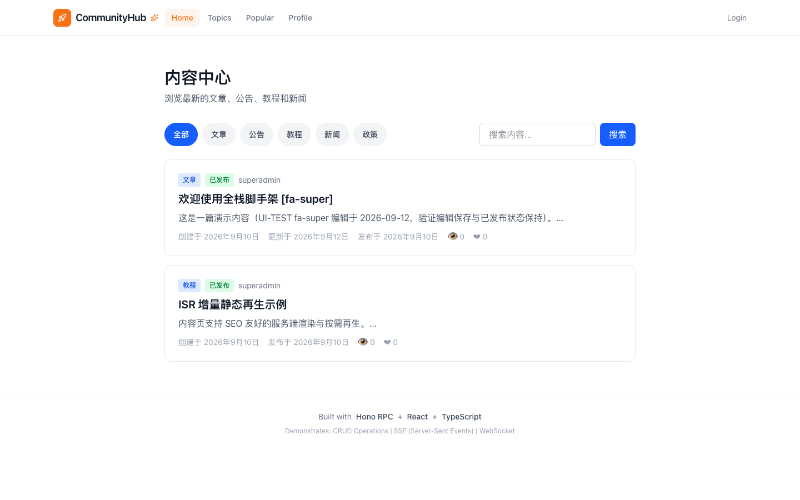

### 分类筛选

**步骤**:

1. 点击"文章"筛选胶囊

**验证**: 列表缩至仅文章类

**截图**: 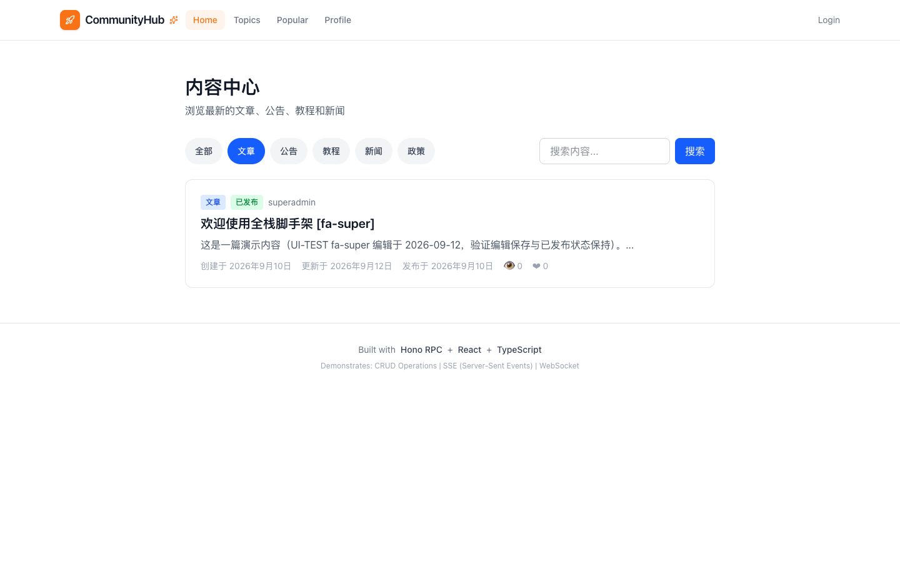

### 搜索

**步骤**:

1. 输入 ISR
2. 点击搜索

**验证**: 命中 ISR 教程

**截图**: 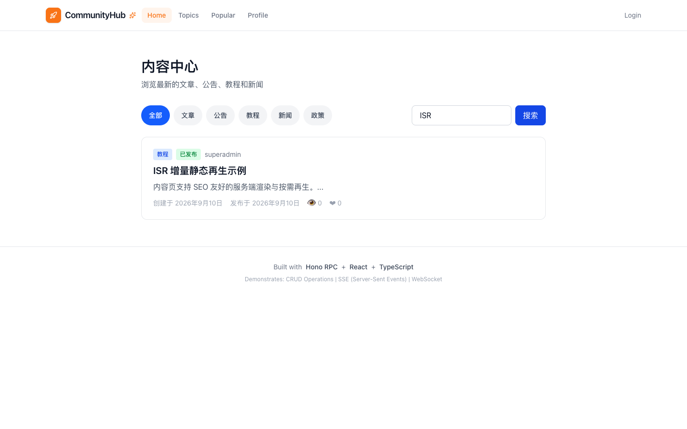

### 查看内容详情

**步骤**:

1. 点击内容卡片

**验证**: 详情页完整（面包屑/正文/返回）

**截图**: 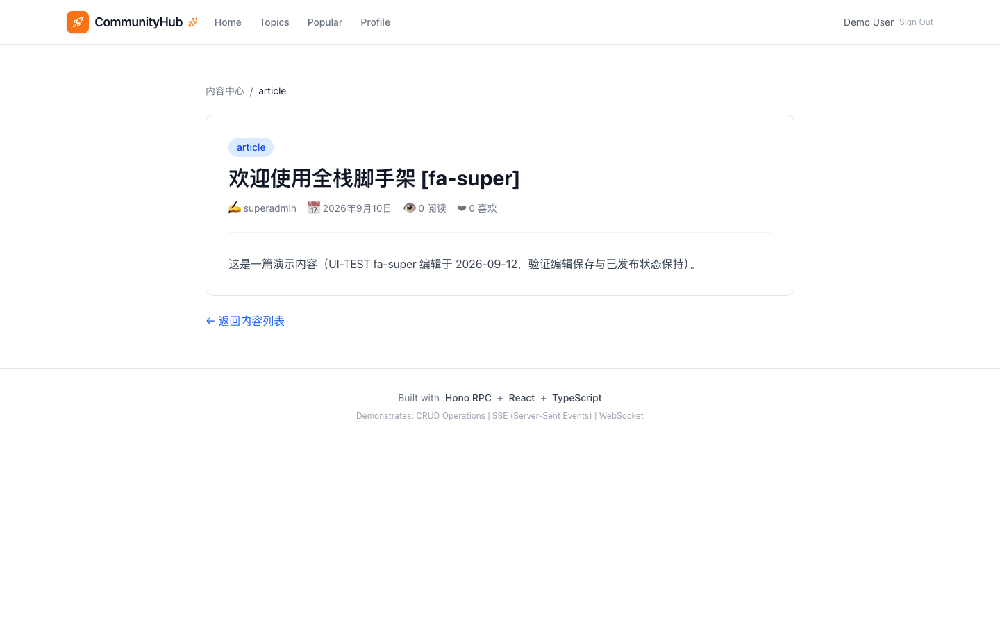

### 登录后首页身份展示（2026-09-12 补拍）

**步骤**:

1. /login 点 Sign In（预填凭据）
2. 回到首页

**验证**: navbar 显示 Demo User + Sign Out，2 卡正常

**截图**: 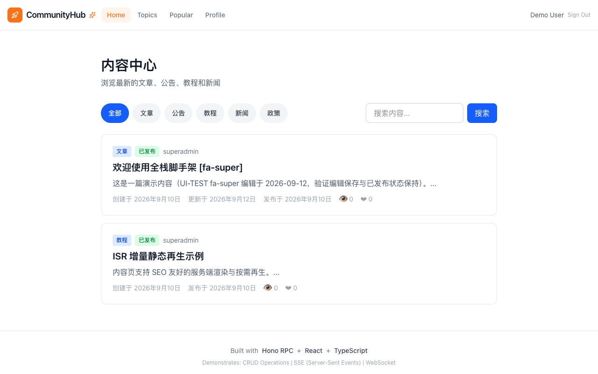

**选择器**:
| 元素 | 选择器 |
|---|---|
| 登出按钮 | `button.text-xs` |

### 登录后详情页评论区探测

**步骤**:

1. 登录态打开内容详情页

**验证**: ⚠ 缺口：评论区整体不存在（无输入框/无评论文案）

**截图**: 

### Profile 登录后内容（逆向：硬编码）

**步骤**:

1. 登录态访问 /profile

**验证**: ⚠ BUG：与游客态相同的 Jane Doe 硬编码档案，与登录身份无关

**截图**: 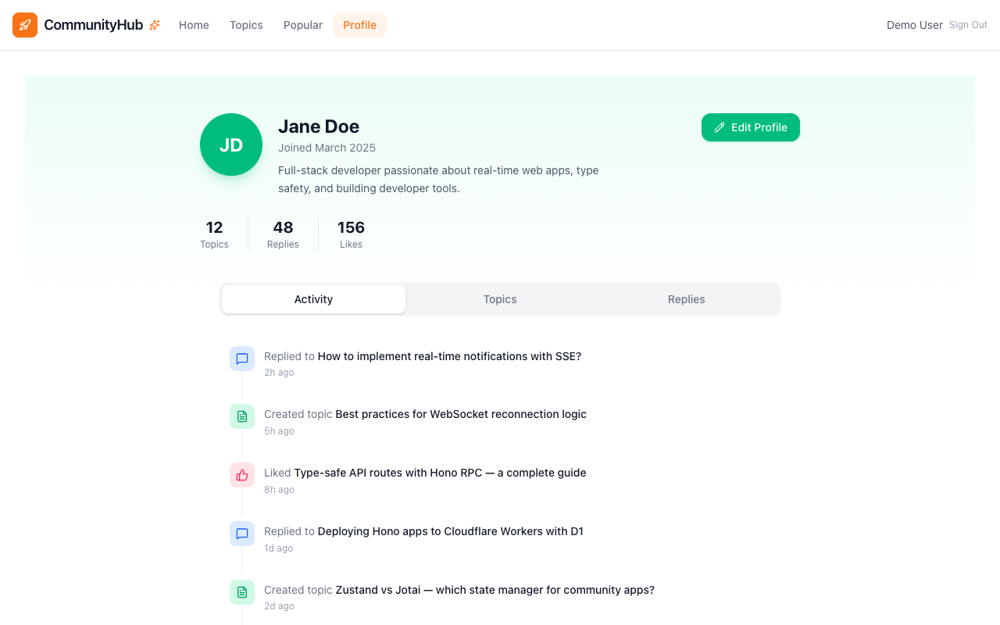

### 登录落地死路（逆向）

**步骤**:

1. 在 /login 点击 Sign In 观察跳转

**验证**: ⚠ P1 BUG：登录成功跳 /todos → forum preset 无此路由 404

**截图**: 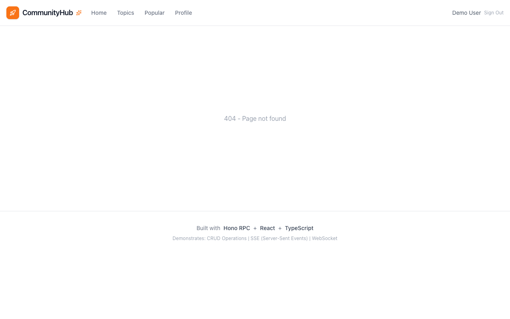

### 硬刷新详情页（SSR 水合验证）

**步骤**:

1. 详情页 F5
2. 300ms 与 1200ms 双探针

**验证**: 300ms 内容完整无白屏；**SSR_DATA** 水合后移除

**截图**: 

### 登出后首页

**步骤**:

1. 点击 Sign Out

**验证**: navbar 变 Login，列表内容不受影响

**截图**: 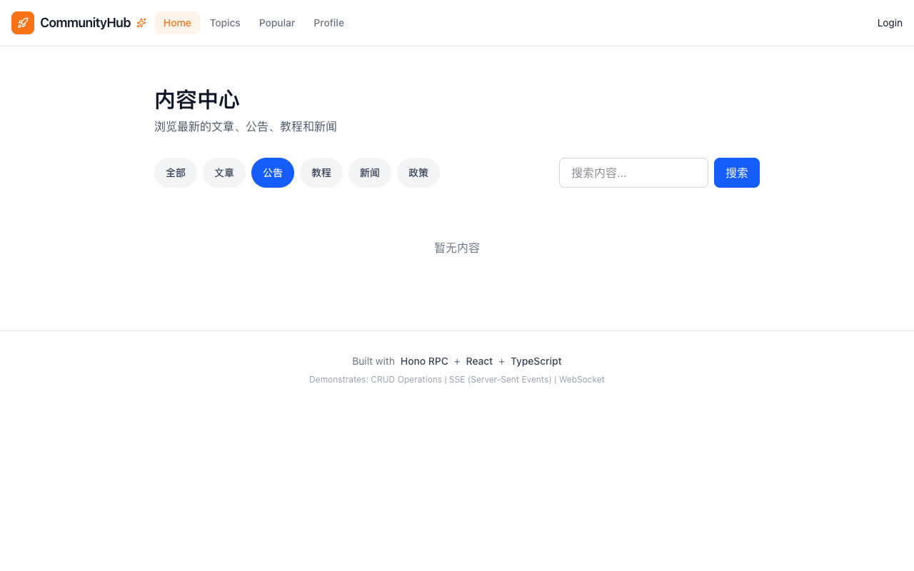

---

## 游客（未登录）

**凭据**: `无需登录`

**案例数**: 17

### 浏览内容列表

**步骤**:

1. 直接打开首页

**验证**: 公开内容可见

**截图**: 

### 发帖/评论被拒

**步骤**:

1. 尝试发帖或评论（需登录）

**验证**: 被要求登录

### 首页全景（2026-09-12 补拍）

**步骤**:

1. 直接打开首页，等待渲染

**验证**: 标题/筛选胶囊/搜索框/2 张卡片完整

**截图**: 

### 筛选"文章"类

**步骤**:

1. 点击第 2 个筛选胶囊

**验证**: 胶囊高亮，仅 1 卡（欢迎文章）

**截图**: 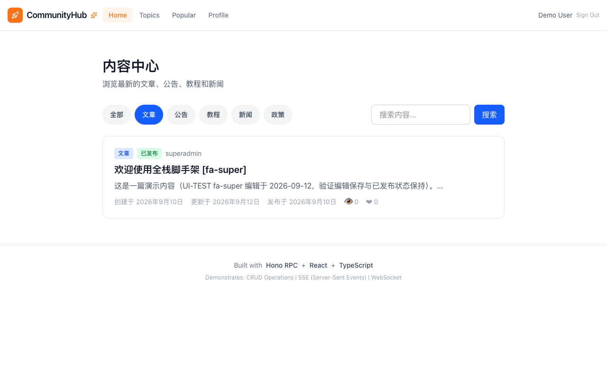

**选择器**:
| 元素 | 选择器 |
|---|---|
| 筛选胶囊 | `div.flex.gap-2.flex-wrap button:nth-of-type(2)` |

### 搜索 ISR

**步骤**:

1. 先点回"全部"再搜索 ISR（搜索不重置分类）

**验证**: 仅 ISR 教程卡

**截图**: 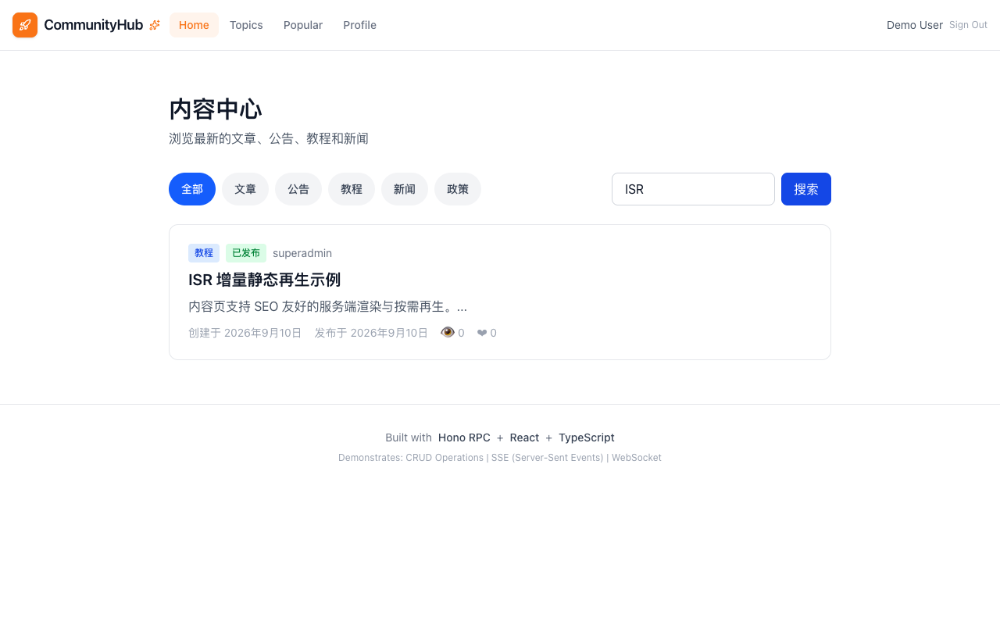

### 详情页全貌

**步骤**:

1. 点开欢迎文章进详情

**验证**: 面包屑/徽标/正文完整；徽标显示原始 key 未本地化（已知）

**截图**: 

### Topics 页

**步骤**:

1. 导航点击 Topics

**验证**: ⚠ 与首页完全相同（复用内容中心，无独立话题视图）

**截图**: 

### Popular 页

**步骤**:

1. 导航点击 Popular

**验证**: ⚠ 与首页完全相同，数据全 0 排序无可见效果

**截图**: 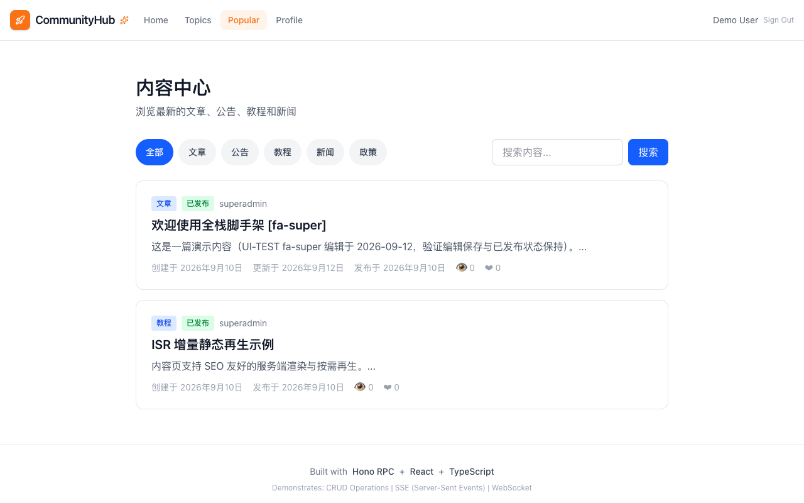

### Profile 无鉴权守卫（逆向）

**步骤**:

1. 登出后访问 /profile

**验证**: ⚠ BUG：无守卫直接渲染 Jane Doe 硬编码档案

**截图**: 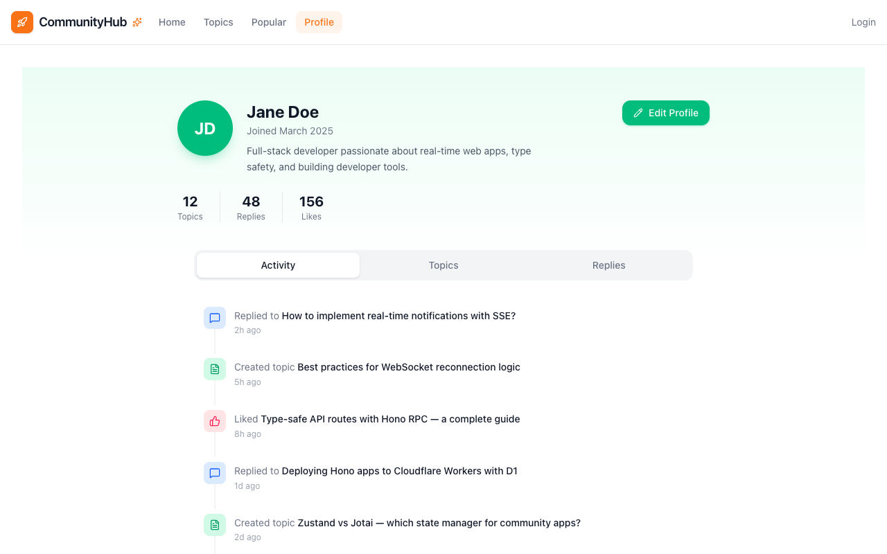

### 登录页（逆向：假报错）

**步骤**:

1. 直接打开 /login 不做任何操作

**验证**: ⚠ P1 BUG：加载即显示 Invalid credentials（未提交过）

**截图**: 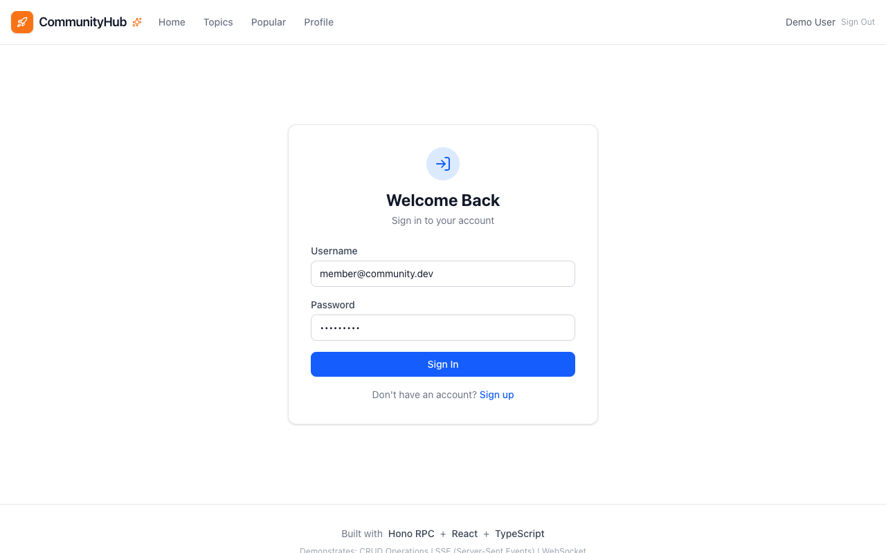

### 注册页表单

**步骤**:

1. 从登录页点 Sign up 链接

**验证**: Create Account 表单完整（min 6 chars 校验提示）

**截图**: 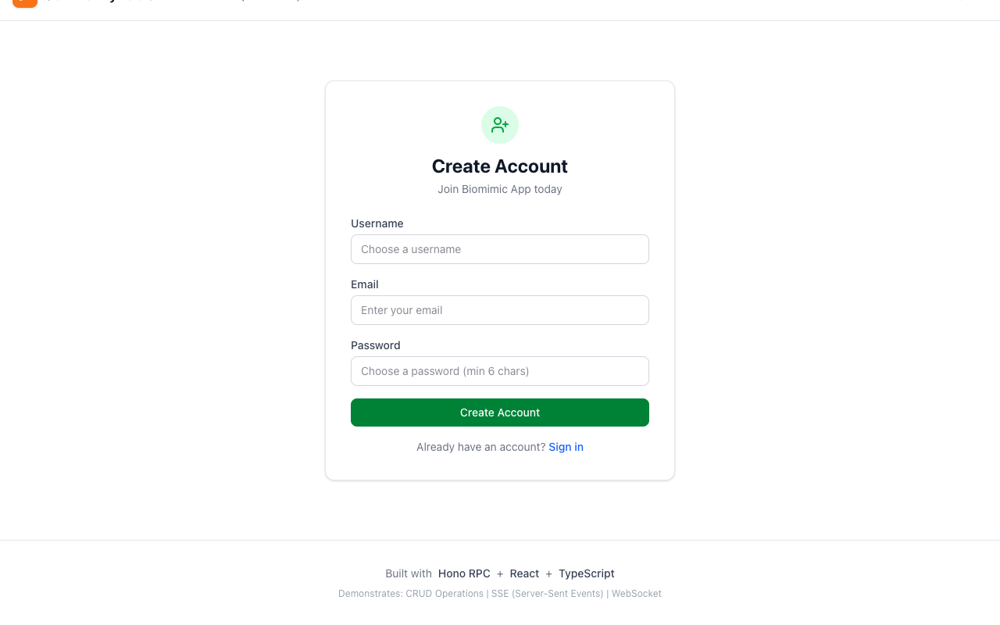

**选择器**:
| 元素 | 选择器 |
|---|---|
| 注册链接 | `[data-testid='login-register-link']` |

### 404 路由兜底

**步骤**:

1. 访问 /no-such-page-xyz

**验证**: HTTP 200 灰字 404；P3：无返回首页链接

**截图**: 

### 移动端首页（375px）

**步骤**:

1. 切 375x812 视口
2. 打开首页

**验证**: 胶囊换行/搜索堆叠/无横向溢出；⚠ 移动端无登录登出入口

**截图**: 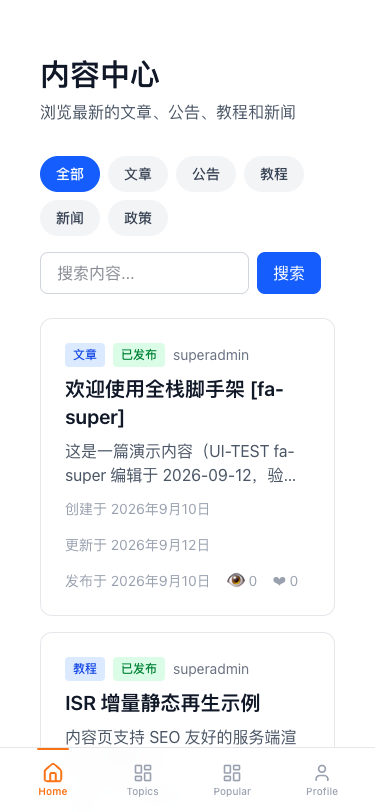

### 移动端详情页

**步骤**:

1. 375px 打开详情

**验证**: 纵向堆叠正常，底部 tab 正常

**截图**: 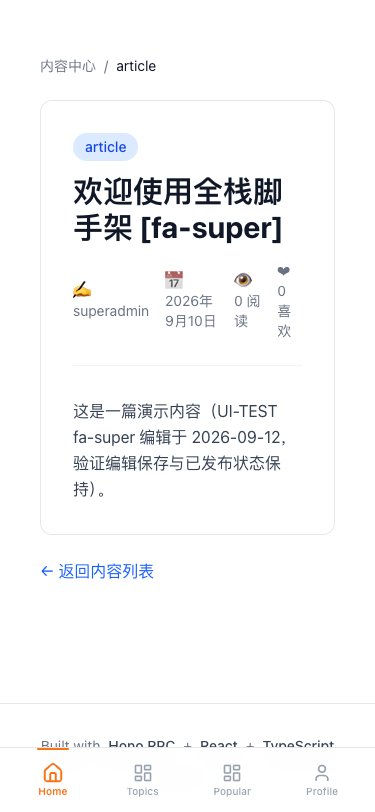

### 移动端登录页（假报错复现）

**步骤**:

1. 375px 打开 /login

**验证**: ⚠ 同桌面：加载即 Invalid credentials

**截图**: 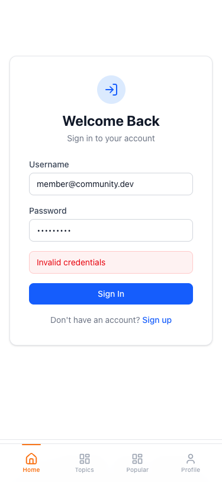

### 登录横幅桌面复现 + 成功登录对照

**步骤**:

1. 桌面打开 /login 截假报错
2. 同凭据点 Sign In

**验证**: 假报错存在但手动登录成功（自动鉴权尝试失败泄入 UI）

**截图**: 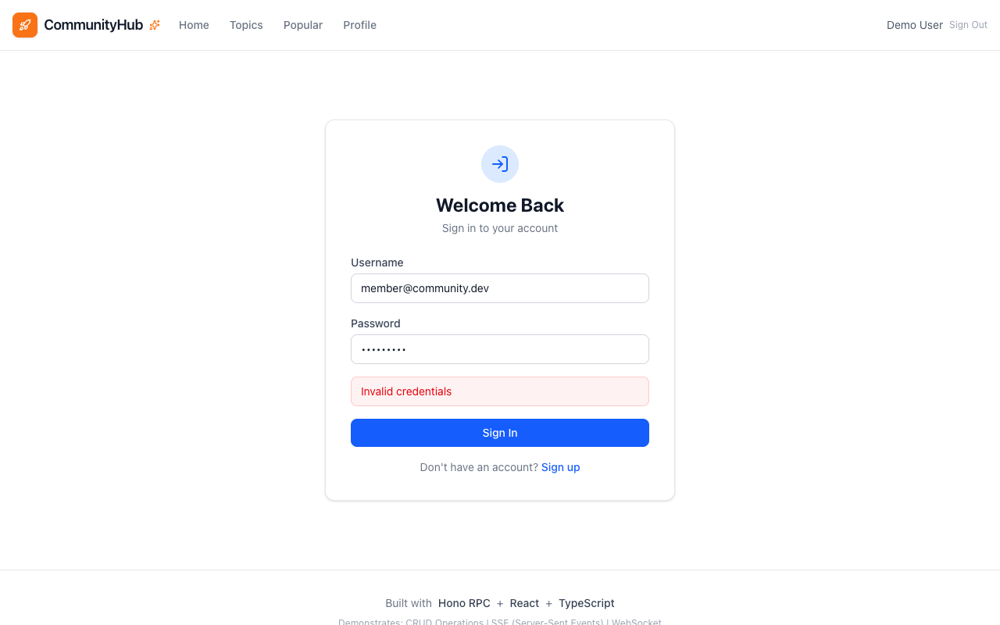

### 空分类筛选空态

**步骤**:

1. 点击"公告"胶囊

**验证**: 显示"暂无内容"空态文案

**截图**: 

---
