# Fullstack Admin — Test Playbook

> 站点：https://fullstack.lpm1.top
> 身份数：4
> 每个身份列出：操作步骤 → 验证 → 截图 → 选择器

---

## 超级管理员

**凭据**: `superadmin / 123456`

**案例数**: 7

### 登录管理后台

**步骤**:

1. 打开 https://fullstack.lpm1.top/admin
2. 在用户名输入框输入 superadmin
3. 在密码输入框输入 123456
4. 点击登录按钮

**验证**: SPA 跳转到 /admin/dashboard，侧栏 10 项且 href 全带 /admin 前缀

**截图**: 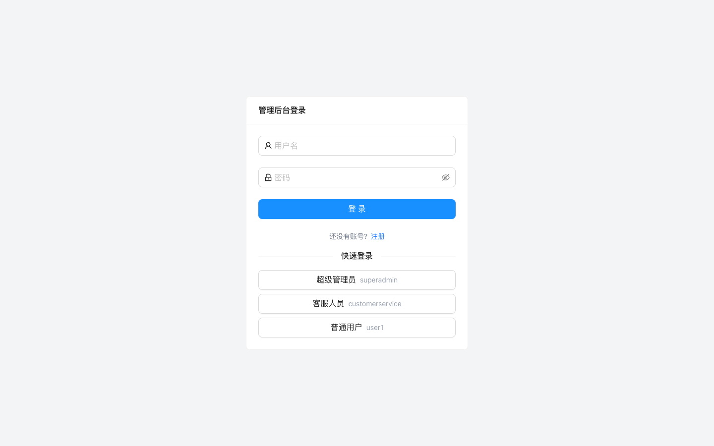

**选择器**:
| 元素 | 选择器 |
|---|---|
| 用户名输入框 | `#username` |
| 密码输入框 | `#password` |
| 登录按钮 | `[data-testid='admin-login-submit']` |
| 快速登录超管按钮 | `find text '超级管理员 superadmin' --action click` |

### 查看仪表盘统计

**步骤**:

1. 登录后自动到达 /admin/dashboard

**验证**: 统计卡显示 总待办12/待处理4/已完成5

**截图**: 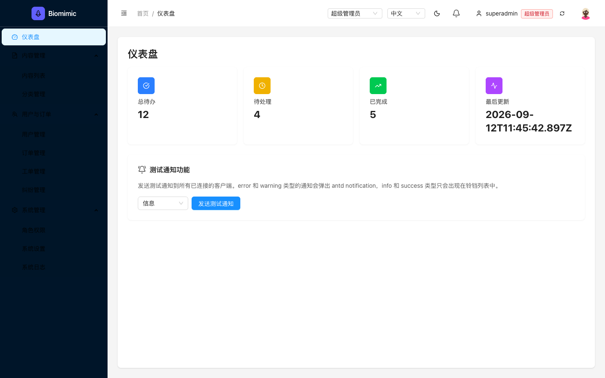

**选择器**:
| 元素 | 选择器 |
|---|---|
| 仪表盘URL | `/admin/dashboard` |

### 用户管理（查看/创建/编辑/删除）

**步骤**:

1. 点击侧栏"用户与订单" → "用户管理"
2. 或直接访问 /admin/users

**验证**: 表格 3 行（superadmin/customerservice/user1），角色徽章+状态正常

**截图**: 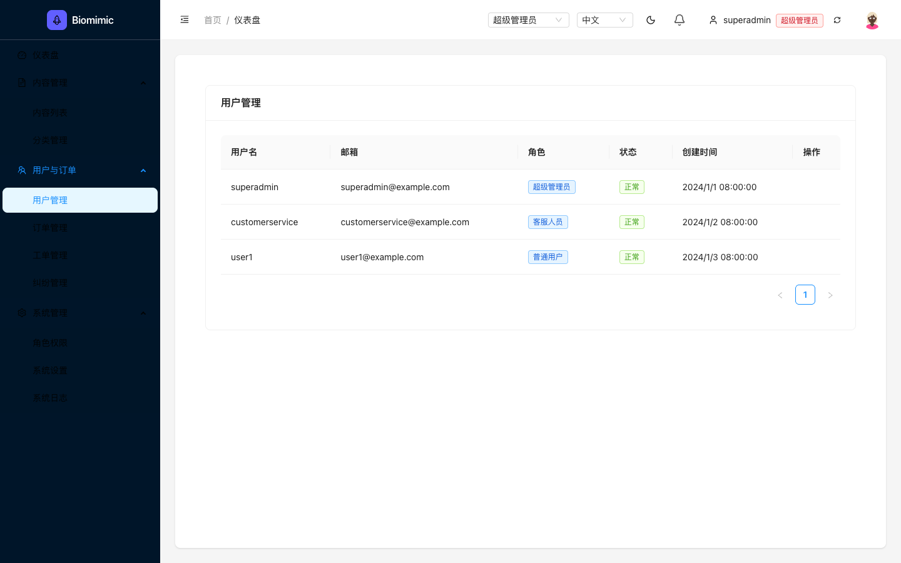

**选择器**:
| 元素 | 选择器 |
|---|---|
| 用户管理侧栏链接 | `a[href='/admin/users']` |
| 表格选择器 | `.ant-table` |
| 表格列名 | `用户名/邮箱/角色/状态/创建时间/操作` |

### 内容管理（新建/编辑/发布）

**步骤**:

1. 点击侧栏"内容管理" → "内容列表"

**验证**: 2 篇已发布文章可见，编辑操作可用

**截图**: 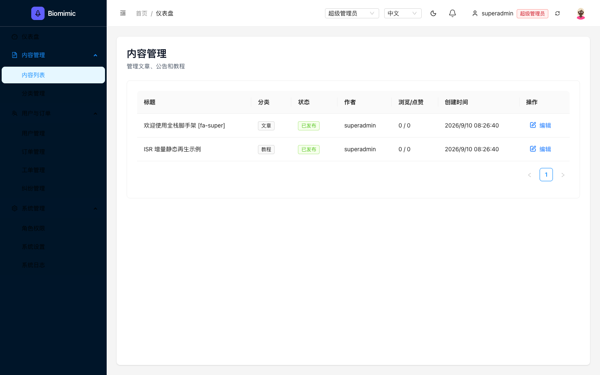

**选择器**:
| 元素 | 选择器 |
|---|---|
| 内容列表侧栏链接 | `a[href='/admin/content']` |

### 角色与权限管理

**步骤**:

1. 点击侧栏"系统管理" → "角色权限"

**验证**: 3 角色列表（super_admin/customer_service/user），权限矩阵完整

**截图**: 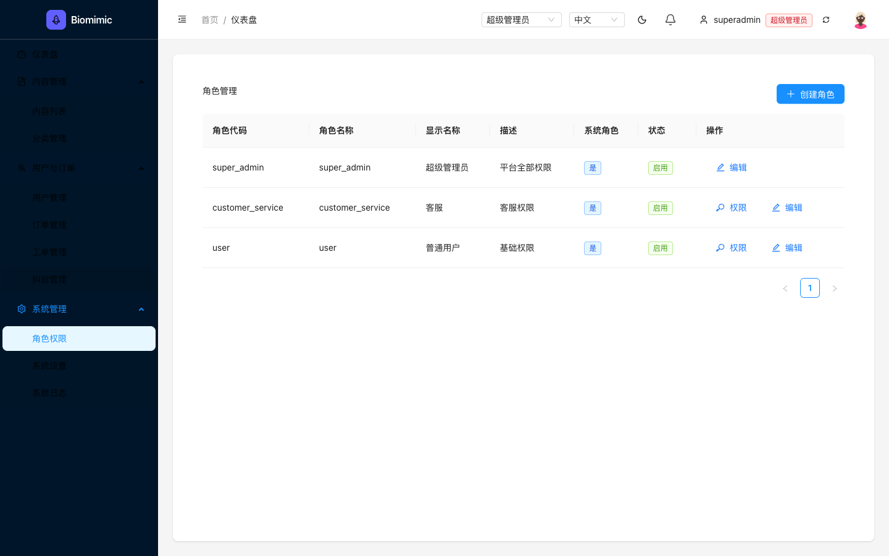

**选择器**:
| 元素 | 选择器 |
|---|---|
| 角色权限侧栏链接 | `a[href='/admin/system/roles']` |

### 系统设置读写

**步骤**:

1. 点击侧栏"系统管理" → "系统设置"

**验证**: 表单带出真实值（站点名称/SMTP/通知/安全四个分区）

**截图**: 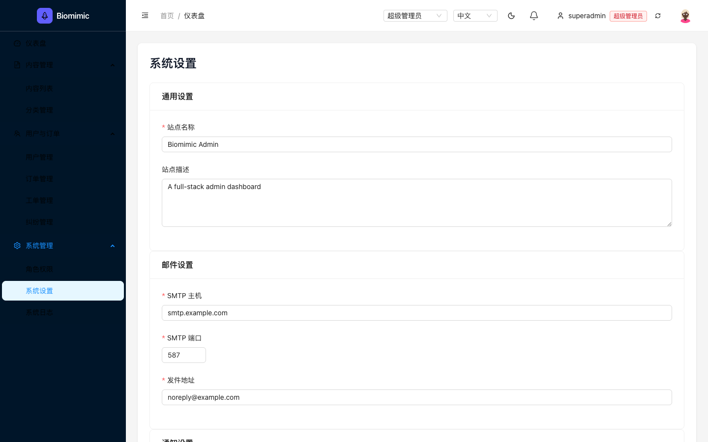

**选择器**:
| 元素 | 选择器 |
|---|---|
| 系统设置侧栏链接 | `a[href='/admin/system/settings']` |

### 审计日志查看

**步骤**:

1. 点击侧栏"系统管理" → "系统日志"

**验证**: 20+ 行审计日志（时间/用户ID/IP/详情）

**截图**: 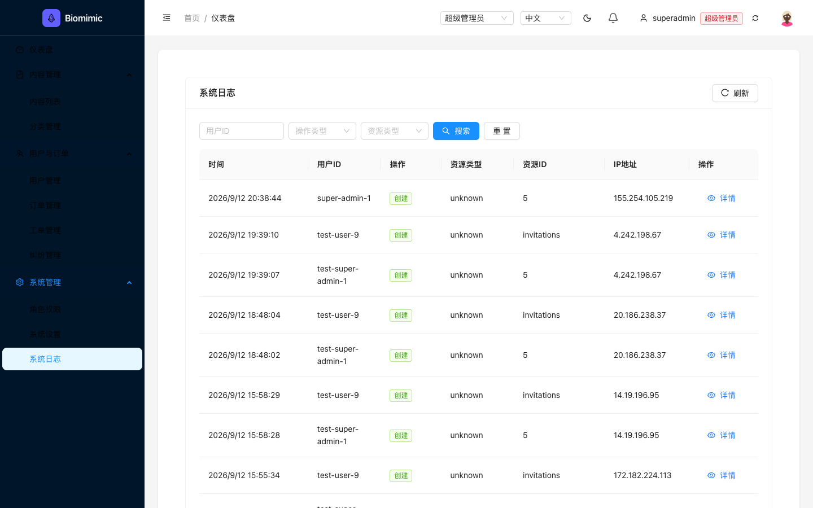

**选择器**:
| 元素 | 选择器 |
|---|---|
| 系统日志侧栏链接 | `a[href='/admin/system/logs']` |

---

## 客服人员

**凭据**: `customerservice / 123456（快速登录按钮）`

**案例数**: 4

### 登录（快捷按钮）

**步骤**:

1. 打开 /admin
2. 点击"客服人员"快捷登录按钮

**验证**: 登录成功，header 显示 customerservice + 客服人员徽标

**截图**: 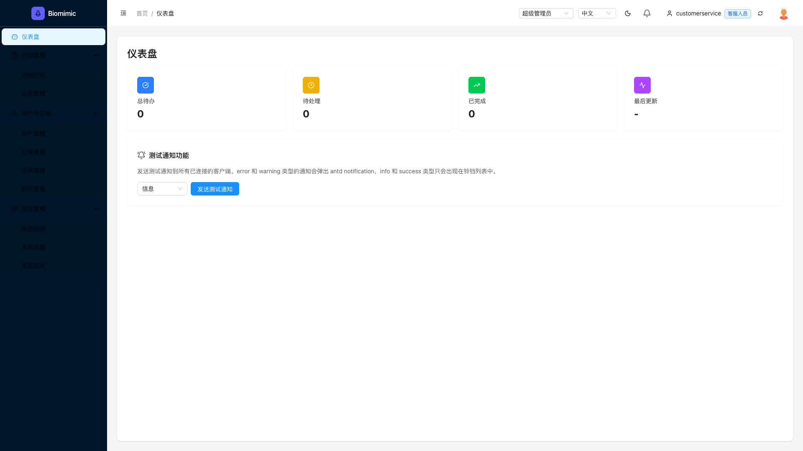

**选择器**:
| 元素 | 选择器 |
|---|---|
| 快捷登录客服按钮 | `find text '客服人员 customerservice' --action click` |

### 仪表盘统计被拒（API 403 → 卡片显示 0）

**步骤**:

1. 登录后到达 /admin/dashboard

**验证**: 统计卡全 0（API 403），但页面壳正常渲染

**截图**: 

**选择器**:
| 元素 | 选择器 |
|---|---|
| 统计API | `/api/admin/stats → 403` |

### 用户管理数据被拒（API 403 → 空表）

**步骤**:

1. 点击侧栏"用户管理"

**验证**: 表头完整但 No data（API 403）

**截图**: 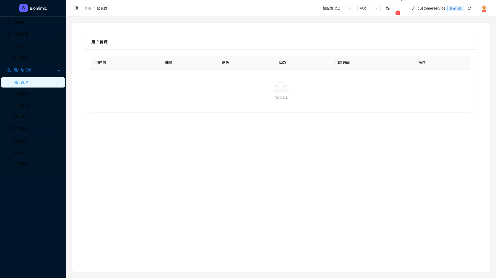

**选择器**:
| 元素 | 选择器 |
|---|---|
| 用户API | `/api/admin/users → 403 Permission denied: user:view` |

### 内容列表可见（只读）

**步骤**:

1. 点击侧栏"内容管理" → "内容列表"

**验证**: 2 篇文章可见，无编辑/删除按钮，无新建按钮

**截图**: 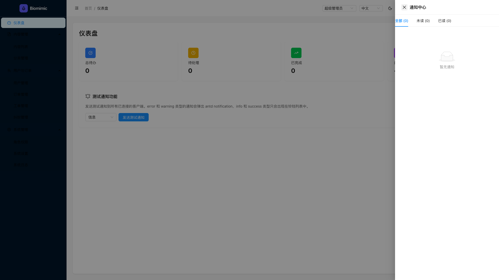

---

## 普通用户

**凭据**: `user1 / 123456（快速登录按钮）`

**案例数**: 3

### 登录（快捷按钮）

**步骤**:

1. 打开 /admin
2. 点击"普通用户"快捷登录按钮

**验证**: 登录成功，header 显示 user1 + 普通用户徽标

**截图**: 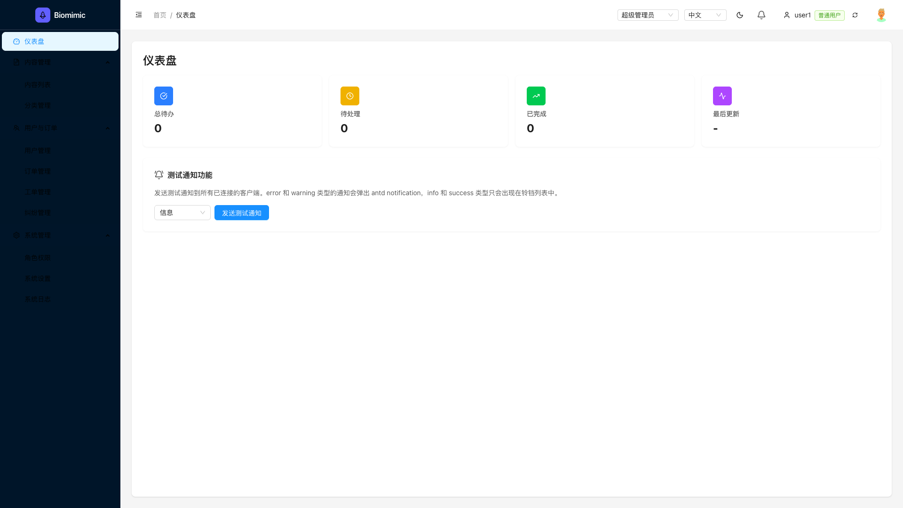

**选择器**:
| 元素 | 选择器 |
|---|---|
| 快捷登录普通用户按钮 | `find text '普通用户 user1' --action click` |

### 仪表盘统计被拒

**步骤**:

1. 登录后到达 /admin/dashboard

**验证**: 统计卡全 0（API 403）

**截图**: 

### 用户管理数据被拒

**步骤**:

1. 点击侧栏"用户管理"

**验证**: 表头完整但 No data

**截图**: 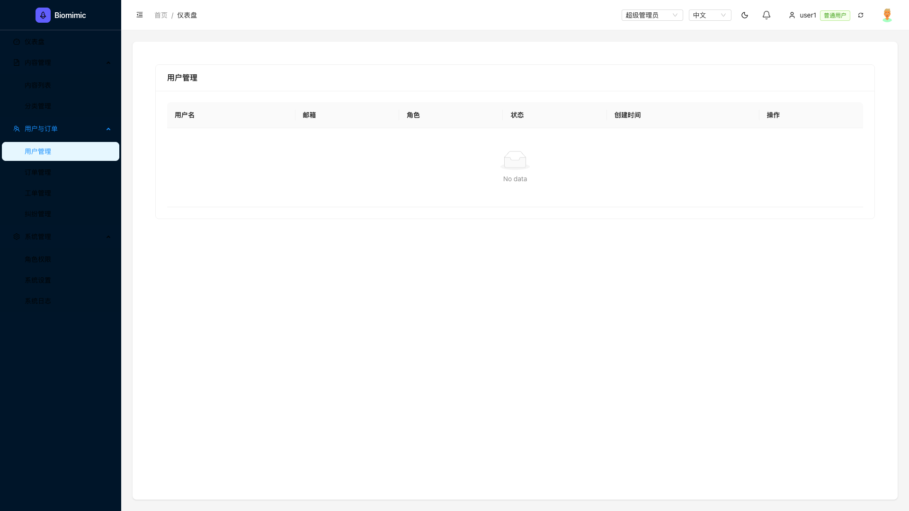

---

## 游客（未登录）

**凭据**: `无需登录`

**案例数**: 3

### 浏览 /todos 页（SSR 渲染数据）

**步骤**:

1. 直接打开 https://fullstack.lpm1.top/todos（不登录）

**验证**: Todo List 页渲染 + SSR 数据可见

**截图**: 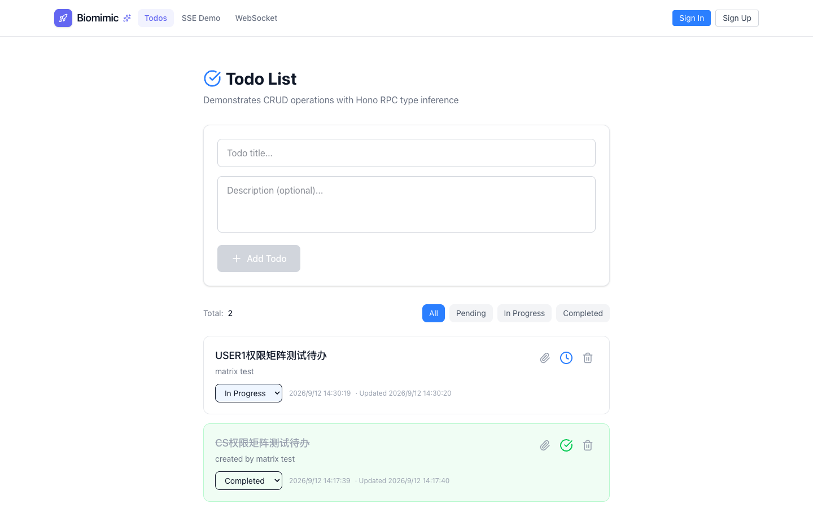

### 写操作被拒（API 401）

**步骤**:

1. 在 /todos 页尝试新增（需登录态）

**验证**: 游客自动登录（dev token），无需手动认证

### 访问 /admin 被重定向

**步骤**:

1. 直接打开 https://fullstack.lpm1.top/admin

**验证**: 302 → /admin/login 登录页

**截图**: 

---
