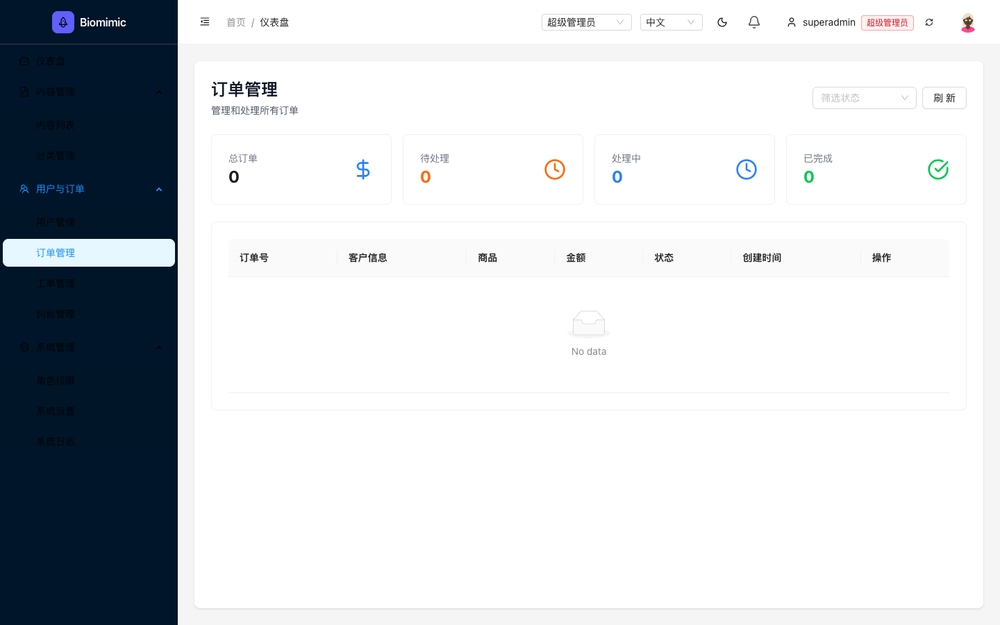
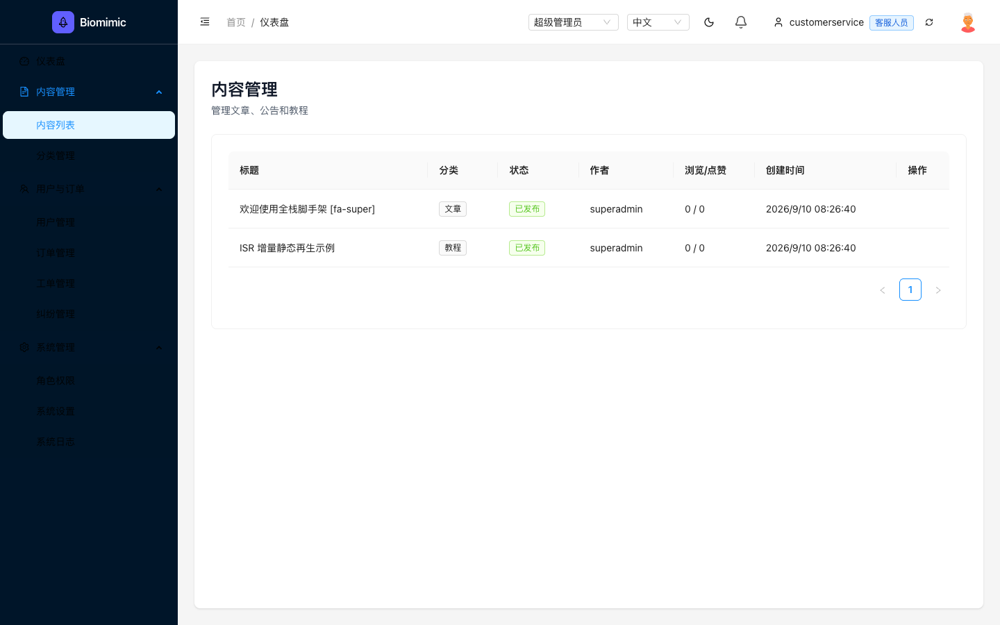
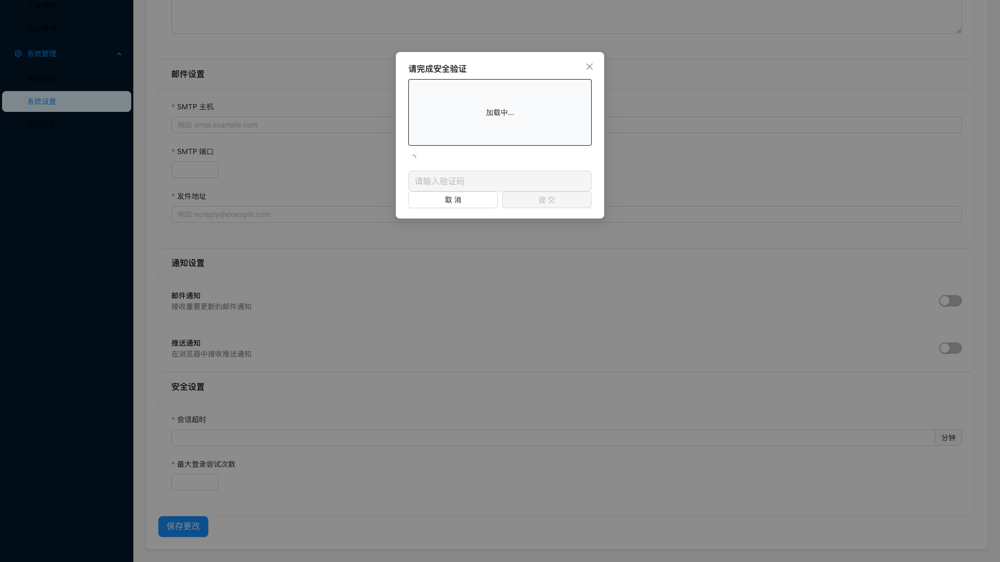
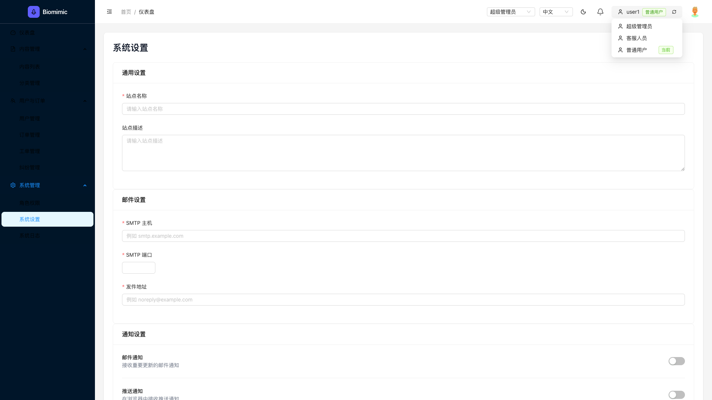

# Fullstack Admin — Test Playbook

> 站点：https://fullstack.lpm1.top
> 身份数：4
> 每个身份列出：操作步骤 → 验证 → 截图 → 选择器

---

## 超级管理员

**凭据**: `superadmin / 123456`

**案例数**: 22

### 登录管理后台

**步骤**:

1. 打开 https://fullstack.lpm1.top/admin
2. 在用户名输入框输入 superadmin
3. 在密码输入框输入 123456
4. 点击登录按钮

**验证**: SPA 跳转到 /admin/dashboard，侧栏 10 项且 href 全带 /admin 前缀

**截图**: 

**选择器**:
| 元素 | 选择器 |
|---|---|
| 用户名输入框 | `#username` |
| 密码输入框 | `#password` |
| 登录按钮 | `[data-testid='admin-login-submit']` |
| 快速登录超管按钮 | `find text '超级管理员 superadmin' --action click` |

### 查看仪表盘统计

**步骤**:

1. 登录后自动到达 /admin/dashboard

**验证**: 统计卡显示 总待办12/待处理4/已完成5

**截图**: 

**选择器**:
| 元素 | 选择器 |
|---|---|
| 仪表盘URL | `/admin/dashboard` |

### 用户管理（查看/创建/编辑/删除）

**步骤**:

1. 点击侧栏"用户与订单" → "用户管理"
2. 或直接访问 /admin/users

**验证**: 表格 3 行（superadmin/customerservice/user1），角色徽章+状态正常

**截图**: 

**选择器**:
| 元素 | 选择器 |
|---|---|
| 用户管理侧栏链接 | `a[href='/admin/users']` |
| 表格选择器 | `.ant-table` |
| 表格列名 | `用户名/邮箱/角色/状态/创建时间/操作` |

### 内容管理（新建/编辑/发布）

**步骤**:

1. 点击侧栏"内容管理" → "内容列表"

**验证**: 2 篇已发布文章可见，编辑操作可用

**截图**: 

**选择器**:
| 元素 | 选择器 |
|---|---|
| 内容列表侧栏链接 | `a[href='/admin/content']` |

### 角色与权限管理

**步骤**:

1. 点击侧栏"系统管理" → "角色权限"

**验证**: 3 角色列表（super_admin/customer_service/user），权限矩阵完整

**截图**: 

**选择器**:
| 元素 | 选择器 |
|---|---|
| 角色权限侧栏链接 | `a[href='/admin/system/roles']` |

### 系统设置读写

**步骤**:

1. 点击侧栏"系统管理" → "系统设置"

**验证**: 表单带出真实值（站点名称/SMTP/通知/安全四个分区）

**截图**: 

**选择器**:
| 元素 | 选择器 |
|---|---|
| 系统设置侧栏链接 | `a[href='/admin/system/settings']` |

### 审计日志查看

**步骤**:

1. 点击侧栏"系统管理" → "系统日志"

**验证**: 20+ 行审计日志（时间/用户ID/IP/详情）

**截图**: 

**选择器**:
| 元素 | 选择器 |
|---|---|
| 系统日志侧栏链接 | `a[href='/admin/system/logs']` |

### 验证码限流触发（逆向防御验证）

**步骤**:

1. 打开 /admin/test/captcha 验证码测试页
2. 点击"连续请求 20 次"

**验证**: 真实弹出验证码 Modal；输入正确码提交后弹窗关闭（响应链闭环）

### 空标题内容创建被拒（逆向）

**步骤**:

1. 内容管理 → 新建内容
2. 不填标题直接提交

**验证**: 表单/zod 校验拦截并提示必填，不产生脏数据

### 未登录访问管理 API（逆向）

**步骤**:

1. 不带 Authorization 请求 /api/admin/stats

**验证**: 返回 401，不泄露任何统计

### 内容编辑后改回原样（正向链）

**步骤**:

1. 内容管理 → 内容列表，点击行内"编辑"按钮
2. 修改标题后点击 OK 保存
3. 再次编辑同一行，改回原标题后 OK 保存

**验证**: 表格标题先更新后恢复原值，状态保持已发布，无多余行

**截图**: 

**选择器**:
| 元素 | 选择器 |
|---|---|
| 编辑按钮 | `find text '编辑' --action click` |
| 弹窗确认 | `find text 'OK' --action click` |

### 系统设置修改后还原（正向链）

**步骤**:

1. 系统管理 → 系统设置，修改站点名称为 QA-Temp-Name
2. 点击"保存更改"
3. 改回原值 Biomimic Admin 再次保存

**验证**: 两次均出现"设置保存成功!" toast，GET /api/admin/settings 回读 siteName 为原值

**截图**: 

**选择器**:
| 元素 | 选择器 |
|---|---|
| 站点名称输入框 | `.ant-layout-content input[placeholder='请输入站点名称']` |
| 保存按钮 | `find text '保存更改' --action click` |

### 仪表盘刷新后统计保持（正向）

**步骤**:

1. 登录到达 /admin/dashboard 记录统计卡数值
2. 按 F5 硬刷新

**验证**: 刷新后统计卡与刷新前一致（GET /api/admin/stats 200），无清零

**截图**: 

### 订单/工单/纠纷空数据页巡检（正向边界）

**步骤**:

1. 依次访问 /admin/orders、/admin/tickets、/admin/disputes

**验证**: 三页壳与表格头渲染正常，统计卡全 0 + No data（线上无 mock 数据），无报错

**截图**: 

### 分类管理与权限页深链（边界实勘）

**步骤**:

1. 直接打开 /admin/categories
2. 再直接打开 /admin/permissions

**验证**: 实勘：categories 超管侧渲染情况未采样（API /api/categories 200 有数据）；permissions 深链 200 但内容区空白（已知缺陷）——逐页记录

**截图**: 

### emoji/中英混合标题正常创建（正向）

**步骤**:

1. 内容列表点击"创建内容"
2. 标题输入 🎉 Release Notes 发布v2 中英混合，填写其余必填项提交
3. 确认后删除该条清理

**验证**: 列表正常渲染该条无乱码无报错，清理后列表恢复基线

### 连续创建 3 条内容（正向批量链）

**步骤**:

1. 连续点击"创建内容"新建 3 条不同标题的内容并逐一提交
2. 记录列表新增数量

**验证**: 3 条均出现在列表，随后全部删除清理，列表回到基线

### 超长标题提交（逆向）

**步骤**:

1. 点击"创建内容"
2. 标题粘贴 256+ 字符长串，提交

**验证**: 实勘：被长度校验拒绝则提示报错；若接受则正常入库显示——记录行为，前端不崩溃

### 纯空格标题提交被拒（逆向）

**步骤**:

1. 点击"创建内容"
2. 标题只输入多个空格，提交

**验证**: 校验拦截（trim 后按必填处理），不产生空标题脏数据

### XSS 注入标题转义验证（逆向）

**步骤**:

1. 点击"创建内容"
2. 标题输入 ，提交
3. 回到列表查看该条渲染

**验证**: 标题按纯文本渲染不执行（无弹窗），列表与详情均无脚本注入效果

### 伪造 Bearer token 调管理 API（逆向）

**步骤**:

1. curl -H "Authorization: Bearer fake-token123" 请求 /api/admin/stats

**验证**: 返回 401，伪造 token 不被接受（仅预置 mock token 可用）

### 双击创建内容提交防重（逆向）

**步骤**:

1. 填写完整创建表单后快速双击 OK 提交按钮

**验证**: 实勘：仅创建 1 条（若出现重复行记录为缺陷），随后清理

---

## 客服人员

**凭据**: `customerservice / 123456（快速登录按钮）`

**案例数**: 8

### 登录（快捷按钮）

**步骤**:

1. 打开 /admin
2. 点击"客服人员"快捷登录按钮

**验证**: 登录成功，header 显示 customerservice + 客服人员徽标

**截图**: 

**选择器**:
| 元素 | 选择器 |
|---|---|
| 快捷登录客服按钮 | `find text '客服人员 customerservice' --action click` |

### 仪表盘统计被拒（API 403 → 卡片显示 0）

**步骤**:

1. 登录后到达 /admin/dashboard

**验证**: 统计卡全 0（API 403），但页面壳正常渲染

**截图**: 

**选择器**:
| 元素 | 选择器 |
|---|---|
| 统计API | `/api/admin/stats → 403` |

### 用户管理数据被拒（API 403 → 空表）

**步骤**:

1. 点击侧栏"用户管理"

**验证**: 表头完整但 No data（API 403）

**截图**: 

**选择器**:
| 元素 | 选择器 |
|---|---|
| 用户API | `/api/admin/users → 403 Permission denied: user:view` |

### 内容列表可见（只读）

**步骤**:

1. 点击侧栏"内容管理" → "内容列表"

**验证**: 2 篇文章可见，无编辑/删除按钮，无新建按钮

**截图**: 

### 客服登出（正向链）

**步骤**:

1. 登录后点击 header 头像下拉
2. 点击"退出登录"

**验证**: 跳回 /admin/login，重新进入后台需再次登录（customer-service-token 登出）

### 客服刷新后只读权限保持（正向）

**步骤**:

1. 进入 /admin/content 后按 F5 硬刷新

**验证**: 刷新后仍无"创建内容"按钮、行内无编辑按钮（只读态持久）

**截图**: 

### 客服伪造角色提权（逆向）

**步骤**:

1. localStorage 把 admin-storage 的 user.role 改为 super_admin
2. 刷新后请求 /api/admin/users

**验证**: 后端按 token 鉴权仍 403 Permission denied，前端角色字段篡改不提权

### 客服保存系统设置被拦截（逆向）

**步骤**:

1. 进入系统设置（表单空，GET 403）
2. 点击"保存更改"

**验证**: 保存被拦截（验证码/403），无任何配置变更落库

**截图**: 

---

## 普通用户

**凭据**: `user1 / 123456（快速登录按钮）`

**案例数**: 6

### 登录（快捷按钮）

**步骤**:

1. 打开 /admin
2. 点击"普通用户"快捷登录按钮

**验证**: 登录成功，header 显示 user1 + 普通用户徽标

**截图**: 

**选择器**:
| 元素 | 选择器 |
|---|---|
| 快捷登录普通用户按钮 | `find text '普通用户 user1' --action click` |

### 仪表盘统计被拒

**步骤**:

1. 登录后到达 /admin/dashboard

**验证**: 统计卡全 0（API 403）

**截图**: 

### 用户管理数据被拒

**步骤**:

1. 点击侧栏"用户管理"

**验证**: 表头完整但 No data

**截图**: 

### 普通用户登出（正向链）

**步骤**:

1. 登录后打开头像下拉
2. 点击"退出登录"

**验证**: 跳回 /admin/login，user-token 登出

### 普通用户 token 直调管理 API（逆向）

**步骤**:

1. curl -H "Authorization: Bearer user-token" 请求 /api/admin/stats 与 /api/admin/users

**验证**: 均 403 Permission denied，与 UI 空数据一致（token 合法但无权限）

### 角色切换下拉提权链（逆向·已知缺陷复现）

**步骤**:

1. 登录后点击 header 角色切换下拉
2. 选择"超级管理员"

**验证**: ⚠ 已知缺陷：admin-storage 的 user+token 被整体替换为目标角色（提权链）；记录切换后可访问的页面与 API，不作为通过标准

**截图**: 

---

## 游客（未登录）

**凭据**: `无需登录`

**案例数**: 6

### 浏览 /todos 页（SSR 渲染数据）

**步骤**:

1. 直接打开 https://fullstack.lpm1.top/todos（不登录）

**验证**: Todo List 页渲染 + SSR 数据可见

**截图**: 

### 写操作被拒（API 401）

**步骤**:

1. 在 /todos 页尝试新增（需登录态）

**验证**: 游客自动登录（dev token），无需手动认证

### 访问 /admin 被重定向

**步骤**:

1. 直接打开 https://fullstack.lpm1.top/admin

**验证**: 302 → /admin/login 登录页

**截图**: 

### 游客刷新 /todos 后 SSR 数据保持（正向）

**步骤**:

1. 打开 /todos 记录渲染内容
2. 按 F5 硬刷新

**验证**: 刷新后 Todo List 与 SSR 数据仍完整渲染（window.**SSR_DATA**.todos），无空白

**截图**: 

### 伪造 token 调 todos 写接口（逆向）

**步骤**:

1. curl -X POST -H "Authorization: Bearer fake-token123" 请求 /api/todos

**验证**: 返回 401，不产生任何待办数据

### 游客深链 /admin/users 被拦（逆向）

**步骤**:

1. 未登录直接打开 https://fullstack.lpm1.top/admin/users

**验证**: 302 重定向到 /admin/login，不渲染任何用户数据

**截图**: 

---
