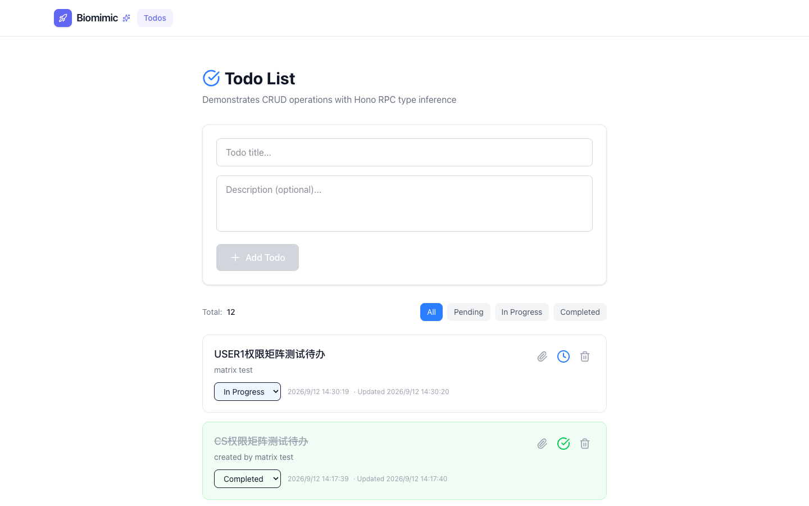
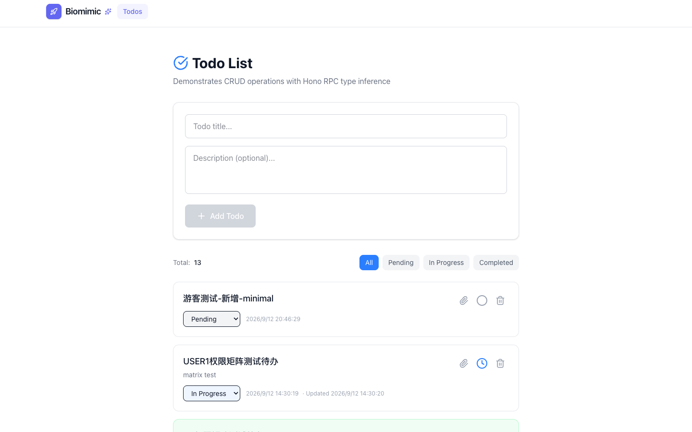

# Minimal — Test Playbook

> 站点：https://minimal.lpm1.top
> 身份数：1
> 每个身份列出：操作步骤 → 验证 → 截图 → 选择器

---

## 游客（唯一身份，无认证模块）

**凭据**: `无需登录`

**案例数**: 2

### 浏览 todos 列表

**步骤**:

1. 直接打开首页

**验证**: Todos 列表 + 极简导航（仅 Biomimic+Todos）

**截图**: 

### 新增 todo

**步骤**:

1. 在输入框填写标题
2. 点击 Add

**验证**: Total +1，新条目置顶

**截图**: 

---
