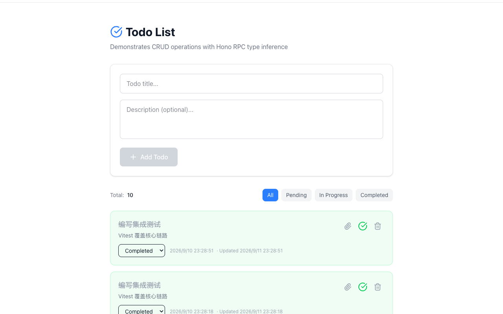
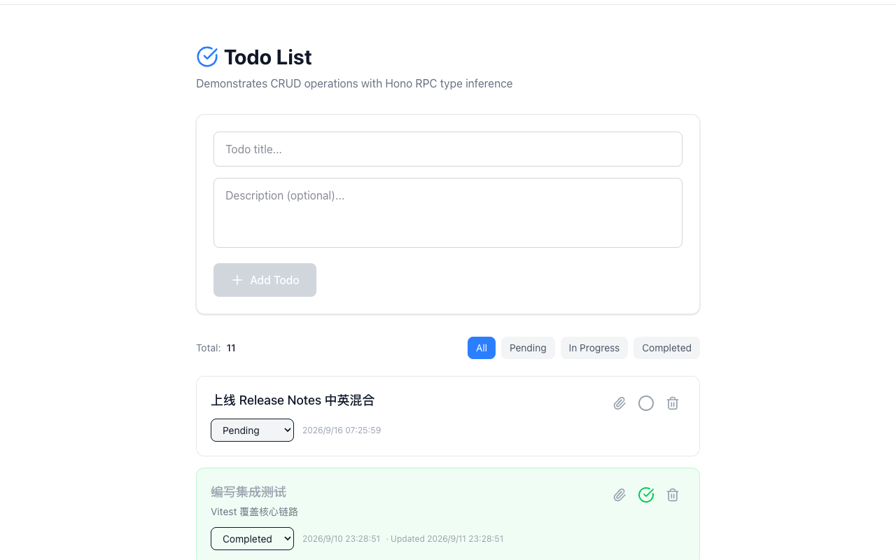
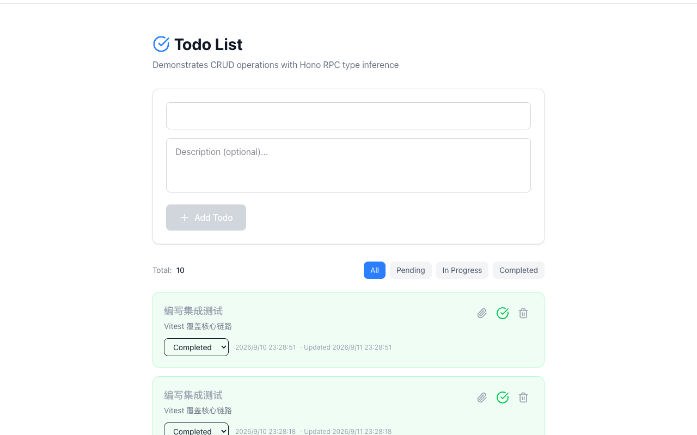
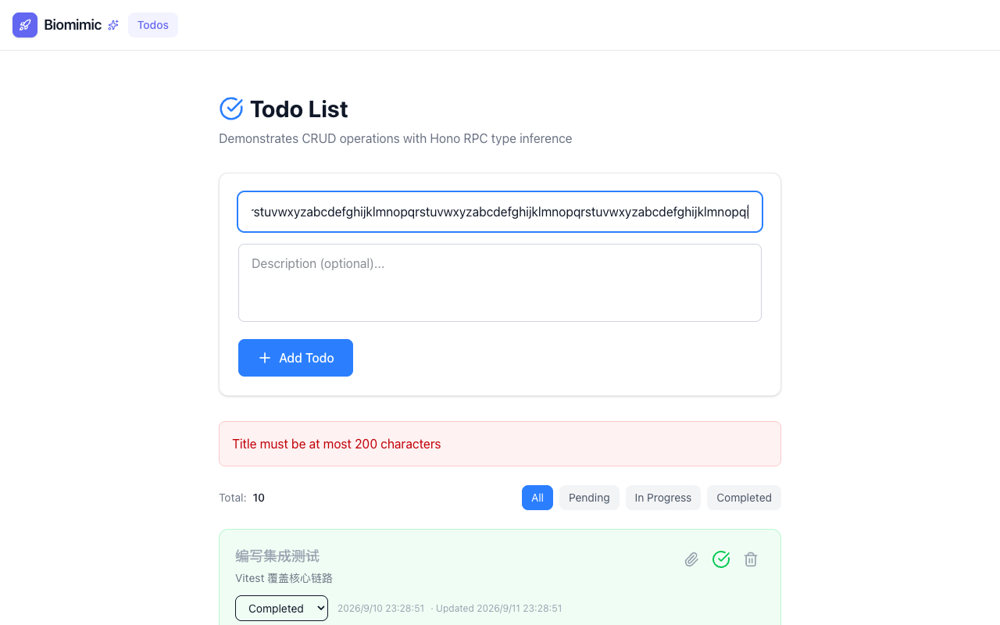
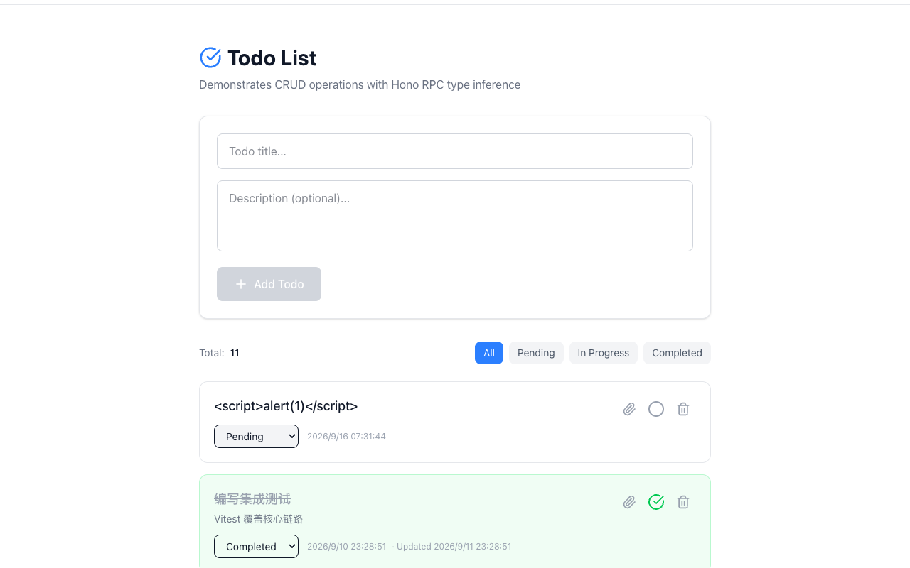
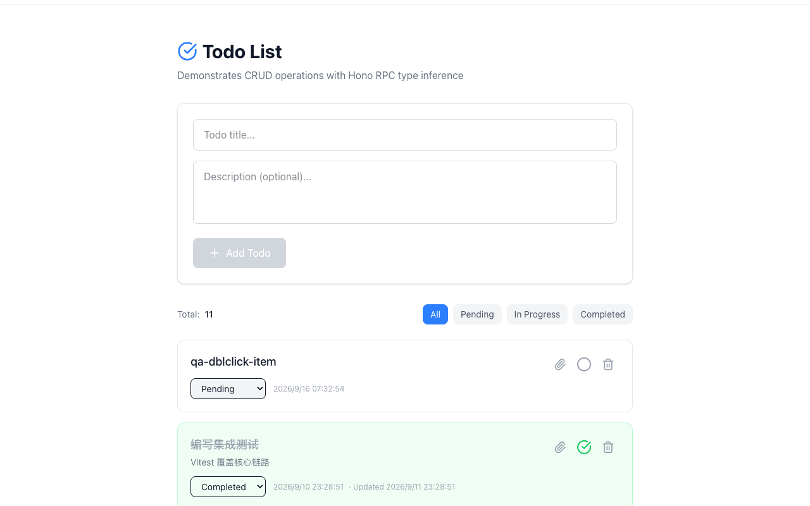

# Minimal — Test Playbook

> 站点：https://minimal.lpm1.top
> 身份数：1
> 每个身份列出：操作步骤 → 验证 → 截图 → 选择器

---

## 游客（唯一身份，无认证模块）

**凭据**: `无需登录`

**案例数**: 16

### 浏览 todos 列表

**步骤**:

1. 直接打开首页

**验证**: Todos 列表 + 极简导航（仅 Biomimic+Todos）

**截图**: 

### 新增 todo

**步骤**:

1. 在输入框填写标题
2. 点击 Add

**验证**: Total +1，新条目置顶

**截图**: 

### 输入中状态（按钮可用性）

**步骤**:

1. 聚焦输入框并输入标题（不提交）

**验证**: Add Todo 由 disabled 变可用

**截图**: 

**选择器**:
| 元素 | 选择器 |
|---|---|
| 输入框 | `[data-testid='todo-title-input']` |
| 添加按钮 | `[data-testid='add-todo-button']` |

### 新增后列表置顶

**步骤**:

1. 提交新增

**验证**: 新条目置顶，Total 12→13，输入框清空

**截图**: 

### 状态切换为 completed

**步骤**:

1. 下拉选择 completed

**验证**: 卡片变绿 + 标题划线 + 绿勾

**截图**: 

### 删除条目

**步骤**:

1. 点击删除

**验证**: 立即移除（无确认弹窗），Total 13→12

**截图**: 

### 移动端 375px

**步骤**:

1. 切 375x812 视口
2. 打开首页

**验证**: 无横向溢出；已知 P3：过滤 chips 右缘截断

**截图**: 

### 空标题提交无效（逆向）

**步骤**:

1. 不输入任何内容直接点击 Add

**验证**: 按钮禁用或提交无效果，不产生空标题条目

**截图**: 

### 状态切换后改回 pending（正向链）

**步骤**:

1. 下拉选择 completed
2. 再改回 pending

**验证**: 先变绿+划线，改回后恢复普通样式，无残留样式

**截图**: 

**选择器**:
| 元素 | 选择器 |
|---|---|
| 状态下拉 | `div.p-5.rounded-xl.border select` |

### 刷新后列表与状态保持（正向）

**步骤**:

1. 记录当前列表与某条状态
2. 按 F5 硬刷新

**验证**: 刷新后列表条目与状态和刷新前一致，Total 计数不变

**截图**: 

### 连续添加 3 条（正向批量链）

**步骤**:

1. 连续 3 次输入不同标题并点击 Add

**验证**: Total +3，三条按序置顶，测试后逐条删除清理（与 todo 站共享后端）

**截图**: 

**选择器**:
| 元素 | 选择器 |
|---|---|
| 输入框 | `[data-testid='todo-title-input']` |
| 添加按钮 | `[data-testid='add-todo-button']` |

### emoji/中英混合标题正常提交（正向）

**步骤**:

1. 输入 🚀 上线 Release Notes 中英混合 标题
2. 点击 Add
3. 确认后删除清理

**验证**: 条目正常显示无乱码无报错，清理后恢复基线

**截图**: 

### 纯空格标题提交（逆向）

**步骤**:

1. 输入框只输入多个空格
2. 观察 Add 按钮状态并尝试提交

**验证**: Add 保持 disabled 或提交无效果（trim 守卫），不产生空标题条目

**截图**: 

### 超长标题提交（逆向）

**步骤**:

1. 粘贴 256+ 字符长串标题
2. 点击 Add

**验证**: 实勘：接受则卡片换行不撑破布局且 Total +1；拒绝则校验提示——记录行为

**截图**: 

### XSS 注入标题转义验证（逆向）

**步骤**:

1. 标题输入 ，点击 Add
2. 查看卡片渲染

**验证**: 纯文本渲染不执行（无弹窗），随后删除清理

**截图**: 

### 双击 Add 防重（逆向）

**步骤**:

1. 输入标题后快速双击 Add 按钮

**验证**: 仅新增 1 条（若重复记录为缺陷），随后清理

**截图**: 

---
