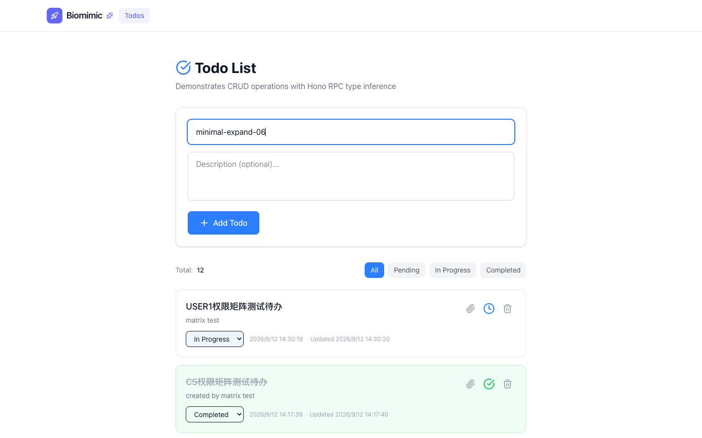
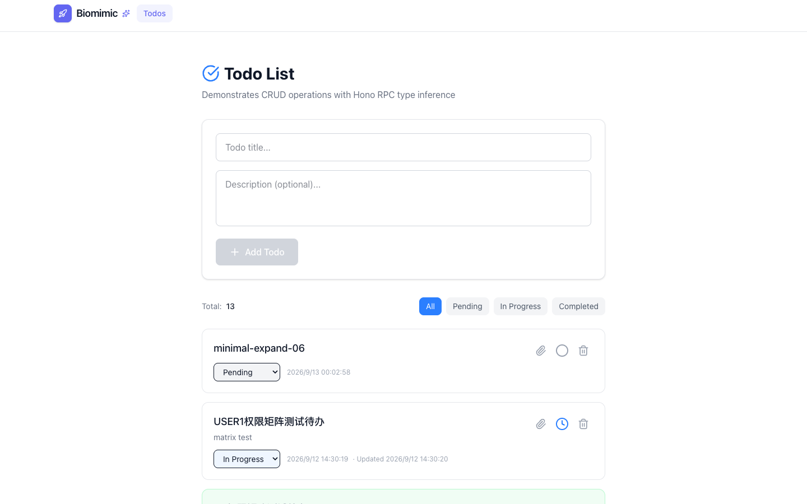
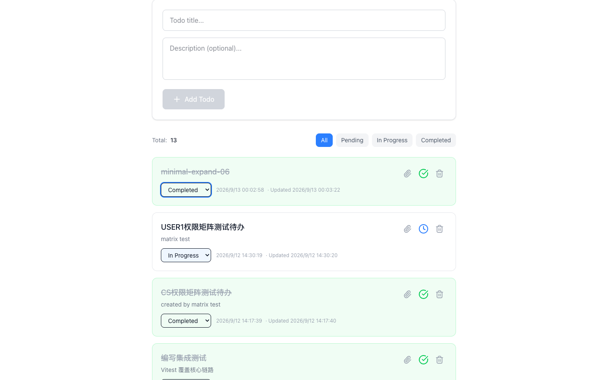
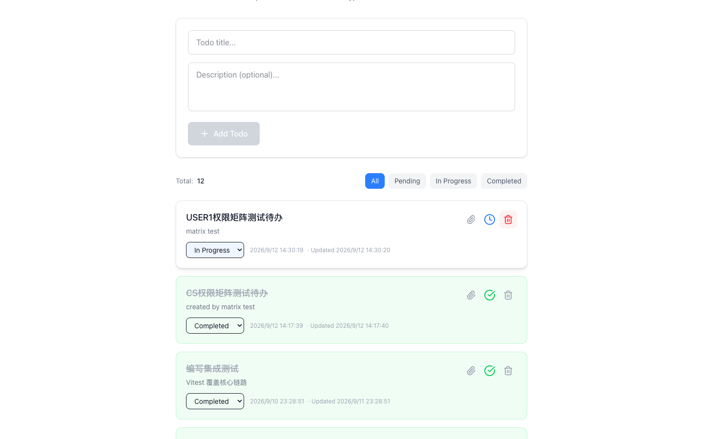
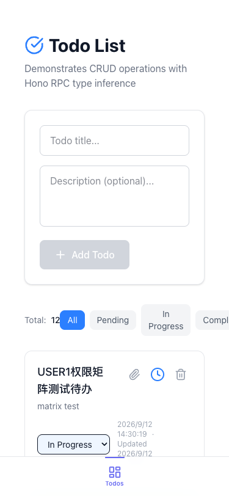

# Minimal — Test Playbook

> 站点：https://minimal.lpm1.top
> 身份数：1
> 每个身份列出：操作步骤 → 验证 → 截图 → 选择器

---

## 游客（唯一身份，无认证模块）

**凭据**: `无需登录`

**案例数**: 7

### 浏览 todos 列表

**步骤**:

1. 直接打开首页

**验证**: Todos 列表 + 极简导航（仅 Biomimic+Todos）

**截图**: 

### 新增 todo

**步骤**:

1. 在输入框填写标题
2. 点击 Add

**验证**: Total +1，新条目置顶

**截图**: 

### 输入中状态（按钮可用性）

**步骤**:

1. 聚焦输入框并输入标题（不提交）

**验证**: Add Todo 由 disabled 变可用

**截图**: 

**选择器**:
| 元素 | 选择器 |
|---|---|
| 输入框 | `[data-testid='todo-title-input']` |
| 添加按钮 | `[data-testid='add-todo-button']` |

### 新增后列表置顶

**步骤**:

1. 提交新增

**验证**: 新条目置顶，Total 12→13，输入框清空

**截图**: 

### 状态切换为 completed

**步骤**:

1. 下拉选择 completed

**验证**: 卡片变绿 + 标题划线 + 绿勾

**截图**: 

### 删除条目

**步骤**:

1. 点击删除

**验证**: 立即移除（无确认弹窗），Total 13→12

**截图**: 

### 移动端 375px

**步骤**:

1. 切 375x812 视口
2. 打开首页

**验证**: 无横向溢出；已知 P3：过滤 chips 右缘截断

**截图**: 

---
