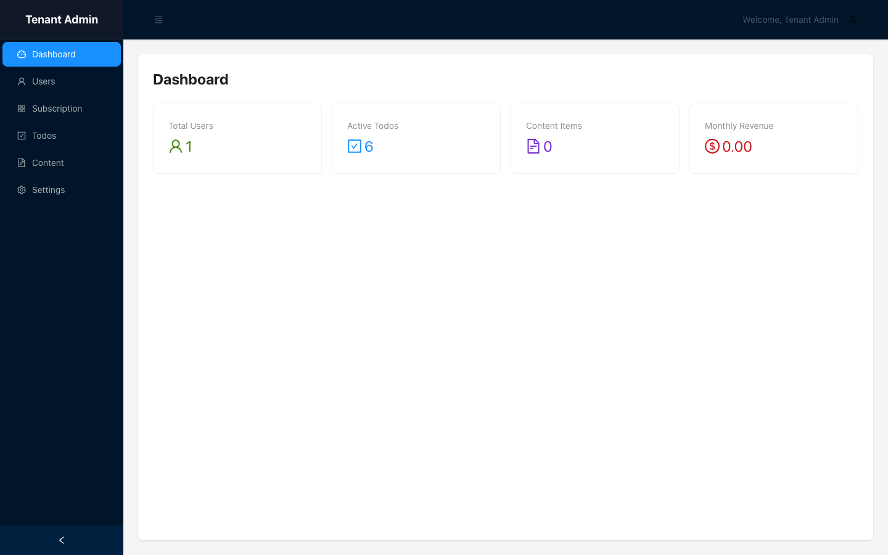
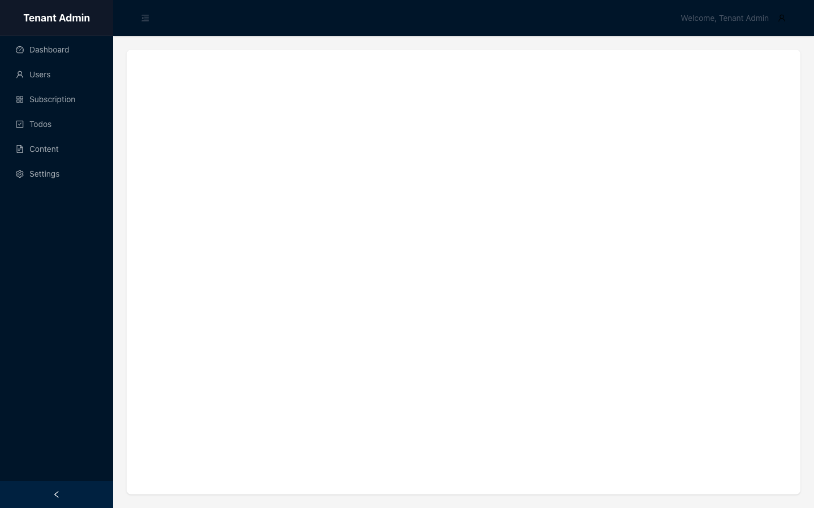
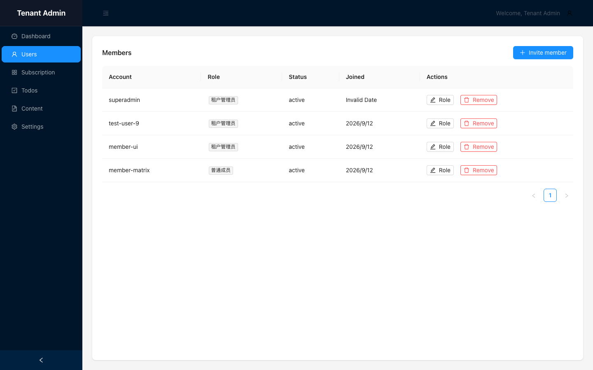
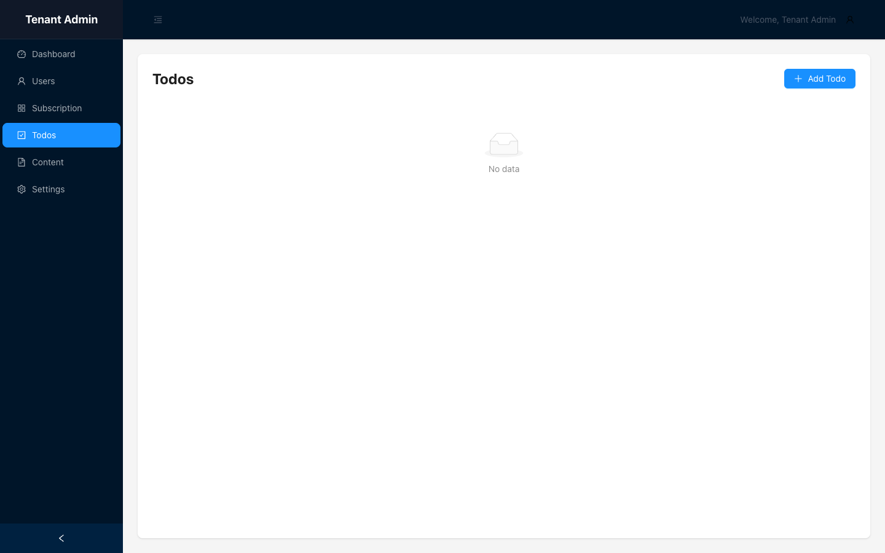
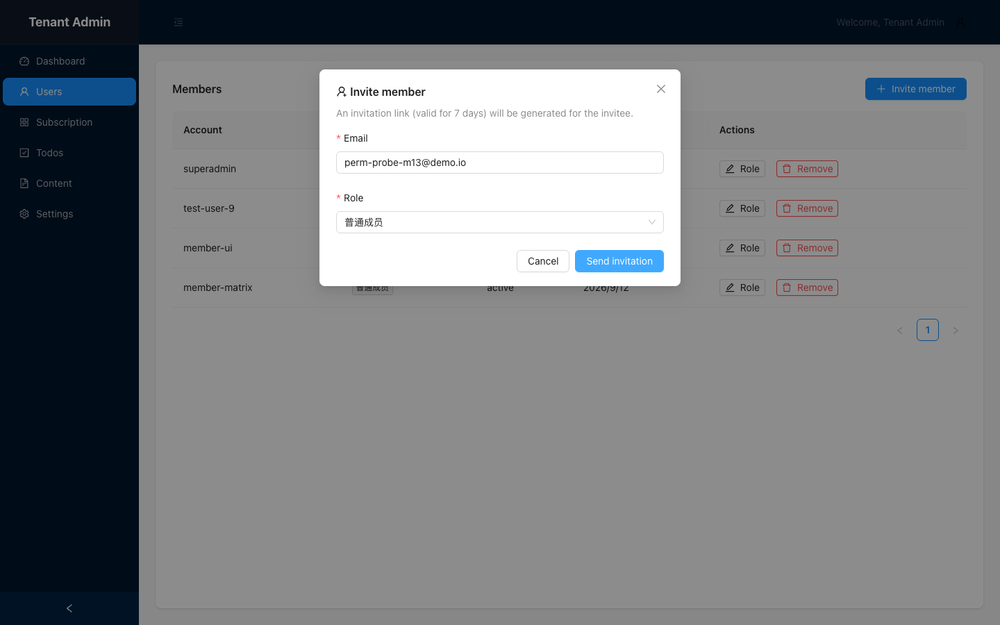
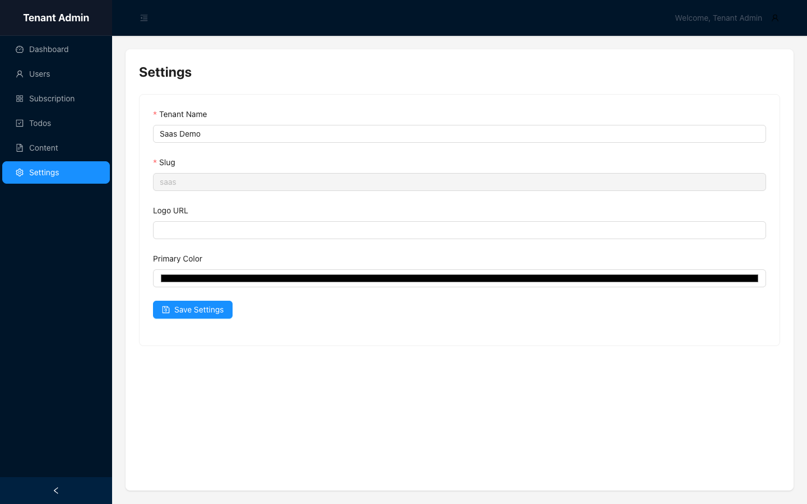
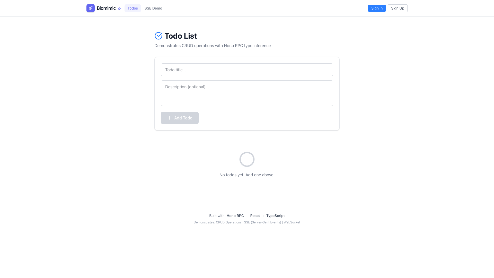
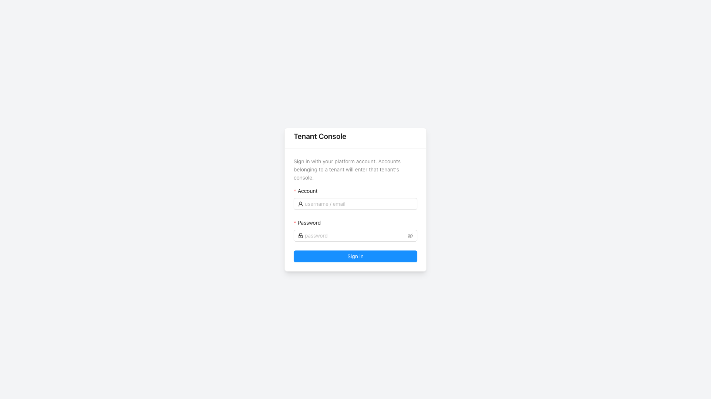
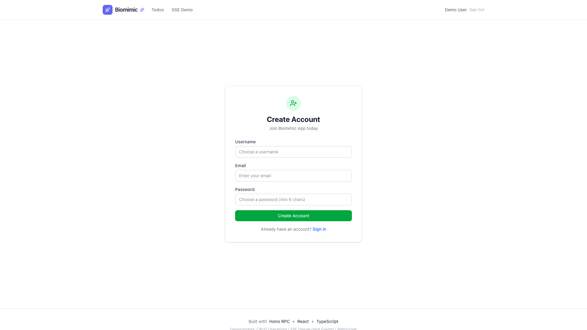
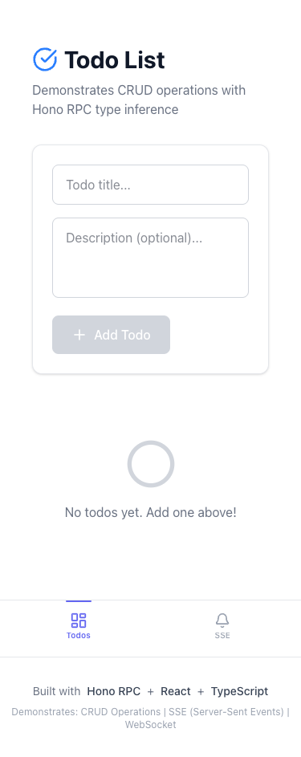

# SaaS Multi-Tenant — Test Playbook

> 站点：https://saas.lpm1.top
> 身份数：3
> 每个身份列出：操作步骤 → 验证 → 截图 → 选择器

---

## 租户管理员

**凭据**: `superadmin / admin123（/tenant/login）`

**案例数**: 9

### 登录租户控制台

**步骤**:

1. 打开 https://saas.lpm1.top/tenant/login
2. 输入 superadmin / admin123
3. 点击 Sign in

**验证**: 进入 /tenant/dashboard，四统计卡正常

**截图**: 

**选择器**:
| 元素 | 选择器 |
|---|---|
| 账号输入框 | `#account` |
| 密码输入框 | `#password` |
| 登录按钮 | `button.ant-btn` |

### 查看仪表盘

**步骤**:

1. 登录后自动到达 /tenant/dashboard

**验证**: Total Users / Active Todos / Content Items / Monthly Revenue 统计卡

**截图**: 

### 成员列表管理

**步骤**:

1. 点击侧栏 Users

**验证**: 成员表格 + 角色徽章 + Invite member 按钮

**截图**: 

**选择器**:
| 元素 | 选择器 |
|---|---|
| 成员表格 | `.ant-table` |
| 邀请按钮 | `find text 'Invite member'` |

### 邀请成员（正向→正向链）

**步骤**:

1. 点击 Invite member
2. 填写邮箱 member@example.com
3. 选择角色（下拉）
4. 点击 Send invitation

**验证**: 绿色 toast "Invitation created"

**截图**: 

**选择器**:
| 元素 | 选择器 |
|---|---|
| 邮箱输入框 | `#email` |
| 角色下拉 | `.ant-select` |
| 发送按钮 | `find text 'Send invitation'` |

### 租户设置

**步骤**:

1. 点击侧栏 Settings
2. 修改 Tenant Name
3. 点击保存

**验证**: toast "Settings updated successfully"

**截图**: 

### 超管工作台全景（2026-09-12 补拍）

**步骤**:

1. superadmin/admin123 登录 /tenant/login

**验证**: 四统计卡正常；P3：Total Users=1 与成员视角=4 矛盾

**截图**: 

### 租户列表页（逆向：UI 缺失）

**步骤**:

1. 探测 /tenant/tenants 与 /admin

**验证**: ⚠ P2：无租户列表页（回退控制台壳），但 GET /api/tenants 200 数据在

**截图**: 

### 成员管理表（超管视角）

**步骤**:

1. 访问 /tenant/users

**验证**: Members 表 4 行 + Role/Remove + Invite；已知 P3：Joined=Invalid Date

**截图**: 

### 审计日志页（逆向：无 UI 无租户维度）

**步骤**:

1. 探测 /tenant/audit /tenant/audit-logs /tenant/logs

**验证**: ⚠ P2：三路由全回退壳无内容；API 仅全局 /api/audit-logs 可达

**截图**: 

---

## 租户成员

**凭据**: `member-matrix@demo.io（/tenant/login UI 登录）`

**案例数**: 6

### 接受邀请加入租户

**步骤**:

1. 注册新账号（POST /api/auth/register）
2. 超管创建邀请并获取 token
3. 登录后打开 /tenant/invite/<token>
4. 点击 Accept invitation

**验证**: 自动进入 /tenant/dashboard

**截图**: 

### 邀请成员被拒（API 403）

**步骤**:

1. 以成员身份登录
2. 尝试点击 Invite member

**验证**: UI 按钮可见但提交后 API 403 Permission denied

**截图**: 

### 成员视角工作台（2026-09-12 补拍）

**步骤**:

1. 成员登录 /tenant/login

**验证**: 落地 dashboard，按用户隔离（A Todos=0）；P3：顶栏写死 Tenant Admin

**截图**: 

### 成员视角数据页

**步骤**:

1. 访问 /tenant/todos

**验证**: No data（用户隔离）；⚠ 管理入口 +Add Todo 未按权限隐藏

**截图**: 

### 越权邀请（逆向：前端静默吞 403）

**步骤**:

1. 成员提交邀请表单

**验证**: ⚠ P2 BUG：UI 零反馈静默失败（后端 403 正确，前端不提示）

**截图**: 

**选择器**:
| 元素 | 选择器 |
|---|---|
| 邮箱输入框 | `#email` |
| 发送按钮 | `find text 'Send invitation'` |

### 成员访问租户设置（逆向：越权可写）

**步骤**:

1. 成员身份访问 /tenant/settings

**验证**: ⚠ P2 BUG：Tenant Name 可编辑可保存（成员可改租户名）

**截图**: 

---

## 访客（未登录）

**凭据**: `无需登录`

**案例数**: 7

### 直访受保护页被拦截

**步骤**:

1. 直接打开 /tenant/dashboard（不登录）

**验证**: 被 TenantGuard 拦回 /tenant/login

**截图**: 

### 伪造邀请 token 被拒

**步骤**:

1. 打开 /tenant/invite/invalid-token-12345

**验证**: 红字 "Invitation not found."

**截图**: 

### 门户首页全貌（2026-09-12 补拍）

**步骤**:

1. 打开 /（未登录）

**验证**: SPA 重定向 /todos，落地页完整（导航/Todos/SSE Demo/Sign In+Sign Up）

**截图**: 

### 直访 /tenant/console 拦截

**步骤**:

1. 未登录打开 /tenant/console

**验证**: TenantGuard 拦回 /tenant/login 登录卡

**截图**: 

### 注册页表单

**步骤**:

1. 打开 /register

**验证**: Create Account 卡完整；注意 SPA 自动播种 Demo User 怪癖

**截图**: 

### 忘记密码入口探测（逆向：全线缺失）

**步骤**:

1. /login /register /tenant/login 三页文本探测 forgot/help/reset

**验证**: ⚠ 缺口：全站无忘记密码/帮助入口（SKIP 记录）

### 游客首页移动版（375px）

**步骤**:

1. 切 375x812 视口打开首页

**验证**: 纵向堆叠正常；⚠ P3：375px 页头隐藏，游客看不到登录入口

**截图**: 

---
