# SaaS Multi-Tenant — Test Playbook

> 站点：https://saas.lpm1.top
> 身份数：3
> 每个身份列出：操作步骤 → 验证 → 截图 → 选择器

---

## 租户管理员

**凭据**: `superadmin / admin123（/tenant/login）`

**案例数**: 25

### 登录租户控制台

**步骤**:

1. 打开 https://saas.lpm1.top/tenant/login
2. 输入 superadmin / admin123
3. 点击 Sign in

**验证**: 进入 /tenant/dashboard，四统计卡正常

**截图**: 

**选择器**:
| 元素 | 选择器 |
|---|---|
| 账号输入框 | `#account` |
| 密码输入框 | `#password` |
| 登录按钮 | `button.ant-btn` |

### 查看仪表盘

**步骤**:

1. 登录后自动到达 /tenant/dashboard

**验证**: Total Users / Active Todos / Content Items / Monthly Revenue 统计卡

**截图**: 

### 成员列表管理

**步骤**:

1. 点击侧栏 Users

**验证**: 成员表格 + 角色徽章 + Invite member 按钮

**截图**: 

**选择器**:
| 元素 | 选择器 |
|---|---|
| 成员表格 | `.ant-table` |
| 邀请按钮 | `find text 'Invite member'` |

### 邀请成员（正向→正向链）

**步骤**:

1. 点击 Invite member
2. 填写邮箱 member@example.com
3. 选择角色（下拉）
4. 点击 Send invitation

**验证**: 绿色 toast "Invitation created"

**截图**: 

**选择器**:
| 元素 | 选择器 |
|---|---|
| 邮箱输入框 | `#email` |
| 角色下拉 | `.ant-select` |
| 发送按钮 | `find text 'Send invitation'` |

### 租户设置

**步骤**:

1. 点击侧栏 Settings
2. 修改 Tenant Name
3. 点击保存

**验证**: toast "Settings updated successfully"

**截图**: 

### 超管工作台全景（2026-09-12 补拍）

**步骤**:

1. superadmin/admin123 登录 /tenant/login

**验证**: 四统计卡正常；P3：Total Users=1 与成员视角=4 矛盾

**截图**: 

### 平台租户列表页（已补建·正向复验）

**步骤**:

1. 超管登录后访问 /tenant/tenants

**验证**: ✅ 已补建（第三轮）：租户表格渲染全部租户（名称/套餐/状态 Tag），终验 9 行 PASS

**截图**: 

### 成员管理表（超管视角）

**步骤**:

1. 访问 /tenant/users

**验证**: Members 表 4 行 + Role/Remove + Invite；已知 P3：Joined=Invalid Date

**截图**: 

### 审计日志页（已补建·全局维度）

**步骤**:

1. 超管登录后访问 /tenant/audit

**验证**: ✅ 已补建（第三轮）：审计表格渲染（时间/用户/操作/资源/IP），终验 20 行 PASS；租户维度过滤仍为待定项

**截图**: 

### 平台租户列表查看

**步骤**:

1. 超管登录后侧栏点击"平台租户"（/tenant/tenants）

**验证**: 租户表格渲染全部租户（名称/套餐/状态 Tag）

**截图**: 

### 平台审计日志查看

**步骤**:

1. 侧栏点击"审计日志"（/tenant/audit）

**验证**: 审计表格渲染（时间/用户/操作/资源/IP），分页可用

**截图**: 

### 邀请无效邮箱被拒（逆向）

**步骤**:

1. Invite member 填入非法格式邮箱提交

**验证**: 表单/后端校验拦截，提示格式错误，不产生邀请

**截图**: 

### 租户设置修改后还原（正向链）

**步骤**:

1. Settings 页把 Tenant Name 改为 QA-Temp-Name
2. 点击 Save Settings
3. 改回 Saas Demo 再次保存

**验证**: 两次均 toast "Settings updated successfully"，回读 #name 为 Saas Demo

**截图**: 

**选择器**:
| 元素 | 选择器 |
|---|---|
| 租户名输入框 | `#name` |
| 保存按钮 | `button.ant-btn` |

### 仪表盘刷新后统计保持（正向）

**步骤**:

1. 登录后记录 /tenant/dashboard 四统计卡数值
2. 按 F5 硬刷新

**验证**: 刷新后四统计卡与刷新前一致（已知口径矛盾另案），无清零

**截图**: 

### 平台租户列表渲染与分页探测（正向实勘）

**步骤**:

1. 侧栏点击"平台租户"进入 /tenant/tenants
2. 检查表格行数、排序与分页控件

**验证**: 实勘：9 个租户渲染（ID 1..11），分页/排序能力以实勘为准——操作后表格无崩溃

**截图**: 

**选择器**:
| 元素 | 选择器 |
|---|---|
| 平台租户侧栏链接 | `a[href='/tenant/tenants']` |

### 审计日志列表与排序探测（正向实勘）

**步骤**:

1. 侧栏点击"审计日志"进入 /tenant/audit
2. 检查 20 行渲染与操作 tag

**验证**: 实勘：表格 20 行 + create tag 渲染；排序/分页能力记录，操作后无崩溃

**截图**: 

**选择器**:
| 元素 | 选择器 |
|---|---|
| 审计日志侧栏链接 | `a[href='/tenant/audit']` |

### 邀请角色选普通成员（正向链）

**步骤**:

1. Users 页点击 Invite member
2. 填入 invite-member-qa@demo.io
3. 角色下拉选"普通成员"
4. 点击 Send invitation

**验证**: 绿色 toast "Invitation created"，角色为 tr_saas_member

**截图**: 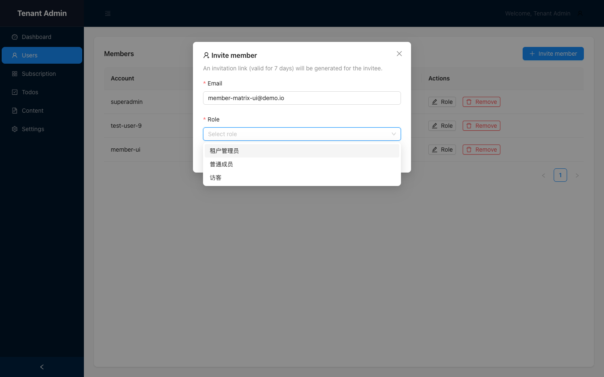

**选择器**:
| 元素 | 选择器 |
|---|---|
| 邮箱输入框 | `.ant-modal input.ant-input` |
| 角色下拉 | `.ant-modal .ant-select-selector` |
| 角色选项 | `.ant-select-item-option[title='普通成员']` |
| 发送按钮 | `.ant-modal .ant-btn-primary` |

### Todo 连续创建 3 条（正向批量链）

**步骤**:

1. 进入 /tenant/todos
2. 连续 + Add Todo 创建 3 条不同标题（OK 提交）

**验证**: 3 条均出现在管理员列表（管理员可见全部创建者行），随后逐条删除清理

**截图**: 

**选择器**:
| 元素 | 选择器 |
|---|---|
| 新增按钮 | `button.ant-btn-primary` |
| 标题输入框 | `#title` |
| 提交按钮 | `.ant-modal .ant-btn-primary` |

### Todo 创建后删除闭环（正向）

**步骤**:

1. - Add Todo 创建一条 qa-delete-me
2. 行内点击删除按钮
3. Confirm Delete 弹窗点击 Yes

**验证**: 确认后该行移除，列表计数回落

**截图**: 

**选择器**:
| 元素 | 选择器 |
|---|---|
| 删除确认按钮 | `.ant-modal-confirm-btns button.ant-btn-primary` |

### 超管登出重登（正向链）

**步骤**:

1. header 用户图标 → Logout
2. 重新 superadmin/admin123 登录

**验证**: 登出跳 /tenant/login 且 tenant-token/current-tenant-slug 双清空，重登后 dashboard 正常

**截图**: 

### 邀请超长邮箱被拒（逆向）

**步骤**:

1. Invite member 邮箱填入 256+ 字符非法长串
2. 点击 Send invitation

**验证**: 表单/后端校验拦截（格式或长度），不产生邀请记录

**截图**: 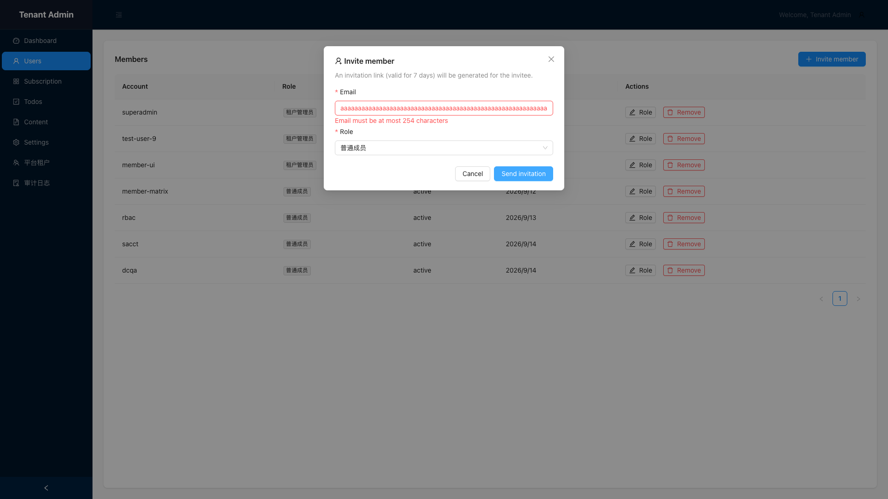

### 邀请纯空格邮箱被拒（逆向）

**步骤**:

1. Invite member 邮箱只输入空格
2. 点击 Send invitation

**验证**: 校验拦截提示格式错误，不产生邀请

**截图**: 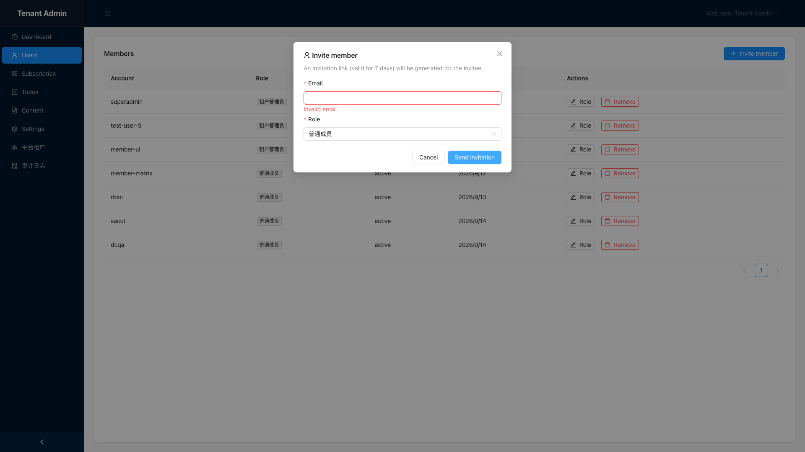

### Todo 标题 XSS 注入转义验证（逆向）

**步骤**:

1. - Add Todo 标题输入 
2. OK 提交后查看列表

**验证**: 标题纯文本渲染不执行（无弹窗），随后删除清理

**截图**: 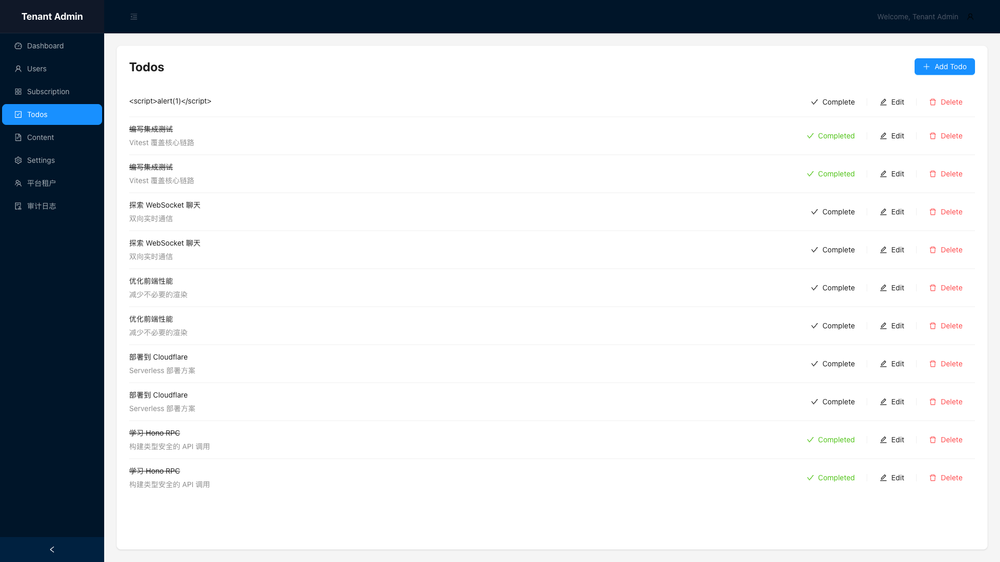

**选择器**:
| 元素 | 选择器 |
|---|---|
| 标题输入框 | `#title` |
| 提交按钮 | `.ant-modal .ant-btn-primary` |

### 伪造 Bearer token 调平台 API（逆向）

**步骤**:

1. curl -H "Authorization: Bearer fake-token123" 请求 GET /api/tenants

**验证**: 返回 401，不泄露租户清单

**截图**: 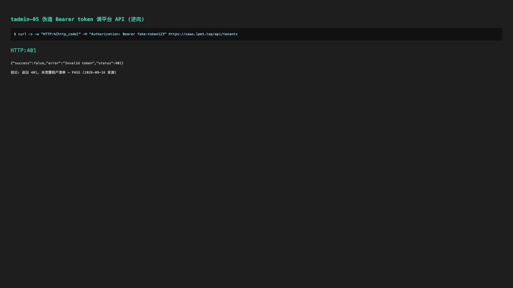

### 双击 Send invitation 防重（逆向）

**步骤**:

1. 填写邀请表单后快速双击 Send invitation

**验证**: 实勘：仅 1 次 toast/1 条邀请（若重复创建记录为缺陷），随后清理

**截图**: 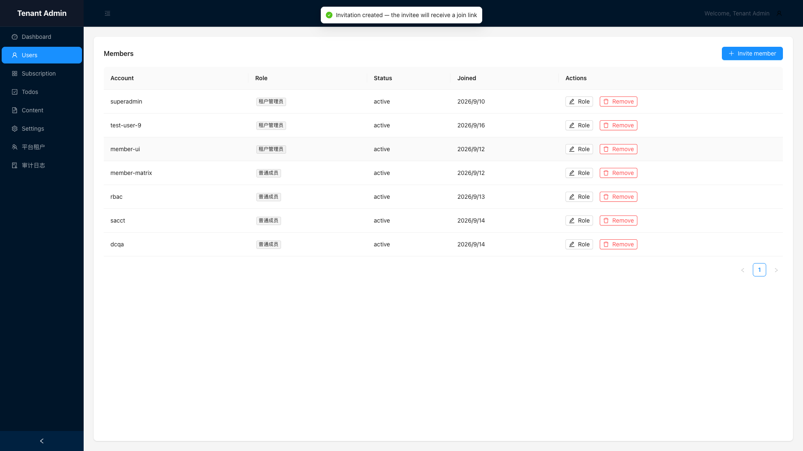

---

## 租户成员

**凭据**: `member-matrix@demo.io（/tenant/login UI 登录）`

**案例数**: 14

### 接受邀请加入租户

**步骤**:

1. 注册新账号（POST /api/auth/register）
2. 超管创建邀请并获取 token
3. 登录后打开 /tenant/invite/<token>
4. 点击 Accept invitation

**验证**: 自动进入 /tenant/dashboard

**截图**: 

### 邀请成员被拒（API 403）

**步骤**:

1. 以成员身份登录
2. 尝试点击 Invite member

**验证**: UI 按钮可见但提交后 API 403 Permission denied

**截图**: 

### 成员视角工作台（2026-09-12 补拍）

**步骤**:

1. 成员登录 /tenant/login

**验证**: 落地 dashboard，按用户隔离（A Todos=0）；P3：顶栏写死 Tenant Admin

**截图**: 

### 成员视角数据页

**步骤**:

1. 访问 /tenant/todos

**验证**: No data（用户隔离）；⚠ 管理入口 +Add Todo 未按权限隐藏

**截图**: 

### 越权邀请（逆向：前端静默吞 403）

**步骤**:

1. 成员提交邀请表单

**验证**: ⚠ P2 BUG：UI 零反馈静默失败（后端 403 正确，前端不提示）

**截图**: 

**选择器**:
| 元素 | 选择器 |
|---|---|
| 邮箱输入框 | `#email` |
| 发送按钮 | `find text 'Send invitation'` |

### 成员访问租户设置（逆向：越权可写）

**步骤**:

1. 成员身份访问 /tenant/settings

**验证**: ⚠ P2 BUG：Tenant Name 可编辑可保存（成员可改租户名）

**截图**: 

### 成员视角无成员管理按钮（RBAC 收敛验证）

**步骤**:

1. 成员身份进入 Users 页

**验证**: 无 Invite member 按钮、成员行无 Role/Remove 操作控件，Role 仅只读徽章

**截图**: 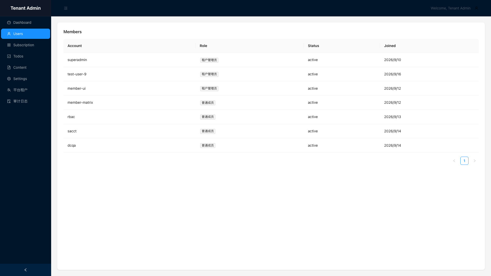

### 成员越权访问平台 API（逆向）

**步骤**:

1. 成员 token 直接请求 GET /api/tenants 与 /api/audit-logs

**验证**: 均返回 403，不泄露平台级数据

**截图**: 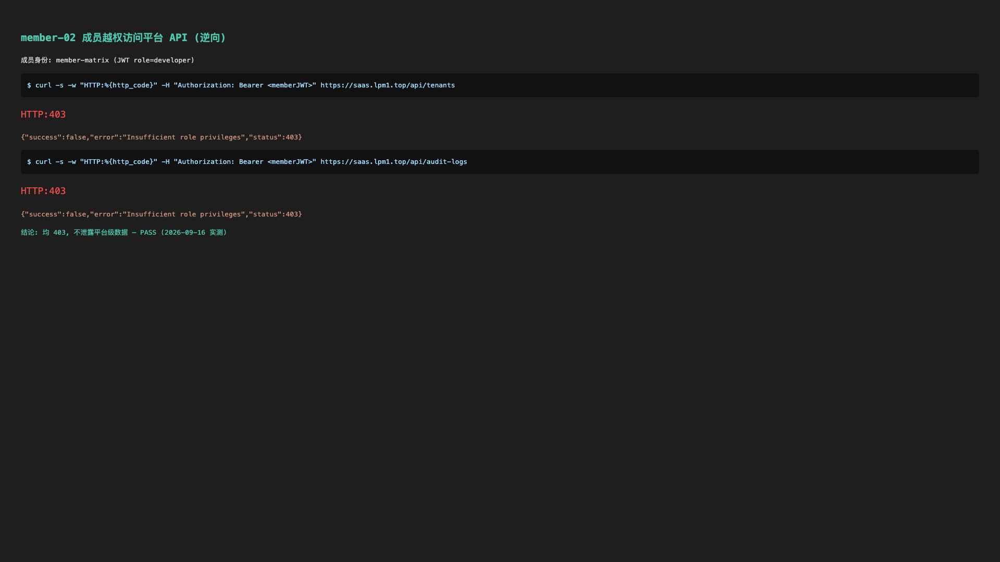

### 成员新增 Todo（正向）

**步骤**:

1. 成员登录进入 /tenant/todos
2. - Add Todo 填写标题提交

**验证**: todo 创建成功且仅自己可见（成员视角 data:create 权限）

**截图**: 

**选择器**:
| 元素 | 选择器 |
|---|---|
| 新增按钮 | `button.ant-btn-primary` |
| 标题输入框 | `#title` |
| 提交按钮 | `.ant-modal .ant-btn-primary` |

### 成员删除自己 Todo（正向闭环）

**步骤**:

1. 在刚创建的 todo 行点击删除
2. 确认弹窗点击 Yes

**验证**: 该行移除回到基线，成员数据隔离不波及他人

**截图**: 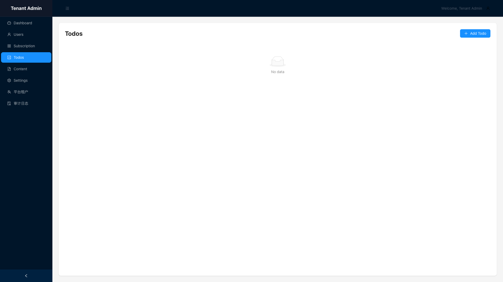

**选择器**:
| 元素 | 选择器 |
|---|---|
| 删除确认按钮 | `.ant-modal-confirm-btns button.ant-btn-primary` |

### 成员登出重登状态保持（正向链）

**步骤**:

1. header 用户图标 → Logout
2. 重新以 member-matrix 登录

**验证**: 重登后仍落地 /tenant/dashboard，数据隔离（A Todos=0）与角色不变

**截图**: 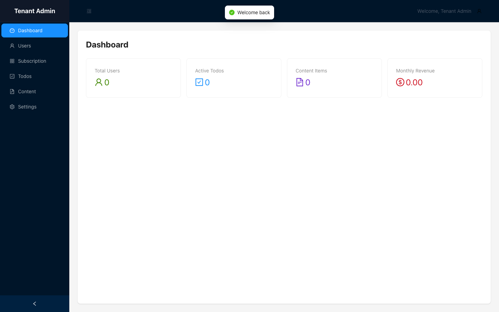

### 成员访问平台租户页（逆向·已知缺陷复现）

**步骤**:

1. 成员身份硬加载 /tenant/tenants

**验证**: ⚠ 已知缺陷：成员亦渲染全量平台租户表（super_admin 鉴权前后端两层均缺）；记录复现，不作为通过标准

**截图**: 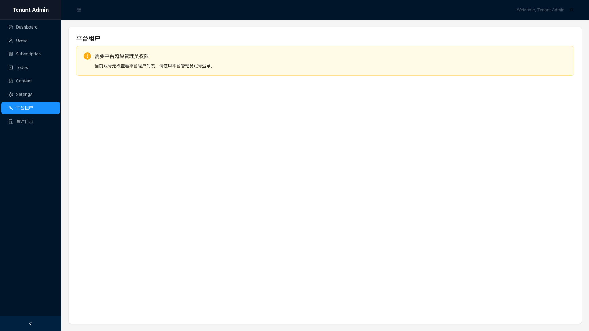

### 成员 Todo 超长标题（逆向）

**步骤**:

1. - Add Todo 标题粘贴 256+ 字符
2. OK 提交

**验证**: 实勘：被 zod 长度校验拒绝则提示；接受则正常入列——记录行为，无崩溃

**截图**: 

**选择器**:
| 元素 | 选择器 |
|---|---|
| 标题输入框 | `#title` |
| 提交按钮 | `.ant-modal .ant-btn-primary` |

### 缺 roleId 的邀请 API 被拒（逆向·API 级）

**步骤**:

1. 以成员 JWT POST /api/tenants/5/members/invite，body 只含 email 不含 roleId

**验证**: 返回 400 ZodError（缺 roleId），不产生邀请；越权邀请 403 另案

**截图**: 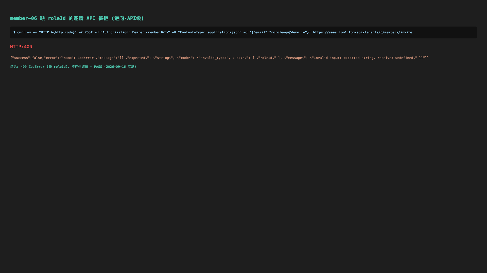

---

## 访客（未登录）

**凭据**: `无需登录`

**案例数**: 17

### 直访受保护页被拦截

**步骤**:

1. 直接打开 /tenant/dashboard（不登录）

**验证**: 被 TenantGuard 拦回 /tenant/login

**截图**: 

### 伪造邀请 token 被拒

**步骤**:

1. 打开 /tenant/invite/invalid-token-12345

**验证**: 红字 "Invitation not found."

**截图**: 

### 门户首页全貌（2026-09-12 补拍）

**步骤**:

1. 打开 /（未登录）

**验证**: SPA 重定向 /todos，落地页完整（导航/Todos/SSE Demo/Sign In+Sign Up）

**截图**: 

### 直访 /tenant/console 拦截

**步骤**:

1. 未登录打开 /tenant/console

**验证**: TenantGuard 拦回 /tenant/login 登录卡

**截图**: 

### 注册页表单

**步骤**:

1. 打开 /register

**验证**: Create Account 卡完整；注意 SPA 自动播种 Demo User 怪癖

**截图**: 

### 忘记密码入口探测（逆向·产品待定项）

**步骤**:

1. /login /register /tenant/login 三页文本探测 forgot/help/reset

**验证**: ⚠ 缺口：全站无忘记密码/帮助入口（SKIP 记录）

### 游客首页移动版（375px）

**步骤**:

1. 切 375x812 视口打开首页

**验证**: 纵向堆叠正常；⚠ P3：375px 页头隐藏，游客看不到登录入口

**截图**: 

### 未登录访问平台 API（逆向）

**步骤**:

1. 无 token 请求 GET /api/tenants

**验证**: 返回 401，不泄露租户清单

**截图**: 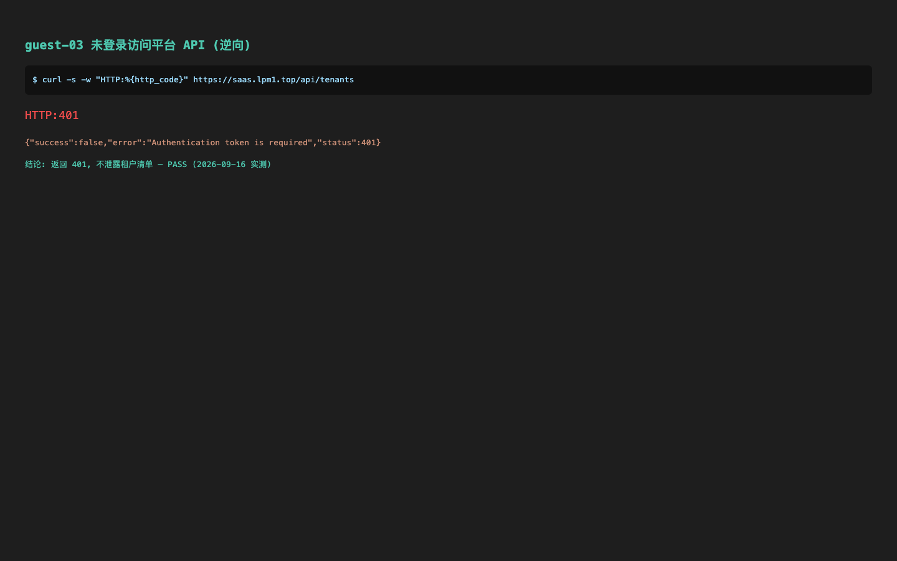

### 错误密码登录被拒（逆向）

**步骤**:

1. /tenant/login 输入 superadmin / wrongpass
2. 点击 Sign in

**验证**: 登录失败提示错误，不进入 dashboard，不签发有效 token

**截图**: 

**选择器**:
| 元素 | 选择器 |
|---|---|
| 账号输入框 | `#account` |
| 密码输入框 | `#password` |
| 登录按钮 | `button.ant-btn` |

### 纯空格账号登录被拒（逆向）

**步骤**:

1. 账号输入空格，密码输入任意值
2. 点击 Sign in

**验证**: 校验或后端拒绝，停留登录页不进入控制台

**截图**: 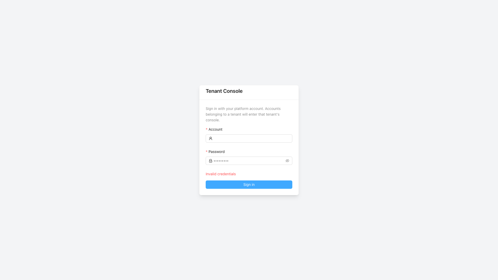

### XSS 注入登录账号（逆向）

**步骤**:

1. 账号输入 ，密码任意
2. 点击 Sign in

**验证**: 错误提示按文本渲染不执行脚本（无弹窗），登录失败

**截图**: 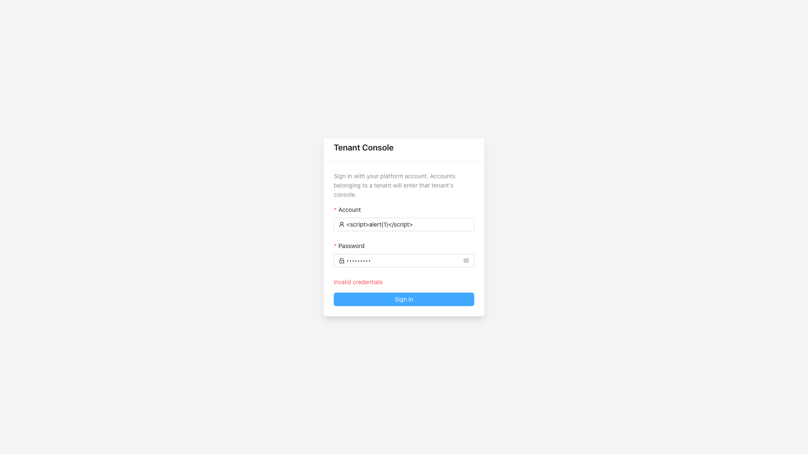

### 双击登录按钮防重（逆向）

**步骤**:

1. 填入有效凭据后快速双击 Sign in

**验证**: 仅一次登录跳转，不产生双 token/双跳转

**截图**: 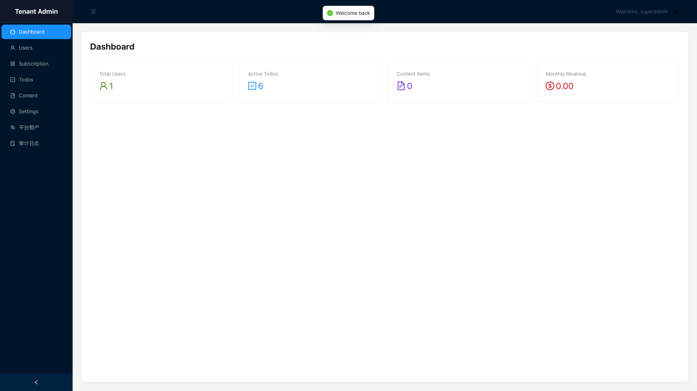

### 注册必填项逐个缺失（逆向）

**步骤**:

1. 打开 /register
2. 分别只填两项留一项提交（username/email/password 三轮）

**验证**: 每轮均被校验拦截并提示对应必填项，不产生半注册账号

**截图**: 

### 注册密码短于 6 位被拒（逆向）

**步骤**:

1. /register 填写合法用户名/邮箱，密码输入 abc1
2. 提交

**验证**: min 6 校验拦截并提示，注册不成功

**截图**: 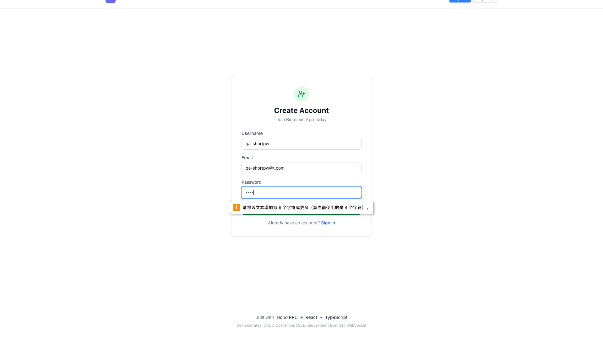

### 注册含 emoji 用户名（正向实勘）

**步骤**:

1. /register 用户名输入 🚀qa_emoji 类含 emoji 用户名提交

**验证**: 实勘：注册成功或被校验拒绝均记录（参考 todo 站中文名可用先例），无 500

**截图**: 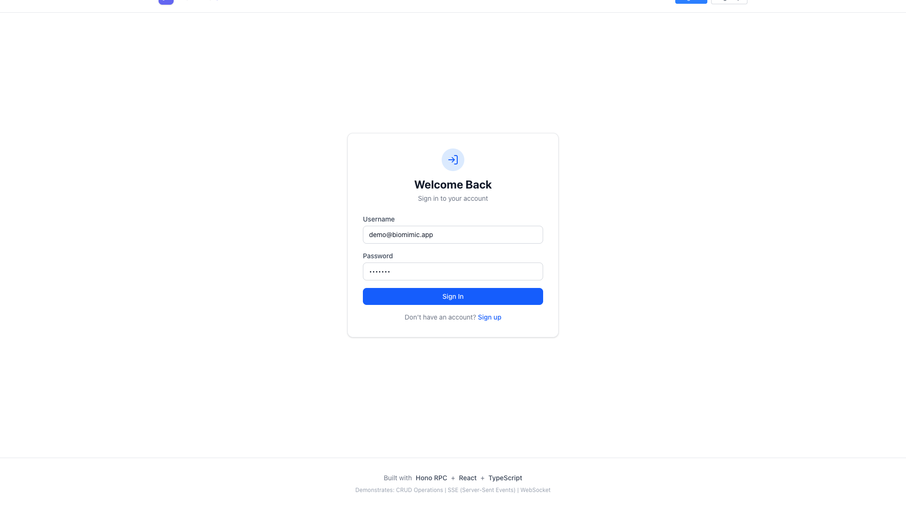

### 访客直访租户子页批量拦截（逆向）

**步骤**:

1. 未登录依次直接打开 /tenant/users、/tenant/todos、/tenant/settings

**验证**: 三个路由均被 TenantGuard 拦回 /tenant/login，不泄露任何数据

**截图**: 

### 伪造 token 调 /api/auth/me（逆向）

**步骤**:

1. curl -H "Authorization: Bearer fake-token123" 请求 GET /api/auth/me

**验证**: 返回 401，不返回任何身份信息

**截图**: 

---
