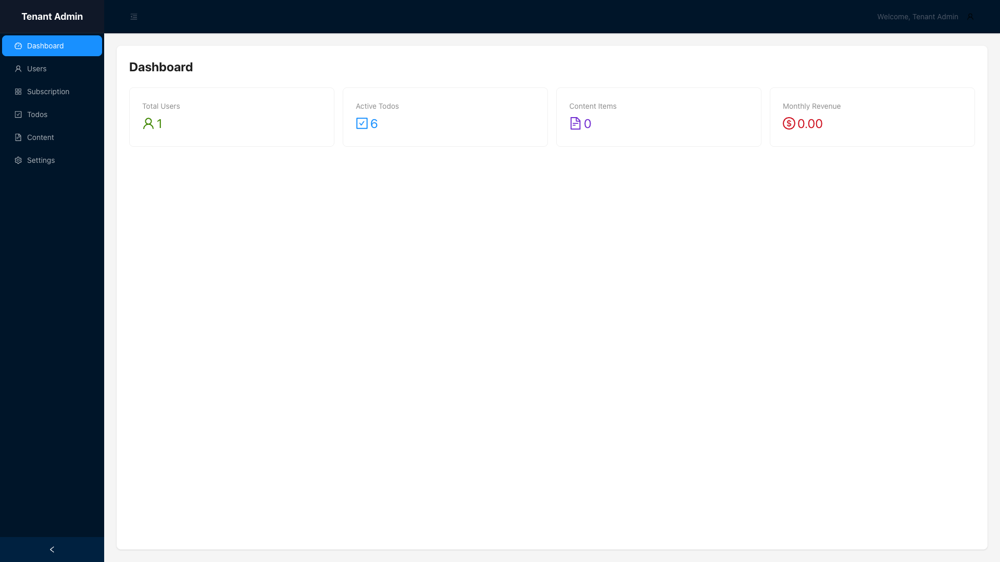
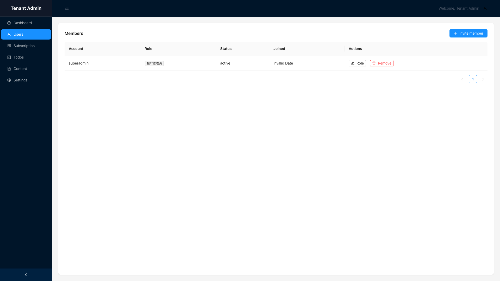
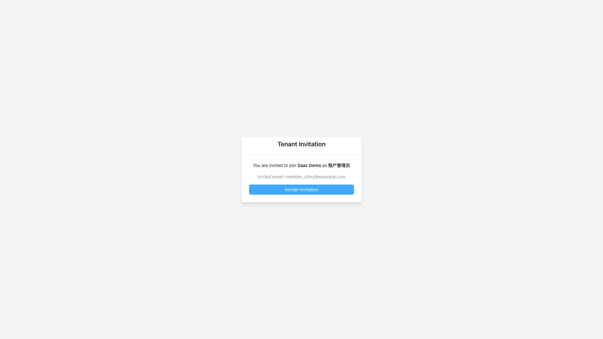
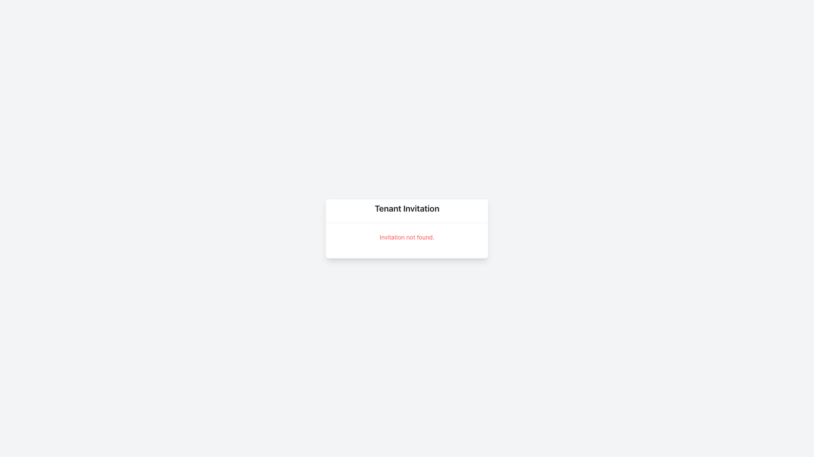

# SaaS Multi-Tenant — Test Playbook

> 站点：https://saas.lpm1.top
> 身份数：3
> 每个身份列出：操作步骤 → 验证 → 截图 → 选择器

---

## 租户管理员

**凭据**: `superadmin / admin123（/tenant/login）`

**案例数**: 5

### 登录租户控制台

**步骤**:

1. 打开 https://saas.lpm1.top/tenant/login
2. 输入 superadmin / admin123
3. 点击 Sign in

**验证**: 进入 /tenant/dashboard，四统计卡正常

**截图**: 

**选择器**:
| 元素 | 选择器 |
|---|---|
| 账号输入框 | `#account` |
| 密码输入框 | `#password` |
| 登录按钮 | `button.ant-btn` |

### 查看仪表盘

**步骤**:

1. 登录后自动到达 /tenant/dashboard

**验证**: Total Users / Active Todos / Content Items / Monthly Revenue 统计卡

**截图**: 

### 成员列表管理

**步骤**:

1. 点击侧栏 Users

**验证**: 成员表格 + 角色徽章 + Invite member 按钮

**截图**: 

**选择器**:
| 元素 | 选择器 |
|---|---|
| 成员表格 | `.ant-table` |
| 邀请按钮 | `find text 'Invite member'` |

### 邀请成员（正向→正向链）

**步骤**:

1. 点击 Invite member
2. 填写邮箱 member@example.com
3. 选择角色（下拉）
4. 点击 Send invitation

**验证**: 绿色 toast "Invitation created"

**截图**: 

**选择器**:
| 元素 | 选择器 |
|---|---|
| 邮箱输入框 | `#email` |
| 角色下拉 | `.ant-select` |
| 发送按钮 | `find text 'Send invitation'` |

### 租户设置

**步骤**:

1. 点击侧栏 Settings
2. 修改 Tenant Name
3. 点击保存

**验证**: toast "Settings updated successfully"

**截图**: 

---

## 租户成员

**凭据**: `受邀注册后登录`

**案例数**: 2

### 接受邀请加入租户

**步骤**:

1. 注册新账号（POST /api/auth/register）
2. 超管创建邀请并获取 token
3. 登录后打开 /tenant/invite/<token>
4. 点击 Accept invitation

**验证**: 自动进入 /tenant/dashboard

**截图**: 

### 邀请成员被拒（API 403）

**步骤**:

1. 以成员身份登录
2. 尝试点击 Invite member

**验证**: UI 按钮可见但提交后 API 403 Permission denied

**截图**: 

---

## 访客（未登录）

**凭据**: `无需登录`

**案例数**: 2

### 直访受保护页被拦截

**步骤**:

1. 直接打开 /tenant/dashboard（不登录）

**验证**: 被 TenantGuard 拦回 /tenant/login

**截图**: 

### 伪造邀请 token 被拒

**步骤**:

1. 打开 /tenant/invite/invalid-token-12345

**验证**: 红字 "Invitation not found."

**截图**: 

---
