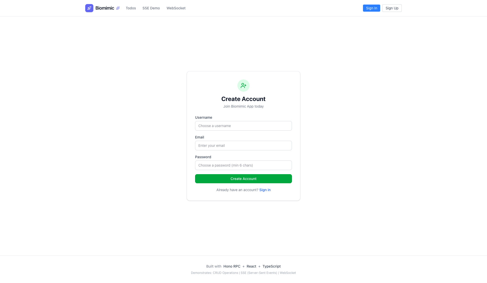
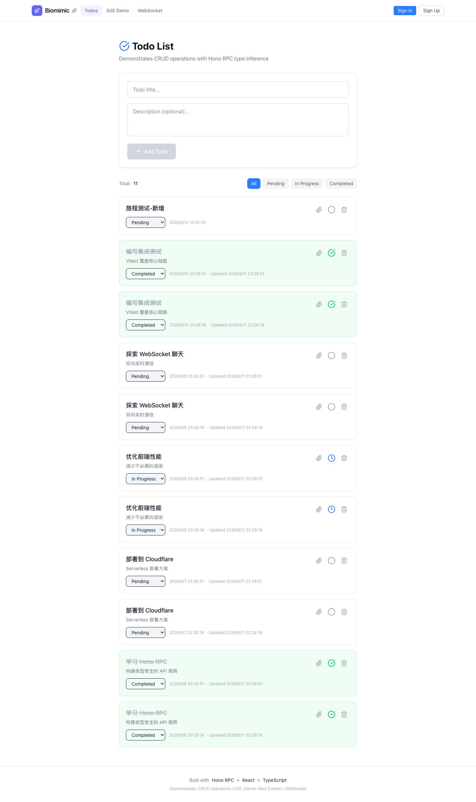
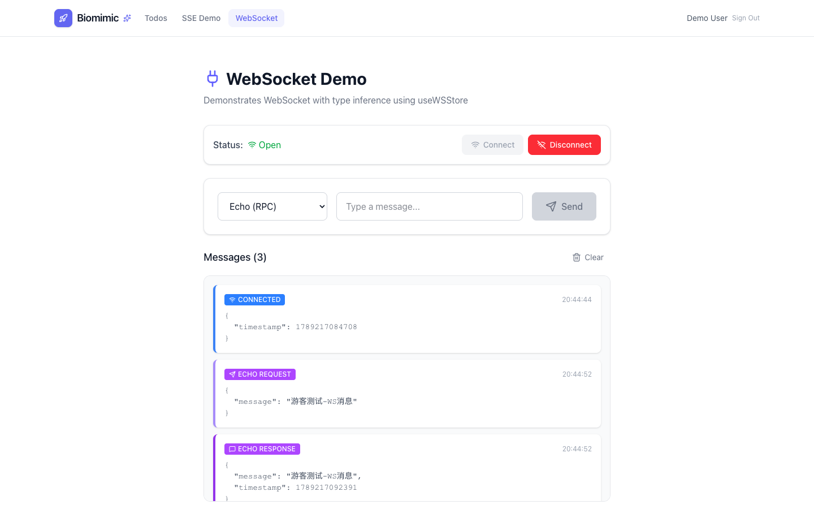
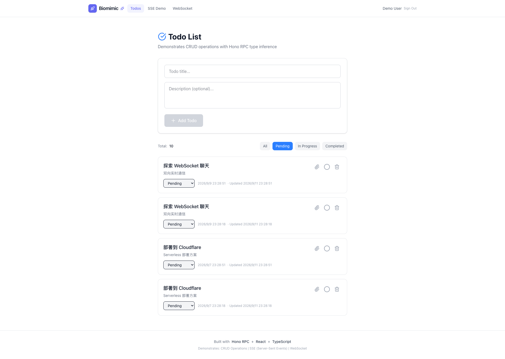
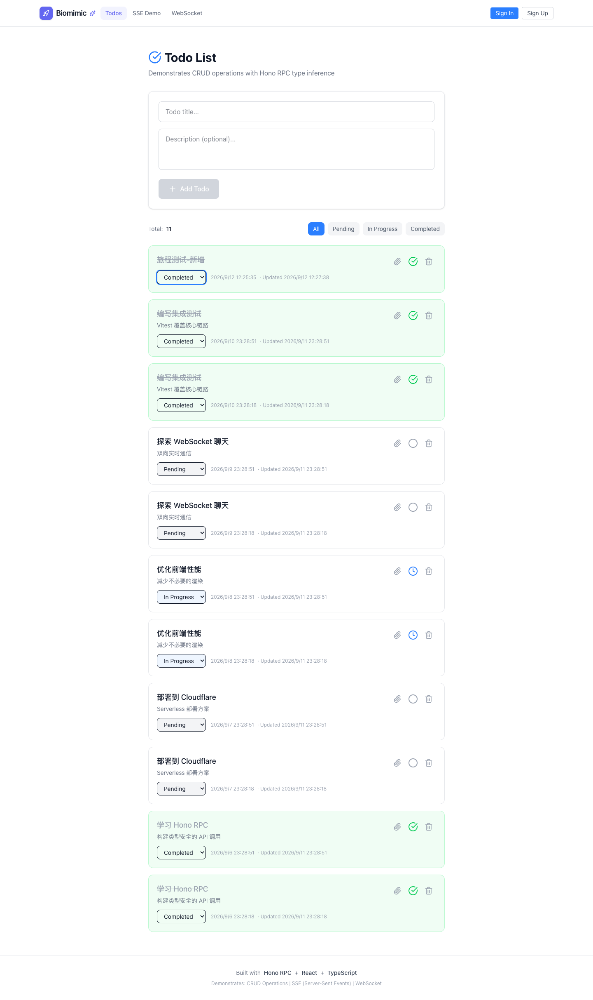
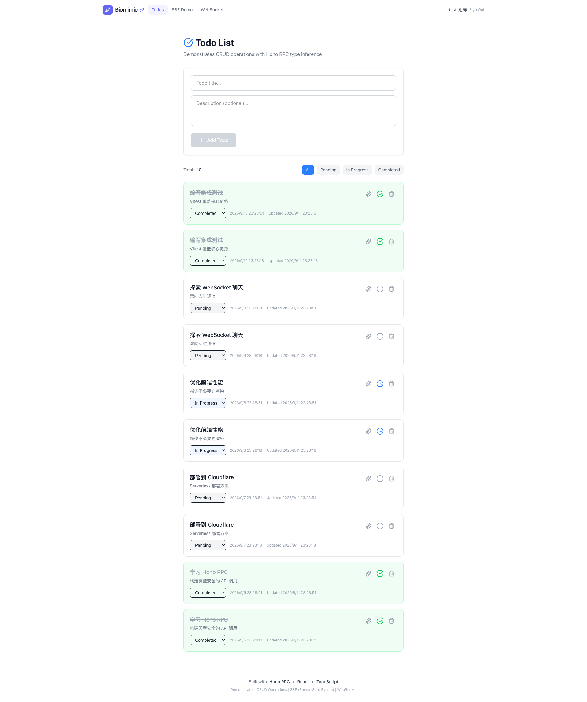
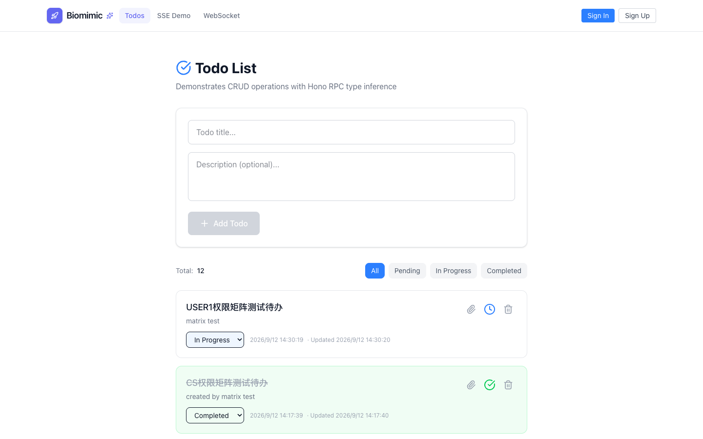

# Todo App — Test Playbook

> 站点：https://todo.lpm1.top
> 身份数：2
> 每个身份列出：操作步骤 → 验证 → 截图 → 选择器

---

## 注册用户

**凭据**: `demo@biomimic.app（登录页预填）`

**案例数**: 12

### 注册新账号

**步骤**:

1. 打开 /register
2. 填写 Username/Email/Password（min 6）
3. 点击注册

**验证**: 跳转到 /login，无报错

**截图**: 

**选择器**:
| 元素 | 选择器 |
|---|---|
| 注册页URL | `/register` |

### Todos CRUD 全流程

**步骤**:

1. 登录后打开 /todos
2. 在输入框填写标题
3. 点击 Add Todo
4. 用状态下拉改为 completed
5. 点击删除按钮

**验证**: 新增→变绿→删除，Total 计数正确变化

**截图**: 

**选择器**:
| 元素 | 选择器 |
|---|---|
| 标题输入框 | `[data-testid='todo-title-input']` |
| 添加按钮 | `[data-testid='add-todo-button']` |
| 状态下拉 | `[data-testid='todo-status']` |
| 删除按钮 | `[data-testid='delete-todo']` |

### WebSocket 聊天

**步骤**:

1. 打开 /websocket
2. 点击 Connect
3. 在输入框填写消息
4. 点击 Send

**验证**: Status 变 Open，ECHO REQUEST/RESPONSE 往返

**截图**: 

### 空标题提交无效（逆向）

**步骤**:

1. 打开 /todos
2. 不输入标题直接点击 Add Todo

**验证**: 提交被拦截，Total 计数不变

### WebSocket 未连接发消息（逆向）

**步骤**:

1. 打开 /websocket
2. 不点 Connect 直接在输入框发送

**验证**: 提示未连接或消息不发出，无假成功

### 连续添加 3 条 todo（正向批量链）

**步骤**:

1. 打开 /todos
2. 连续 3 次输入不同标题并点击 Add Todo

**验证**: Total +3，三条按提交顺序置顶，输入框逐次清空

**截图**: 

**选择器**:
| 元素 | 选择器 |
|---|---|
| 标题输入框 | `[data-testid='todo-title-input']` |
| 添加按钮 | `[data-testid='add-todo-button']` |

### 筛选切换组合（正向）

**步骤**:

1. /todos 依次点击 filter-pending → filter-completed → filter-all

**验证**: 每个过滤下卡片状态与计数一致，切回 all 恢复全量

**截图**: 

**选择器**:
| 元素 | 选择器 |
|---|---|
| 全部过滤 | `[data-testid='filter-all']` |
| 待办过滤 | `[data-testid='filter-pending']` |
| 完成过滤 | `[data-testid='filter-completed']` |

### 刷新后 todo 状态保持（正向）

**步骤**:

1. 将一条 todo 状态改为 completed
2. 按 F5 硬刷新

**验证**: 刷新后该条仍为 completed（服务端持久），Total 不变

**截图**: 

**选择器**:
| 元素 | 选择器 |
|---|---|
| 状态下拉 | `div.p-5.rounded-xl.border select` |

### 登出重登后数据保持（正向链）

**步骤**:

1. 点击 Sign Out 登出
2. /login 重新登录 demo 账号
3. 回到 /todos

**验证**: 重登后列表与服务端一致（增删改结果保留），不丢数据

**截图**: 

**选择器**:
| 元素 | 选择器 |
|---|---|
| 登出按钮 | `button.text-xs.text-gray-400` |
| 登录提交 | `[data-testid='login-submit']` |

### XSS 注入 todo 标题（逆向）

**步骤**:

1. 标题输入 ，点击 Add Todo
2. 查看卡片渲染

**验证**: 标题按纯文本渲染不执行（无弹窗），随后删除清理

### 超长标题提交（逆向）

**步骤**:

1. 标题粘贴 256+ 字符长串
2. 点击 Add Todo

**验证**: 实勘：接受则卡片正常换行不溢出且 Total +1；拒绝则提示校验——记录行为，无崩溃

### 双击 Add Todo 防重（逆向）

**步骤**:

1. 输入标题后快速双击 Add Todo

**验证**: 仅创建 1 条（若重复记录为缺陷），随后清理

---

## 游客（自动登录）

**凭据**: `无需登录（自动登录为 Demo User）`

**案例数**: 3

### 免登录操作 todos

**步骤**:

1. 直接打开 /todos

**验证**: 自动登录为 Demo User，可直接增删改

**截图**: 

### 登出态访问受保护接口（逆向）

**步骤**:

1. 清空 localStorage 后无 token 请求 /api/todos 写接口

**验证**: 返回 401，REST 层要求认证（页面自动登录为 demo 特性，接口层不放松）

### 硬刷新后自动登录态保持（正向）

**步骤**:

1. 直接打开 /todos
2. 按 F5 硬刷新后再新增一条

**验证**: 刷新后仍处于自动登录态（可增删改），新条目 Total +1 成功

**截图**: 

---
