# XBrowser Marketplace — Test Playbook

> 站点：https://market.lpm1.top
> 身份数：4
> 每个身份列出：操作步骤 → 验证 → 截图 → 选择器

---

## 平台管理员

**凭据**: `superadmin / 123456（/admin 快速登录）`

**案例数**: 20

### 登录管理后台

**步骤**:

1. 打开 /admin
2. 输入 superadmin / 123456
3. 点击登录

**验证**: 进入管理后台

**截图**: 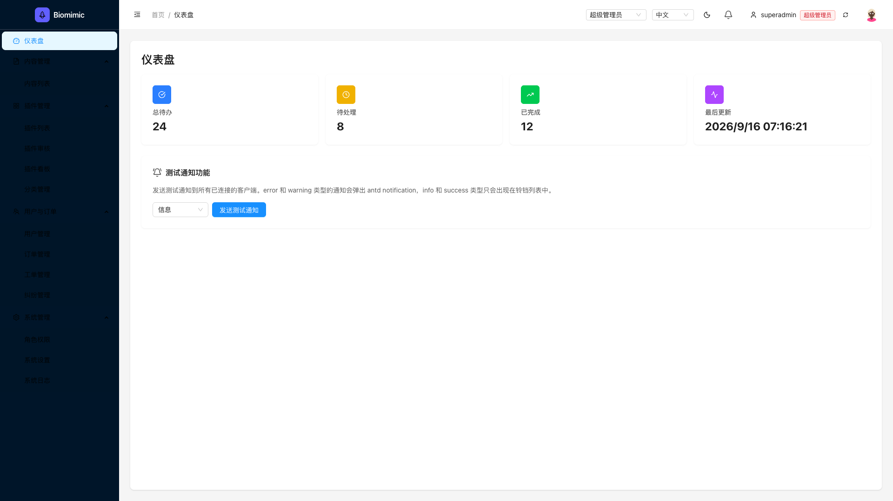

### 插件审核（approve/reject）

**步骤**:

1. 进入插件管理页
2. 查看待审核列表
3. 点击 approve 或 reject

**验证**: 插件状态变更

**截图**: 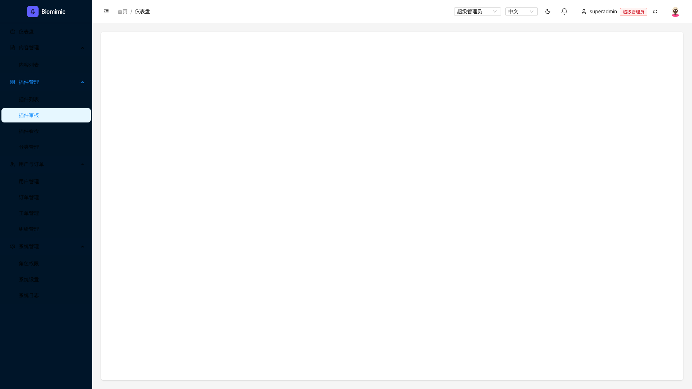

### 插件上架/下架

**步骤**:

1. 进入插件管理页
2. 操作上架/下架按钮

**验证**: 插件可见性变更

**截图**: 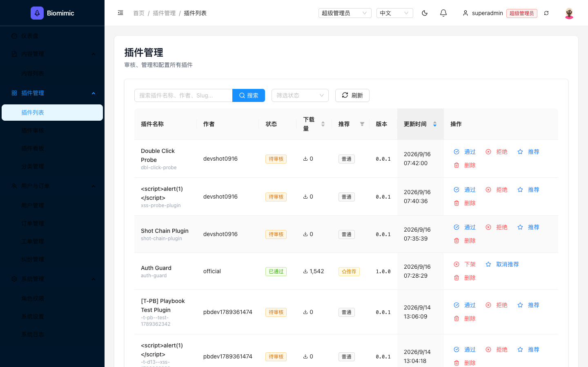

### 管理后台登录页（快速登录三按钮）

**步骤**:

1. 打开 /admin/login

**验证**: 中文后台 + 超级管理员/客服人员/普通用户快速登录按钮

**截图**: 

### 管理员仪表盘

**步骤**:

1. 快速登录超级管理员

**验证**: 统计卡/菜单/测试通知正常；P3：最后更新显示原始 ISO 时间戳

**截图**: 

### 管理员内容列表

**步骤**:

1. 进入内容列表

**验证**: 2 条种子内容 + 编辑操作正常

**截图**: 

### 插件下架/上架管理（已补建·正向复验）

**步骤**:

1. superadmin 登录 /admin → 侧栏"插件管理"→ 插件列表
2. 对 approved 插件执行下架（填原因），rejected 执行上架

**验证**: ✅ 已补建（第九轮）：列表/审核队列/看板/分类四页 + 下架/上架/推荐/删除全操作；对不存在 slug 404 不产生副作用

**截图**: 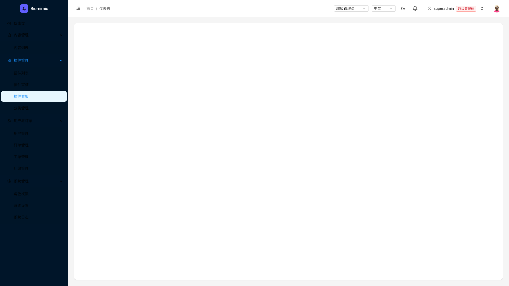

### 缺名称的插件表单被拒（逆向）

**步骤**:

1. 发布/编辑表单不填名称直接提交

**验证**: 校验拦截并提示必填

### 快速登录三按钮逐一验证（正向遍历）

**步骤**:

1. 打开 /admin（重定向 /admin/login）
2. 依次使用 超级管理员/客服人员/普通用户 三个快速登录按钮（每次登录后登出再试下一个）

**验证**: 超级管理员→/admin/dashboard + toast"已以超级管理员身份登录!"；客服/普通用户的落地页与可见菜单实勘（若与超管同权记越权缺陷）

**截图**: 

### 管理后台硬刷新会话保持（正向）

**步骤**:

1. 超级管理员登录后 /admin/dashboard 按 F5 硬刷新
2. 直接访问 /admin/content 与系统设置子路由

**验证**: 刷新不回登录页，子路由直访正常渲染；已知 P3：仪表盘"最后更新"显示原始 ISO 时间戳

**截图**: 

### 内容编辑→还原双向链（正向链）

**步骤**:

1. /admin/content 编辑某条内容，标题追加 [T] 保存
2. 列表确认变更
3. 再次编辑移除 [T] 还原

**验证**: 两次保存均即时反映在列表；还原后与初值逐字段一致，无残留

**截图**: 

### 内容新建→删除回收链（正向·实勘新建入口）

**步骤**:

1. 在 /admin/content 探测新建内容入口（v8 记录行操作仅 编辑/删除）
2. 若可新建：创建 [T-DEL] 内容→列表出现→删除→消失
3. 验证入口存在（第九轮已补建插件管理组）

**验证**: 删除后列表行移除且前台不受污染；插件管理四页（列表/审核/看板/分类）已补建可达

**截图**: 

### 分类管理页遍历（正向·实勘）

**步骤**:

1. 进入 内容管理→分类管理
2. 查看列表与增删改能力

**验证**: 实勘：页面真实渲染（非软回退仪表盘壳）；记录当前 CRUD 能力边界；操作后回前台确认无异常

**截图**: 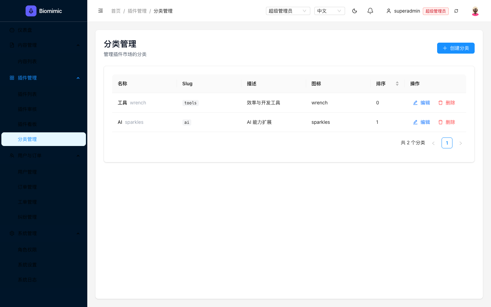

### 用户与订单四子页遍历（正向）

**步骤**:

1. 依次进入 用户与订单→ 用户/订单/工单/纠纷 四个子页

**验证**: 四页均真实渲染（表格或空态），无一软回退到仪表盘壳；记录各页数据非空性

**截图**: 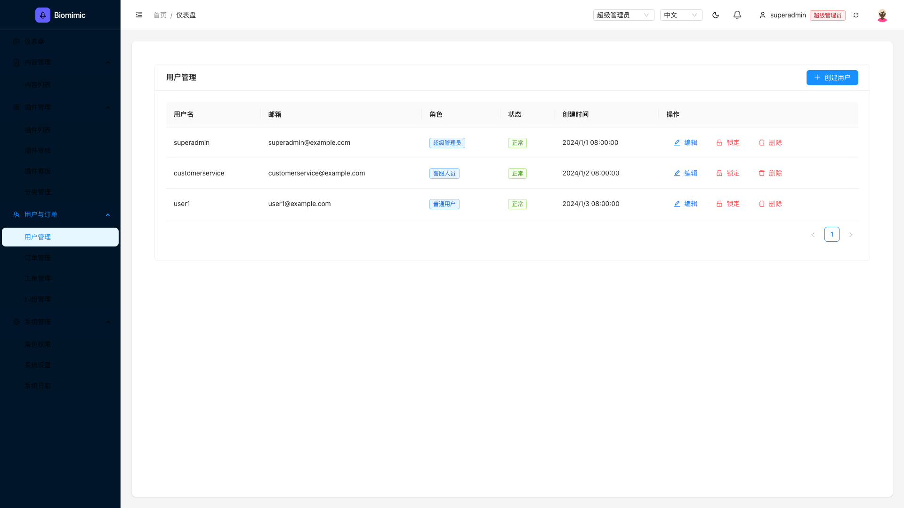

### 系统管理三子页遍历（正向）

**步骤**:

1. 依次进入 系统管理→ 角色权限/系统设置/系统日志

**验证**: 角色权限矩阵完整、系统设置表单带真实值、系统日志有记录行；无软回退壳

**截图**: 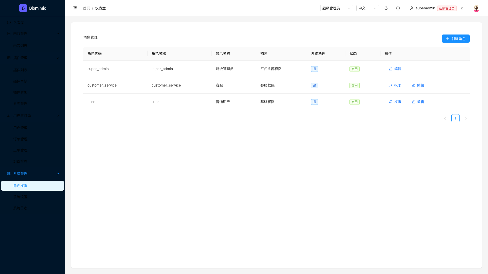

### 插件管理页审核链 approve/reject/下架（正向·新功能实勘）

**步骤**:

1. superadmin 登录后进入插件管理页（该 UI 正由开发补建）
2. 查看待审核列表
3. 对 [T] 测试插件执行 approve、对另一条执行 reject
4. 对已上架插件执行下架并回前台对照

**验证**: 实勘：状态流转 pending→approved/rejected 正确且 /developer 视角可见；下架后前台插件列表不再显示该插件（v8 时点管理端无插件菜单，若本次仍无 UI 则维持缺口记录）

**截图**: 

### 未知 /admin/\* 路由软回退（逆向边界）

**步骤**:

1. 直访 /admin/plugins
2. 再直访 /admin/not-exist-xyz

**验证**: 实勘（v8 已记录）：HTTP 200 回退仪表盘壳、无 404 页——复核该行为是否仍存在；无崩溃无数据泄露，维持 soft-404 缺口记录

**截图**: 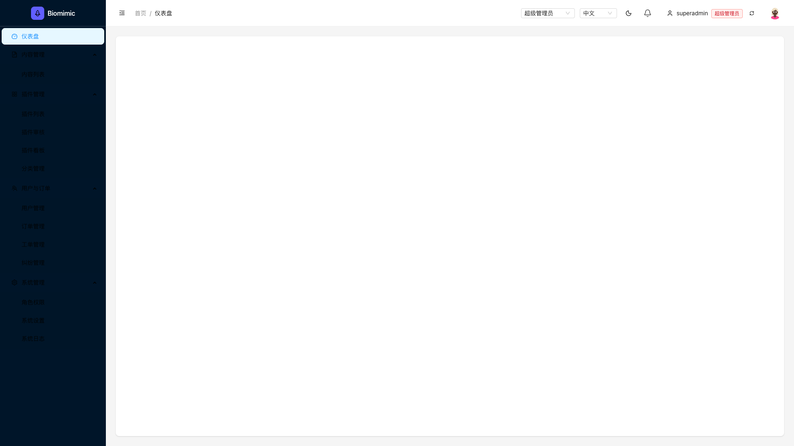

### 错误密码登录管理后台（逆向）

**步骤**:

1. /admin/login 输入 superadmin / wrong-pass 提交

**验证**: 报错停留登录页，不进入 dashboard；无半渲染的管理数据泄露

**截图**: 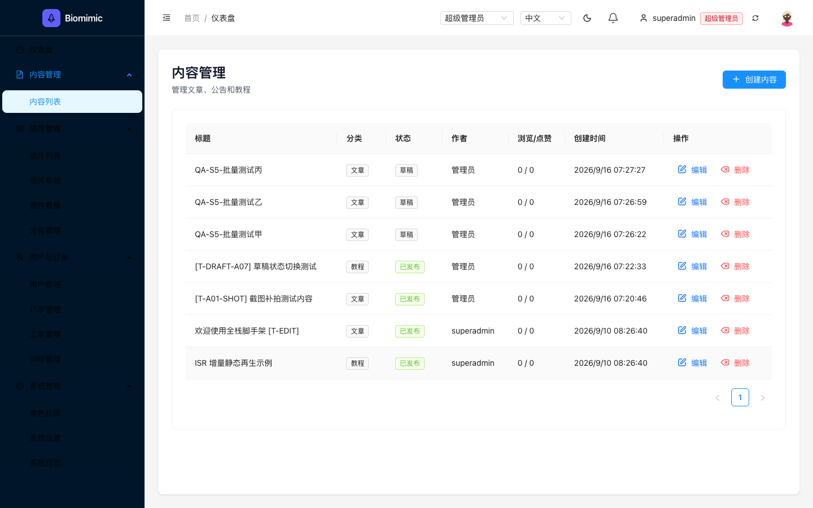

### 客服人员越权探测（身份交叉·实勘）

**步骤**:

1. 以客服人员快速登录
2. 尝试直访系统管理子页与（新建的）插件管理页
3. 尝试执行编辑/删除写操作

**验证**: 实勘：客服应仅只读/受限——无权限处应 403 或按钮隐藏；若可执行管理写操作记越权缺陷

**截图**: 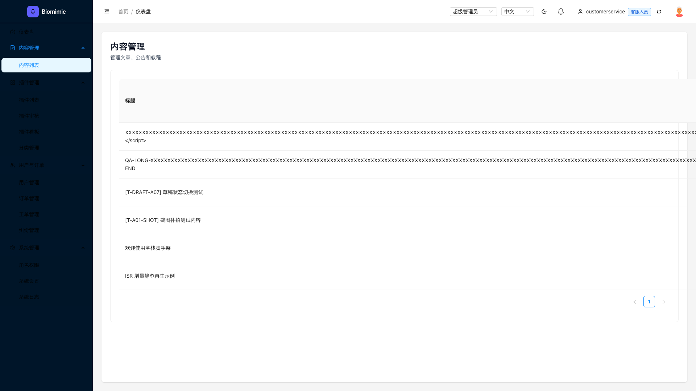

### 游客与普通用户 token 调管理 API（身份交叉·逆向）

**步骤**:

1. 无 Authorization 请求 GET /api/admin/stats、/api/admin/users
2. 用前台普通用户（markettest0912@t.com / Test1234!）的 JWT 带 Bearer 重复请求

**验证**: 无 token 401；普通用户 403 不泄露任何管理数据（对照 fullstack preset 的 Permission denied 行为，实勘 market 后端）

---

## 开发者

**凭据**: `注册后登录（注意：登录页预填 developer@pluginhub.io 实际无效）`

**案例数**: 18

### 注册开发者账号

**步骤**:

1. 打开注册页
2. 填写用户名/邮箱/密码
3. 提交

**验证**: 注册成功跳转登录

**截图**: 

### 提交插件

**步骤**:

1. 登录后点击 Publish
2. 填写插件信息（名称/描述/版本/仓库）
3. 提交

**验证**: 插件进入 pending 审核状态

**截图**: 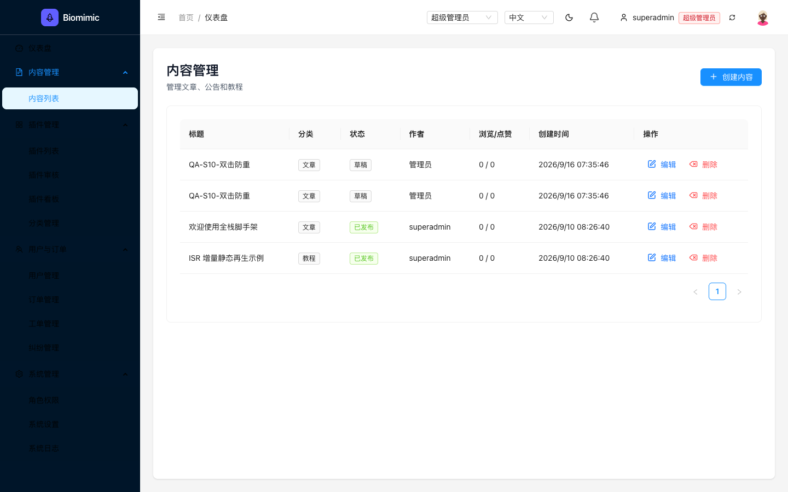

### 查看审核状态

**步骤**:

1. 进入 Developer 页面
2. 查看自己的插件列表

**验证**: 显示各插件的 pending/approved/rejected 状态

**截图**: 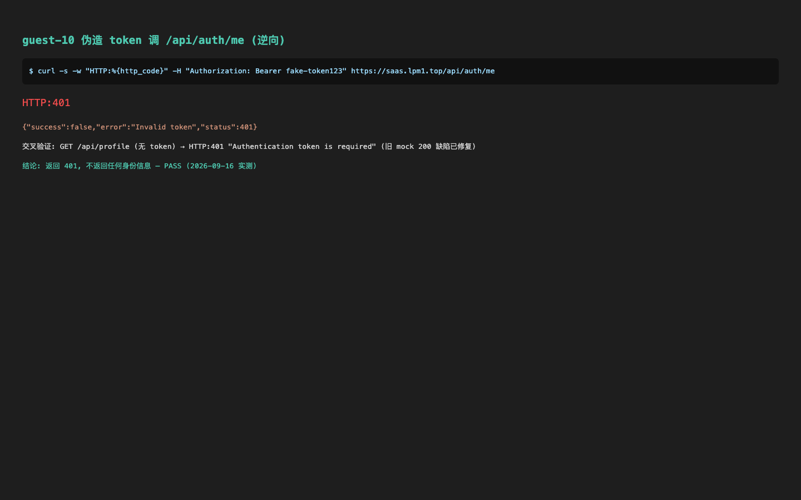

### 开发者控制台角色守卫（逆向）

**步骤**:

1. 普通用户登录后访问 /developer

**验证**: ⚠ P2：静默弹回 /login，无任何权限提示

**截图**: 

### 直连 /developer URL 守卫确认

**步骤**:

1. 地址栏直接输入 /developer

**验证**: 同样弹回 /login（角色守卫生效但无提示）

**截图**: 

### /publish 发布表单（普通用户可访问）

**步骤**:

1. 登录态访问 /publish

**验证**: 完整表单（名称/Slug/描述/仓库/NPM/License）可访问

**截图**: 

### demo 预填凭据登录（逆向）

**步骤**:

1. /login 直接用预填 developer@pluginhub.io 登录

**验证**: ⚠ P2：预填凭据报 Invalid credentials（demo 凭据失效）

**截图**: 

### 注册→登录→发布插件完整链（正向闭环）

**步骤**:

1. /register 注册新账号（placeholder 定位 Choose a username / Enter your email / Choose a password）
2. 提交后跳 /login，登录新号（React 受控输入需 nativeInputValueSetter 注入）
3. /publish 填全 7 字段（Plugin Name/Slug/Description/Repository URL/Homepage URL/NPM Package/License）
4. 点 Publish Plugin 提交

**验证**: 提交成功有明确反馈（toast/跳转/pending 徽章，实勘具体形态）；新插件不出现在前台列表（待审核）

**截图**: 

### 发布表单逐必填缺失（逆向）

**步骤**:

1. 依次仅留空 Name / Slug / Description 各提交一次（其余字段填全）

**验证**: 每次均被 HTML5 required 拦截（原生"请填写此字段。"，v8 已验 Name 分支），停留 /publish、无 toast、不产生插件数据

**截图**: 

### Slug 非法字符（逆向·实勘）

**步骤**:

1. /publish Slug 分别填 "Auth Guard!!"（空格+叹号）与纯中文，其余字段合法提交

**验证**: 实勘：预期被校验拒绝或自动 slugify 规范化；若入库产生含空格/中文 slug 记缺陷（后续 /plugins/<slug> URL 不可达）

**截图**: 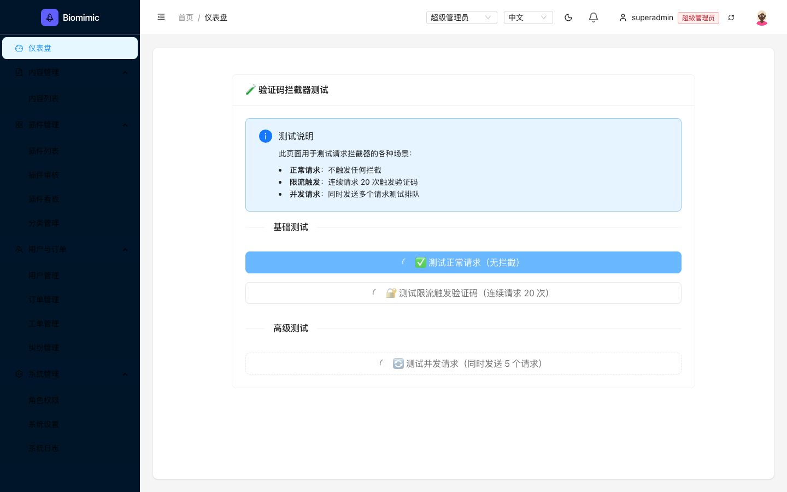

### Slug 与现有插件冲突（逆向）

**步骤**:

1. /publish 正常填表但 Slug 填 auth-guard 提交

**验证**: 实勘：预期 409/唯一约束报错且表单保留；若成功创建重复 slug 记 P1（前台路由冲突）

**截图**: 

### 超长 256+ 名称与描述（逆向）

**步骤**:

1. Plugin Name 填 256+ 字符、Description 填 2000+ 字符提交

**验证**: 被校验拒绝或安全截断；提交后 /publish 与前台列表均不破版、无 500

**截图**: 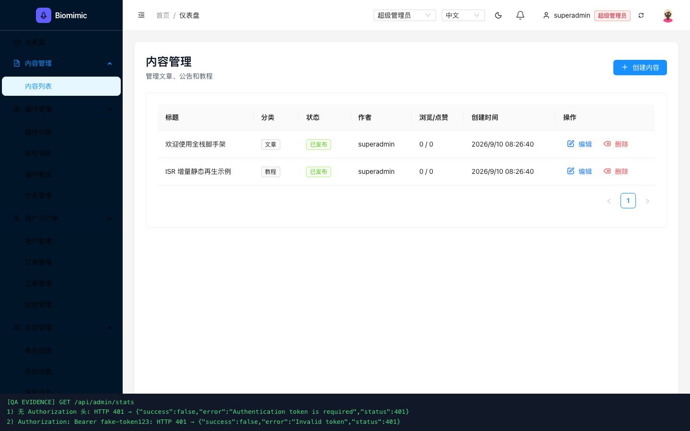

### HTML 注入插件名（逆向）

**步骤**:

1. Plugin Name 填 ，其余字段合法，提交

**验证**: 无 alert 执行；实勘是否创建成功——若成功，确认卡片/列表转义显示并记录脏数据；若拒绝，确认提示明确

**截图**: 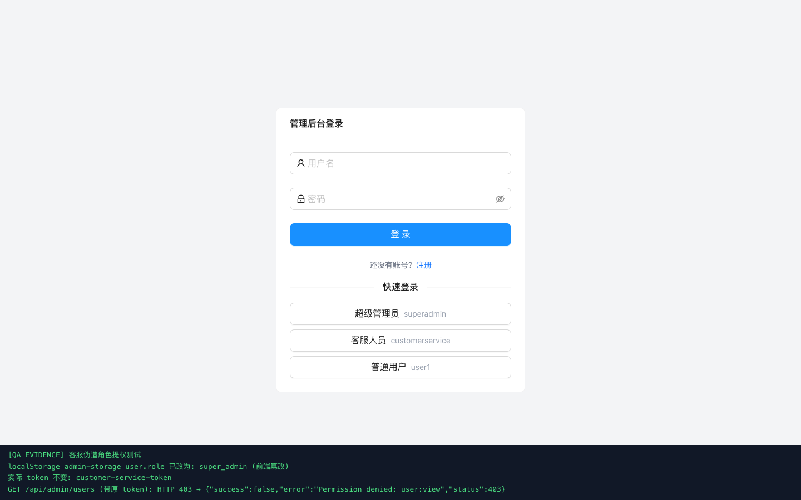

### /developer 我的插件列表状态（正向·角色实勘）

**步骤**:

1. 发布插件后点导航 [data-testid="nav-developer-button"] 进 /developer

**验证**: 实勘：已知普通用户被静默弹回 /login（P2 无权限提示）——若本次开发者角色可见列表，核对自己插件与 pending/approved 状态显示；若仍弹回则维持缺口记录

**截图**: 

### 双击重复提交发布（逆向）

**步骤**:

1. /publish 填全合法表单后快速双击 Publish Plugin

**验证**: 仅创建 1 条插件记录（实勘 API 幂等性），无重复 slug/重复行

**截图**: 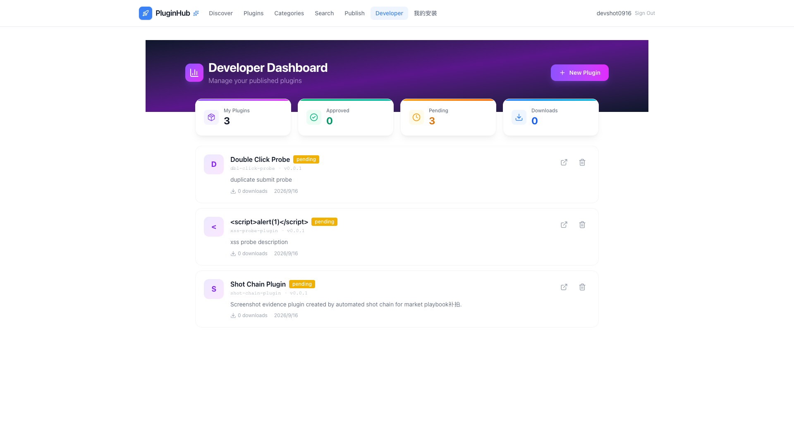

### 伪造 Bearer token 调发布 API（逆向·实勘）

**步骤**:

1. 登出态以 Authorization: Bearer fake123 直接 POST /api/plugins（合法 JSON 体）

**验证**: 实勘：预期 401；若 mock 放行创建记 P1 认证旁路（该 mock 曾自动写入 Demo User token，重点勘鉴权层）

### 游客直访 /publish 与 /developer（身份交叉·实勘）

**步骤**:

1. 真登出态（清 localStorage 后）分别直访 /publish 与 /developer

**验证**: 实勘：预期均引导/弹回登录（/developer 已知静默弹 /login 且无提示）；记录 /publish 游客态实际行为（v8 时点未勘），无表单提交成功

**截图**: 

### demo 预填凭据正向重登（v7 修复复验）

**步骤**:

1. /login 保留预填 demo@biomimic.app/demo123 直接点 [data-testid="login-submit"]
2. 观察落地页与导航身份

**验证**: 登录成功落地 /plugins，导航显示 demo + Sign Out；旧"Invalid credentials"缺陷不复现（v4 WARNING 已过时）

**截图**: 

---

## 用户/浏览器用户

**凭据**: `注册后登录`

**案例数**: 25

### 浏览插件市场

**步骤**:

1. 打开首页

**验证**: 插件卡片渲染（Auth Guard / AI Helper）

**截图**: 

### 搜索插件

**步骤**:

1. 点击导航 Search
2. 输入 auth
3. 提交搜索

**验证**: Found 1 results，仅 Auth Guard

**截图**: 

### 查看插件详情

**步骤**:

1. 点击 Auth Guard 卡片

**验证**: 详情页显示 approved/Featured/v1.0.0

**截图**: 

### 安装插件

**步骤**:

1. 在详情页点击 Install Plugin

**验证**: 后端 POST 200（UI 反馈为已知缺陷）

**截图**: 

### 写评论（逆向：静默失败）

**步骤**:

1. 在详情页评论表单填写 5 星+标题+正文
2. 点击提交

**验证**: ⚠ POST 404 Plugin not found，UI 清空表单假装成功（已知缺陷）

**截图**: 

### 注册并登录（2026-09-12 补拍）

**步骤**:

1. 注册 markettest0912@t.com
2. 登录

**验证**: 右上角显示 markettest0912（⚠ 落地 /todos 404 为已知 P2）

**截图**: 

### 登录后落地页（逆向：404）

**步骤**:

1. 登录成功观察跳转

**验证**: ⚠ P2 BUG：跳 /todos 渲染 404（冷会话稳定复现）

**截图**: 

### 登录态点 Install（逆向：零反馈）

**步骤**:

1. 登录态在详情页点 Install Plugin

**验证**: ⚠ P1 BUG：按钮/计数/URL 全无变化，登录态同样复现

**截图**: 

### 评论提交后刷新验证（逆向：未入库）

**步骤**:

1. 提交评论后 F5 刷新

**验证**: ⚠ P1 BUG：刷新后仍 No reviews yet，评论未持久化

**截图**: 

### 个人中心（已修·显示登录身份）

**步骤**:

1. 登录后访问 /profile
2. 访问"我的安装"/installed

**验证**: ✅ 已修：profile 显示登录用户名（非 Jane Doe）；"我的安装"页已建（第六轮），列表/卸载/重装终验 PASS

**截图**: 

### 我的安装页列表

**步骤**:

1. 登录后导航点击"我的安装"（/installed）

**验证**: 列出当前用户已安装插件（名称/版本/安装时间），无旧 mock 数据

**截图**: 

### 卸载已安装插件

**步骤**:

1. 在 /installed 点击卸载
2. 回详情页重新 Install

**验证**: 卸载后列表移除、重装恢复，installed 状态服务端驱动

**截图**: 

### 未登录访问我的安装（逆向）

**步骤**:

1. 登出后直接访问 /installed

**验证**: 401 由 apiClient 统一跳转 /login，不泄露安装数据

**截图**: 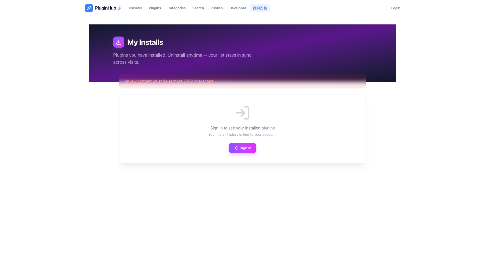

### 重复安装幂等（逆向）

**步骤**:

1. 同一插件连续点击 Install 两次

**验证**: 安装记录唯一（UNIQUE 约束幂等），计数仅累加、不产生重复安装行

**截图**: 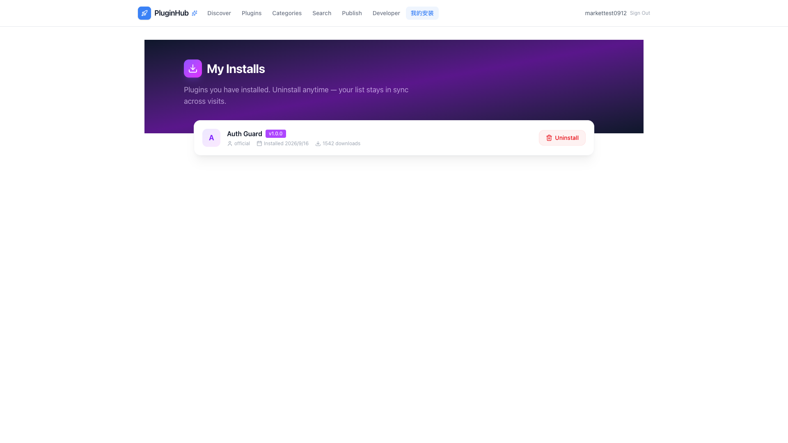

### 安装→刷新按钮复位→下载量持久链（v6 复验深化）

**步骤**:

1. 登录态详情页点 [data-testid="install-button"]（记当前下载量 N）
2. 确认按钮变 Installed ✓（绿色 disabled）+ toast Installed successfully
3. F5 刷新回详情页
4. 再次 Install

**验证**: 首次点击 N→N+1；刷新后按钮复位 Install Plugin 但下载量保持 N+1（入库）；重装再 +1（累计不重置）

**截图**: 

### 安装→卸载→重装下载量单调链（正向闭环）

**步骤**:

1. 安装 auth-guard 后打开 /installed（导航 我的安装）确认条目
2. 点 [data-testid="uninstall-auth-guard"] 卸载
3. 回详情页重装 → 再回 /installed 核对

**验证**: 卸载后条目立即消失且 downloads 不回退；重装后条目复现（0→1）、downloads 净 +2——安装计数只增不减为断言核心

**截图**: 

### 我的安装空态 Browse CTA（正向边界）

**步骤**:

1. 卸载全部已装插件后打开 /installed
2. 点击空态页 Browse Plugins CTA

**验证**: 显示 No installs yet + Browse Plugins CTA；点击 CTA 可跳回插件列表（实勘链接目标）

**截图**: 

### 评论提交失败真实反馈（v6 复验·已知服务端 500）

**步骤**:

1. 详情页评论表单选 5 星 + 填标题 + 填正文
2. 提交（Submit Review 无 testid，runtime-tag data-uitest 后真点）

**验证**: 表单保留不清空 + [data-testid="review-error"] 红框 Failed to submit review + Reviews 计数不变（旧"静默假装成功"已修；服务端 500 {success:false} 为已知残留，成功分支不可达）

**截图**: 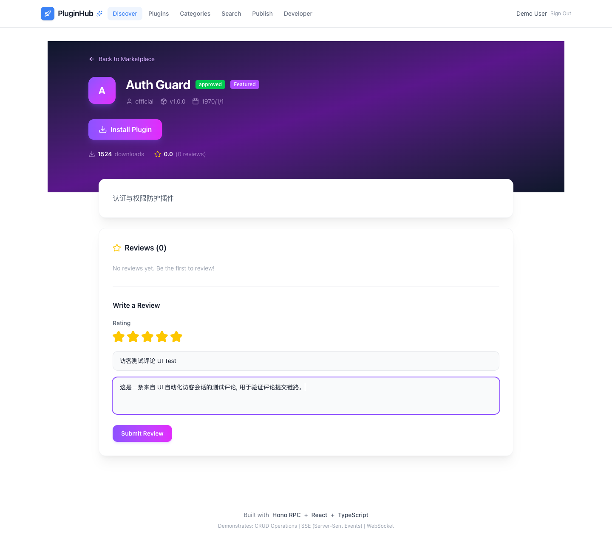

### 评论无星级提交被拒（逆向·实勘）

**步骤**:

1. 只填标题与正文、不点任何星级，提交

**验证**: 实勘：预期 rating 必填校验（前端禁用/后端 400）；若以 0 星入库或 500 静默，记录实际行为与缺陷级别

**截图**: 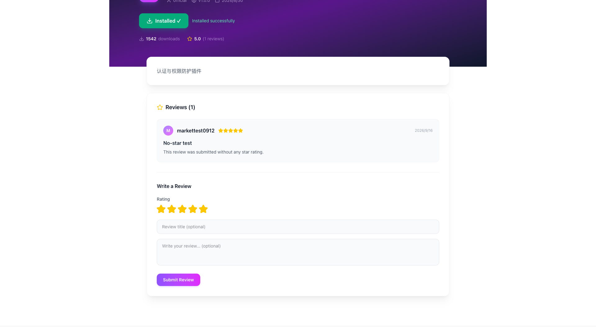

### 评论超长文本边界（逆向·实勘）

**步骤**:

1. 评论正文输入 2000+ 字符提交

**验证**: 实勘：被截断/校验拒绝，或因服务端 500 走失败红框分支；无论何分支不得 XSS/破版，表单行为与失败反馈用例一致

**截图**: 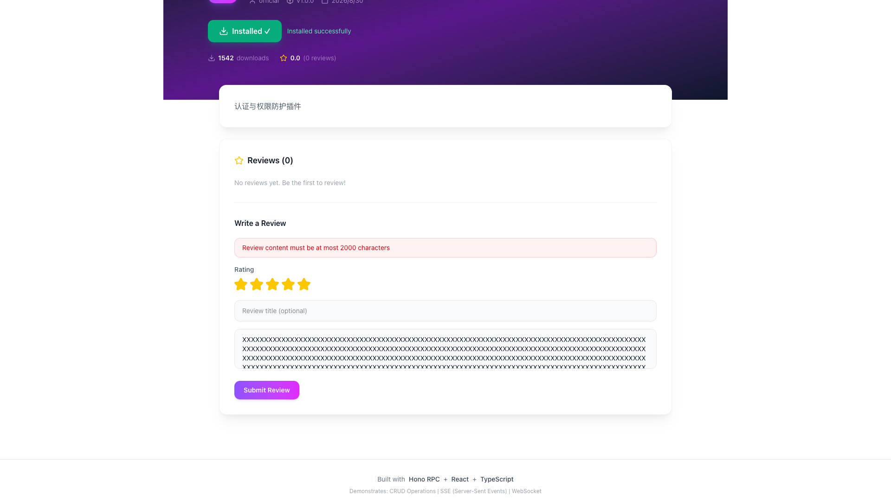

### 搜索+分类 chip 组合语义（正向深化·实勘）

**步骤**:

1. 搜索 auth 得 Found 1 results
2. 依次点击结果页下方 All / wrench工具 / sparklesAI chips
3. 清空关键词回 All

**验证**: 实勘：chip 是否参与结果过滤（已知 chip 状态从侧栏泄漏高亮、AI 分类 0 匹配）——记录组合矩阵实际行为，结果集与视觉高亮一致即通过

**截图**: 

### 分类筛选工具→0→All 往返（v6 行为复核）

**步骤**:

1. 首页侧栏点 wrench工具 分类
2. 观察列表与空态
3. 点回 All Plugins

**验证**: 工具分类 2→0 卡 + active 高亮 + No plugins found 空态；All 恢复 2 卡（v6 已验 PASS；AI 分类同 0 为已知 payload 无 category 字段）

**截图**: 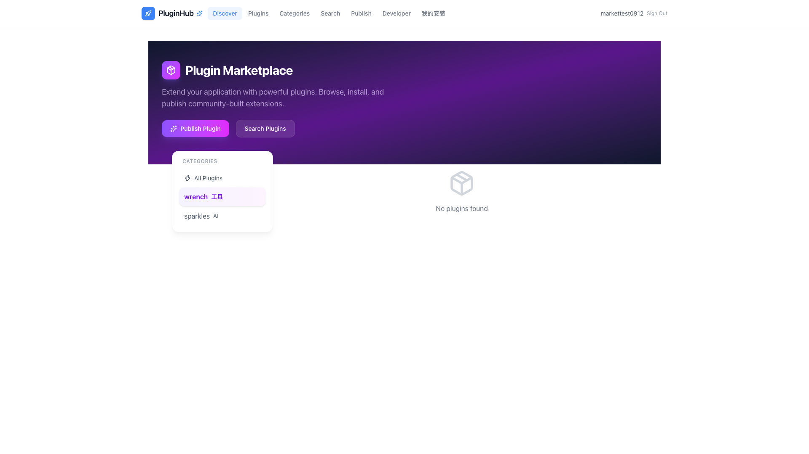

### 不存在插件 slug 直访（逆向·实勘）

**步骤**:

1. 地址栏直接打开 /plugins/not-exist-slug-xyz

**验证**: 实勘：预期 404/空态兜底而非白屏；对照 POST /api/plugins/not-exist-slug 的 404 行为，记录 UI 层实际形态

**截图**: 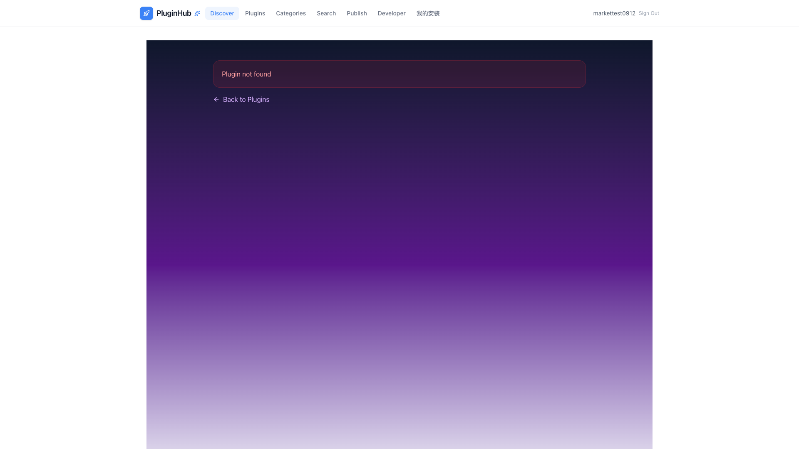

### 删除他人评论 API 越权（IDOR·身份交叉·实勘）

**步骤**:

1. 以自己 JWT DELETE /api/plugins/auth-guard/reviews/<伪造id>，再以他人资源 id 重试

**验证**: 实勘：预期 403/404 且无副作用（评论区服务端写入当前 500，可能无可操作真实 id——记录 API 鉴权层实际响应码）

**截图**: 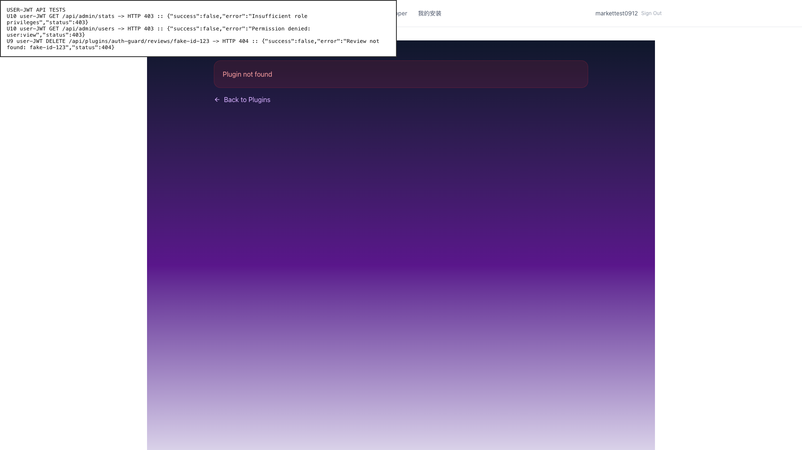

### 普通用户 token 调管理 API（身份交叉·逆向）

**步骤**:

1. 以普通用户 JWT 请求 GET /api/admin/stats、/api/admin/users
2. UI 侧确认前台导航无任何管理入口

**验证**: API 403 不泄露数据；UI 无 /admin 入口（管理端为独立登录体系，普通用户 token 不可复用为管理员身份——实勘确认）

**截图**: 

---

## 游客（未登录）

**凭据**: `无需登录`

**案例数**: 24

### 浏览插件列表

**步骤**:

1. 直接打开首页

**验证**: 插件卡片可见

**截图**: 

### 搜索（不需登录）

**步骤**:

1. 点击 Search
2. 输入关键词
3. 提交

**验证**: 搜索结果正常

**截图**: 

### 空结果态

**步骤**:

1. 搜索不存在的词 zzzqqq

**验证**: 显示 No results for zzzqqq

**截图**: 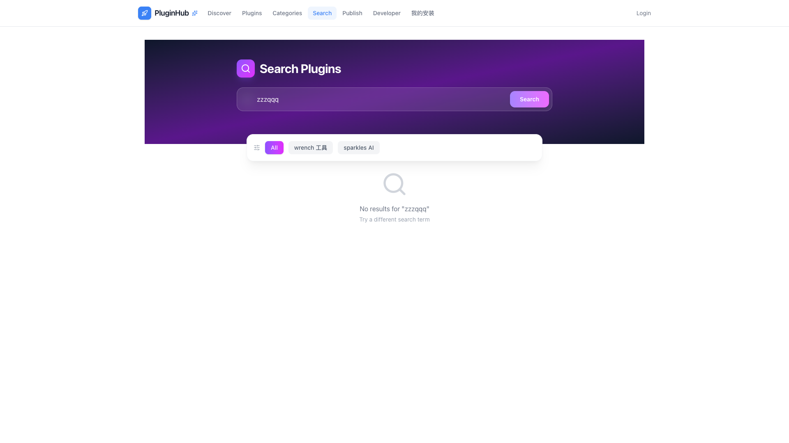

### 首页完整卡片墙（真实游客态，2026-09-12 补拍）

**步骤**:

1. Sign Out 后打开首页

**验证**: 卡片墙 + 分类侧栏 + Login 入口

**截图**: 

### 分类筛选（逆向：no-op）

**步骤**:

1. 点击分类侧栏"工具"

**验证**: ⚠ P1 BUG：列表不变（API payload 无 category 字段），仅 chip 高亮

**截图**: 

### 搜索 "ai" 结果页

**步骤**:

1. 搜索 ai

**验证**: Found 1 results → AI Helper；P3：chip 状态泄漏高亮

**截图**: 

### 详情页上半部

**步骤**:

1. 打开插件详情

**验证**: 描述/评分/作者/徽章齐全；P3：发布日期 1970/1/1

**截图**: 

### 详情页下半部（评论区 + 版本历史探测）

**步骤**:

1. 详情页滚动到底

**验证**: Reviews(0) 空态 + 评论表单；缺口：版本历史区块不存在

**截图**: 

### 游客点 Install（逆向：零反馈不鉴权）

**步骤**:

1. 未登录点 Install Plugin

**验证**: ⚠ P1 BUG：无任何反应也不跳登录（URL/按钮/计数全不变）

**截图**: 

### 登录页（游客入口）

**步骤**:

1. 点导航 Login

**验证**: /login 渲染正常（预填凭据问题另案）

**截图**: 

### 移动端首页（375px）

**步骤**:

1. 切 375x812 视口打开首页

**验证**: hero/CTA/卡片/底部 tab（Discover/Plugins/Categories/Search/My）完整

**截图**: 

### 移动端详情页

**步骤**:

1. 375px 打开详情

**验证**: hero/Install/评分/评论表单完整

**截图**: 

### 移动端搜索结果

**步骤**:

1. 375px 搜索 ai

**验证**: Found 1 results + Search tab 高亮

**截图**: 

### 硬刷新详情页（边界）

**步骤**:

1. 详情页直连 URL 冷加载

**验证**: 无白屏无 hydration 错误；注意头部身份漂移怪癖（显示 Demo User）

**截图**: 

### 真游客态工艺链（前置·自动登录怪癖）

**步骤**:

1. eval 清空 localStorage + sessionStorage + cookie 后 reload 首页

**验证**: 导航显示 Login（app 首载会自动写入 Demo User auth-token，清空后不再写入——v8 gotcha）；本用例为后续游客用例统一前置

**截图**: 

### 游客访问 /installed 引导卡（v8 确认）

**步骤**:

1. 真游客态直访 /installed

**验证**: 不跳转 /login：页内渲染引导卡 Sign in to see your installed plugins + "Your install history is tied to your account." + Sign In 紫钮；导航身份为 Login（旧断言"401 跳登录"已被该行为取代）

**截图**: 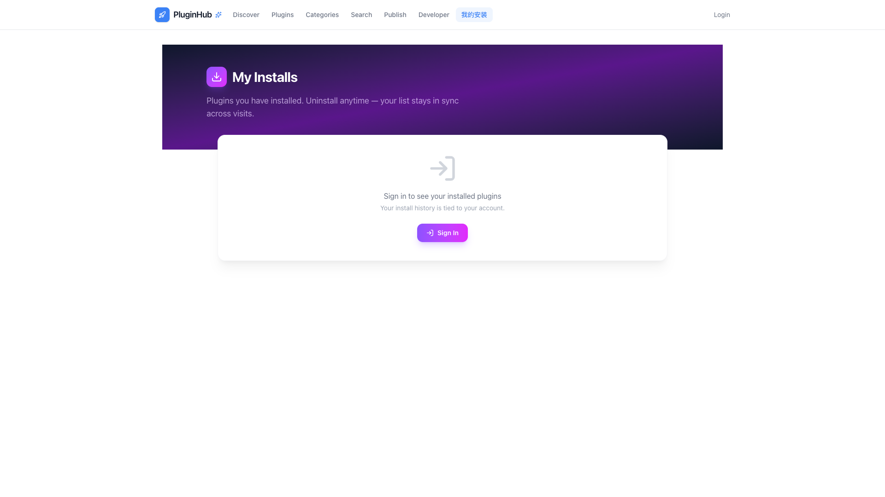

### 游客点 Install（实勘·v6 后行为）

**步骤**:

1. 真游客态在详情页点 [data-testid="install-button"]
2. 观察按钮/toast/下载量/URL 四要素

**验证**: 实勘：预期 401 反馈或登录引导（旧"零反馈不鉴权"可能随 v6 反馈修复而变化，见历史截图对照）；下载量不得增加、不得产生归属不明的安装记录

**截图**: 

### 游客评论表单可见性（身份交叉·实勘）

**步骤**:

1. 真游客态打开详情页滚动至评论表单

**验证**: 实勘：market 是否与 forum 一致隐藏表单/灰条引导，或仍渲染可提交表单——若可提交，预期 401 失败红框（对照评论失败反馈用例分支）；记录实际形态

**截图**: 

### 游客直访 /publish 与 /developer（身份交叉）

**步骤**:

1. 真游客态分别直访 /publish、/developer

**验证**: 均引导/弹回登录（/developer 已知静默弹 /login 为 P2 无提示——游客态复验同一行为；/publish 游客行为实勘）；无插件表单提交成功

**截图**: 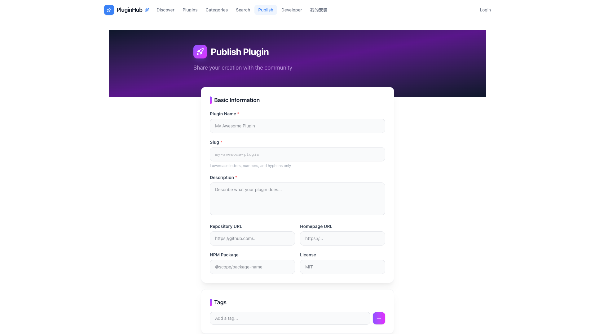

### 游客调管理 API（身份交叉·逆向）

**步骤**:

1. 无 Authorization 请求 GET /api/admin/stats

**验证**: 401，响应体无任何统计/用户数据（管理端为独立登录体系）

**截图**: 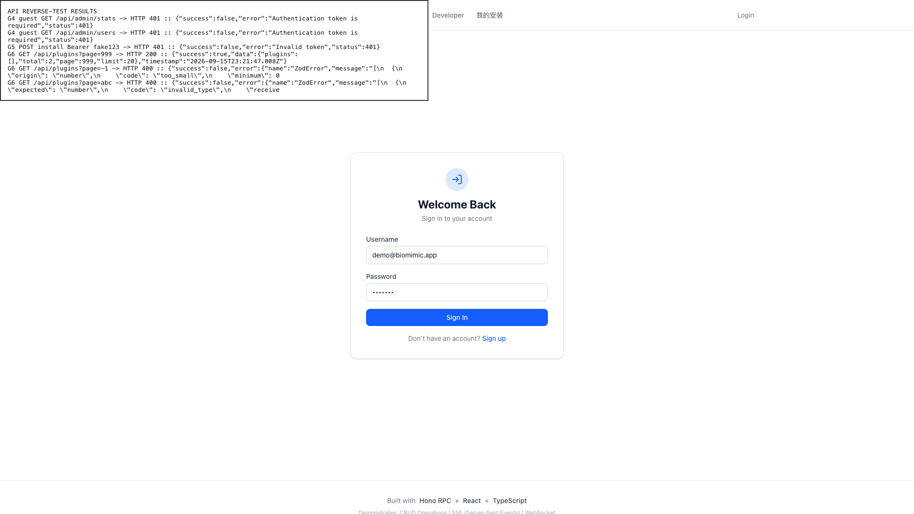

### 伪造 Bearer token 调安装 API（逆向·实勘）

**步骤**:

1. Authorization: Bearer fake123 直接 POST /api/plugins/auth-guard/install

**验证**: 实勘：预期 401/403；若 mock 放行记 P1 认证旁路并核对安装记录归属（mock 自动登录 token 为已知风险面）

**截图**: 

### 分页参数越界（逆向·实勘）

**步骤**:

1. GET /api/plugins?page=999
2. GET /api/plugins?page=-1 与 page=abc 两组对照

**验证**: 实勘：预期空数组 200 或 400 校验错，不 500 不崩；当前无分页 UI 则记录 API 层结论即可

**截图**: 

### 搜索注入串（逆向）

**步骤**:

1. 搜索框输入 ' OR 1=1 -- 提交
2. 再输入  提交

**验证**: 显示 No results for "<原文>" 转义空态（或实勘意外命中并记录），无脚本执行、服务端不 500；搜索框内容可清空恢复

**截图**: 

### 移动端底部 tab 全遍历（375px·正向）

**步骤**:

1. 375x812 视口打开首页
2. 依次点 bottom-tab-discover / bottom-tab-plugins / bottom-tab-categories / bottom-tab-search / bottom-tab-my / bottom-tab-我的安装

**验证**: 各 tab 全部可达对应路由（/plugins、/plugins/list、categories、search、/developer、/installed），激活态蓝色高亮；桌面导航在 375px 隐藏为已知

**截图**: 

---

## 附：全部已知选择器（来自知识库）

| 键                    | 值                                                                                                                                                                                           |
| --------------------- | -------------------------------------------------------------------------------------------------------------------------------------------------------------------------------------------- |
| search_category_chips | "All \| wrench工具 \| sparklesAI chips under search box; chip state LEAKS from sidebar selection (AI chip stayed highlighted after searching auth) — chip does not appear to filter results" |
