# XBrowser Marketplace — Test Playbook

> 站点：https://market.lpm1.top
> 身份数：4
> 每个身份列出：操作步骤 → 验证 → 截图 → 选择器

---

## 平台管理员

**凭据**: `superadmin / 123456（/admin 快速登录）`

**案例数**: 6

### 登录管理后台

**步骤**:

1. 打开 /admin
2. 输入 superadmin / 123456
3. 点击登录

**验证**: 进入管理后台

### 插件审核（approve/reject）

**步骤**:

1. 进入插件管理页
2. 查看待审核列表
3. 点击 approve 或 reject

**验证**: 插件状态变更

### 插件上架/下架

**步骤**:

1. 进入插件管理页
2. 操作上架/下架按钮

**验证**: 插件可见性变更

### 管理后台登录页（快速登录三按钮）

**步骤**:

1. 打开 /admin/login

**验证**: 中文后台 + 超级管理员/客服人员/普通用户快速登录按钮

**截图**: 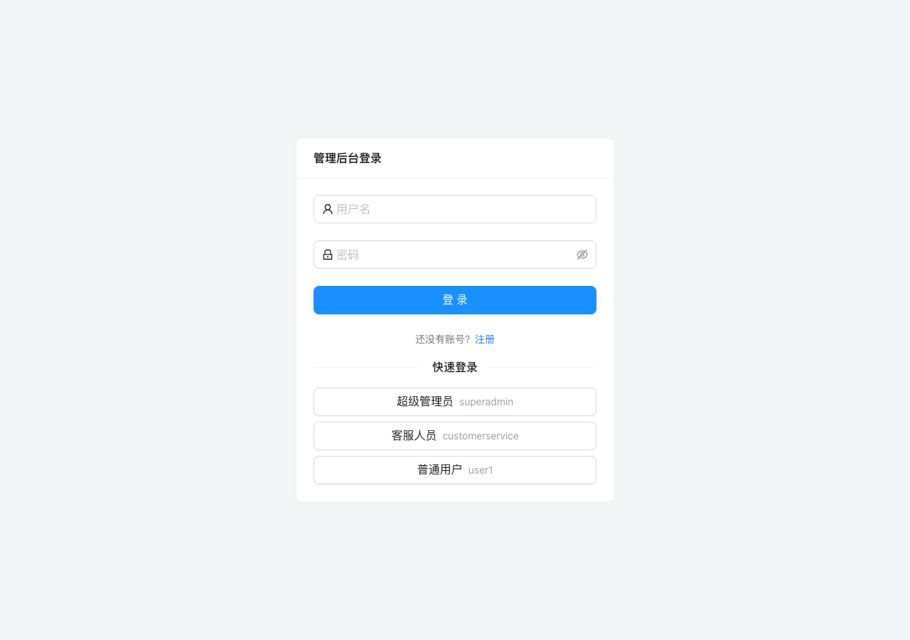

### 管理员仪表盘

**步骤**:

1. 快速登录超级管理员

**验证**: 统计卡/菜单/测试通知正常；P3：最后更新显示原始 ISO 时间戳

**截图**: 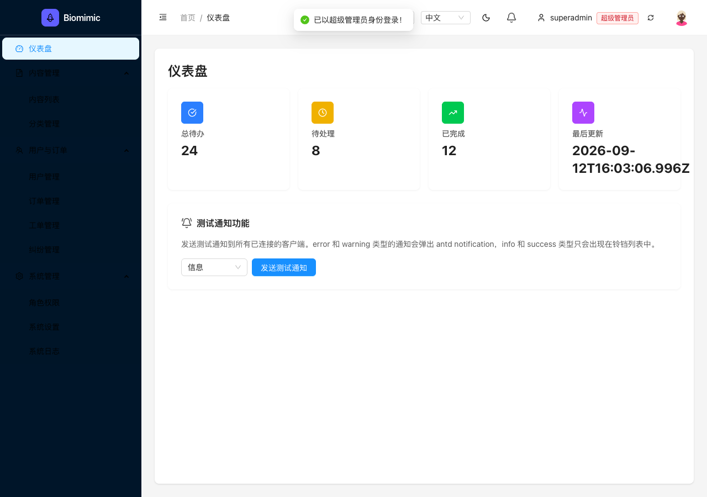

### 管理员内容列表

**步骤**:

1. 进入内容列表

**验证**: 2 条种子内容 + 编辑操作正常

**截图**: 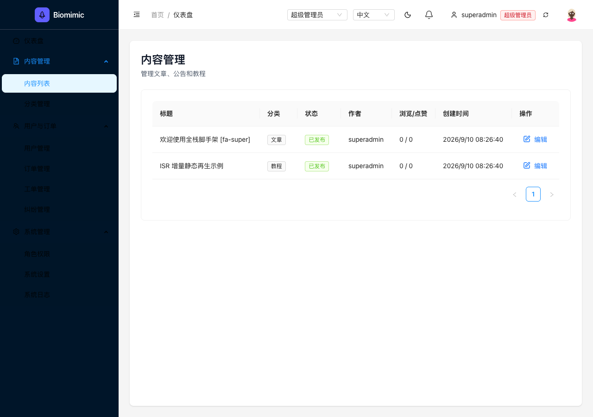

---

## 开发者

**凭据**: `注册后登录（注意：登录页预填 developer@pluginhub.io 实际无效）`

**案例数**: 7

### 注册开发者账号

**步骤**:

1. 打开注册页
2. 填写用户名/邮箱/密码
3. 提交

**验证**: 注册成功跳转登录

### 提交插件

**步骤**:

1. 登录后点击 Publish
2. 填写插件信息（名称/描述/版本/仓库）
3. 提交

**验证**: 插件进入 pending 审核状态

### 查看审核状态

**步骤**:

1. 进入 Developer 页面
2. 查看自己的插件列表

**验证**: 显示各插件的 pending/approved/rejected 状态

### 开发者控制台角色守卫（逆向）

**步骤**:

1. 普通用户登录后访问 /developer

**验证**: ⚠ P2：静默弹回 /login，无任何权限提示

**截图**: 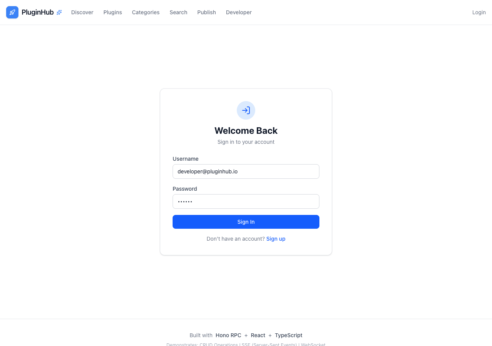

### 直连 /developer URL 守卫确认

**步骤**:

1. 地址栏直接输入 /developer

**验证**: 同样弹回 /login（角色守卫生效但无提示）

**截图**: 

### /publish 发布表单（普通用户可访问）

**步骤**:

1. 登录态访问 /publish

**验证**: 完整表单（名称/Slug/描述/仓库/NPM/License）可访问

**截图**: 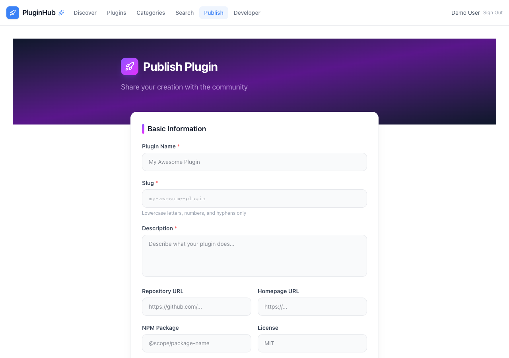

### demo 预填凭据登录（逆向）

**步骤**:

1. /login 直接用预填 developer@pluginhub.io 登录

**验证**: ⚠ P2：预填凭据报 Invalid credentials（demo 凭据失效）

**截图**: 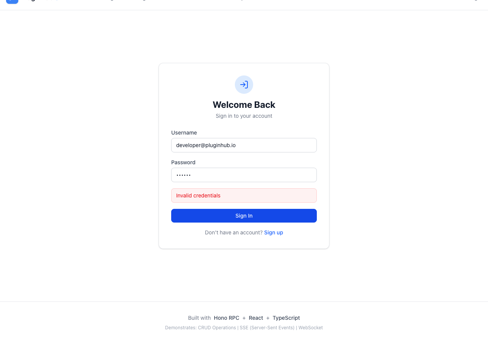

---

## 用户/浏览器用户

**凭据**: `注册后登录`

**案例数**: 10

### 浏览插件市场

**步骤**:

1. 打开首页

**验证**: 插件卡片渲染（Auth Guard / AI Helper）

**截图**: 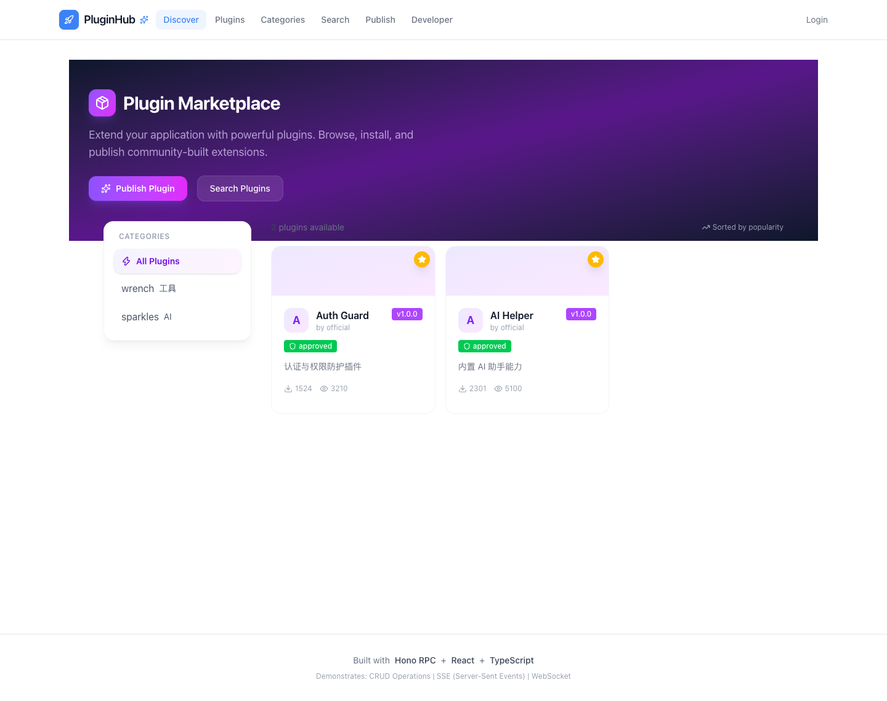

### 搜索插件

**步骤**:

1. 点击导航 Search
2. 输入 auth
3. 提交搜索

**验证**: Found 1 results，仅 Auth Guard

**截图**: 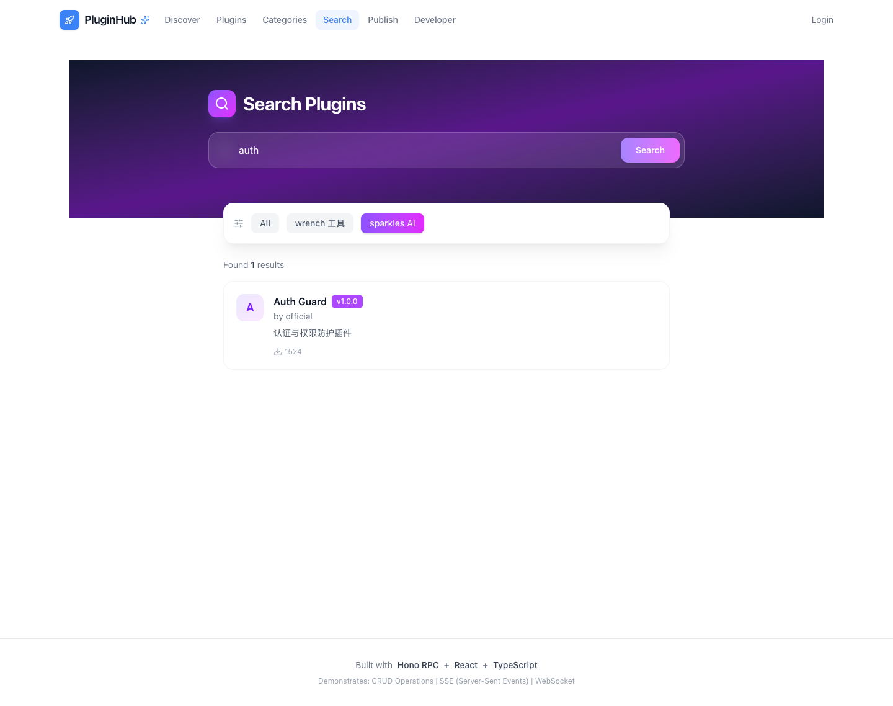

### 查看插件详情

**步骤**:

1. 点击 Auth Guard 卡片

**验证**: 详情页显示 approved/Featured/v1.0.0

**截图**: 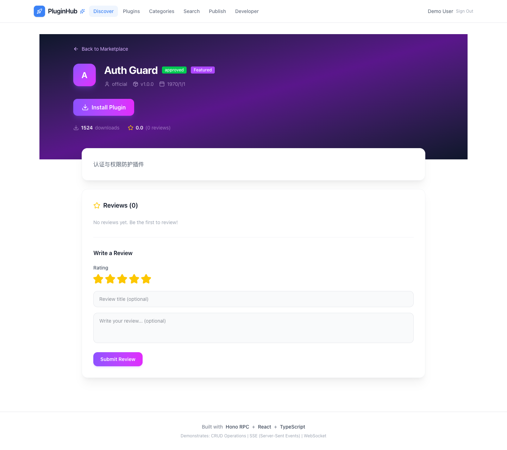

### 安装插件

**步骤**:

1. 在详情页点击 Install Plugin

**验证**: 后端 POST 200（UI 反馈为已知缺陷）

**截图**: 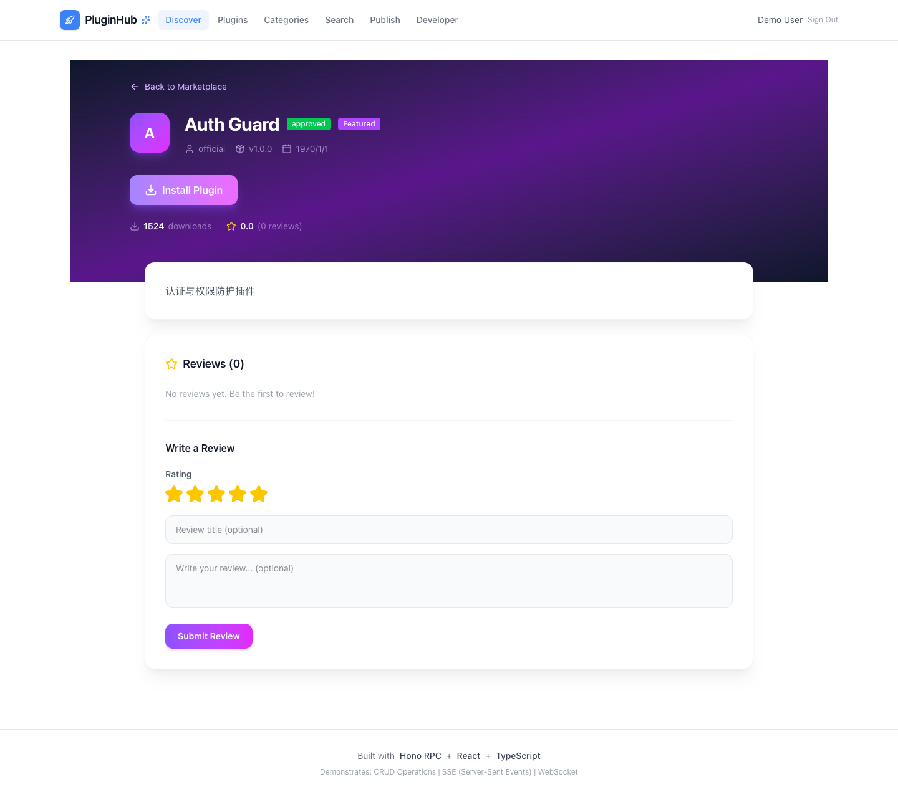

### 写评论（逆向：静默失败）

**步骤**:

1. 在详情页评论表单填写 5 星+标题+正文
2. 点击提交

**验证**: ⚠ POST 404 Plugin not found，UI 清空表单假装成功（已知缺陷）

**截图**: 

### 注册并登录（2026-09-12 补拍）

**步骤**:

1. 注册 markettest0912@t.com
2. 登录

**验证**: 右上角显示 markettest0912（⚠ 落地 /todos 404 为已知 P2）

**截图**: 

### 登录后落地页（逆向：404）

**步骤**:

1. 登录成功观察跳转

**验证**: ⚠ P2 BUG：跳 /todos 渲染 404（冷会话稳定复现）

**截图**: 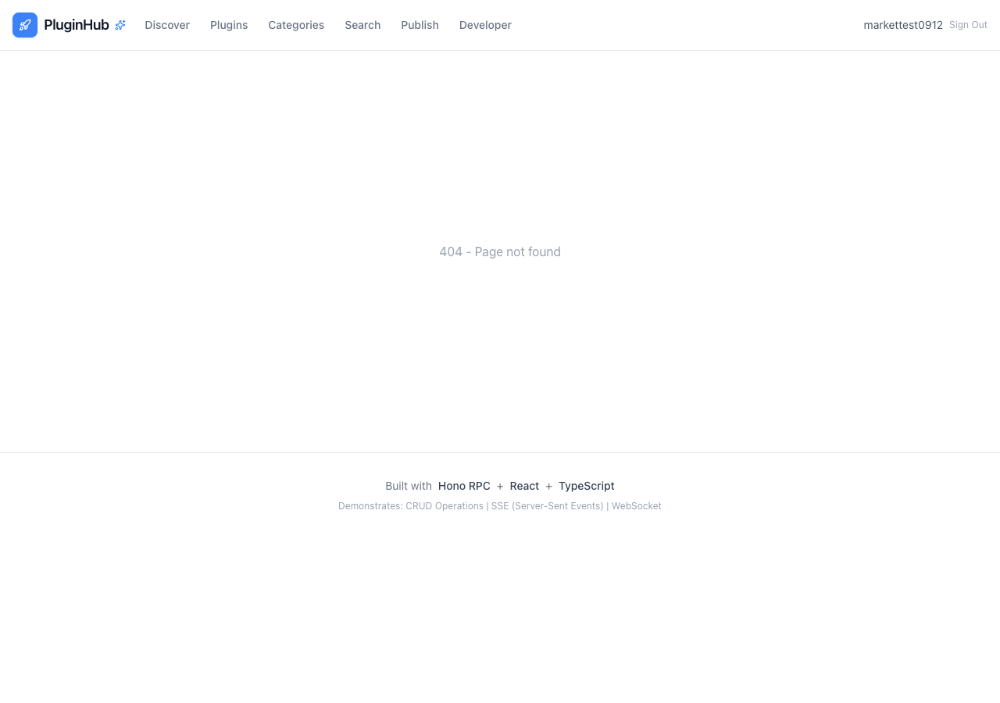

### 登录态点 Install（逆向：零反馈）

**步骤**:

1. 登录态在详情页点 Install Plugin

**验证**: ⚠ P1 BUG：按钮/计数/URL 全无变化，登录态同样复现

**截图**: 

### 评论提交后刷新验证（逆向：未入库）

**步骤**:

1. 提交评论后 F5 刷新

**验证**: ⚠ P1 BUG：刷新后仍 No reviews yet，评论未持久化

**截图**: 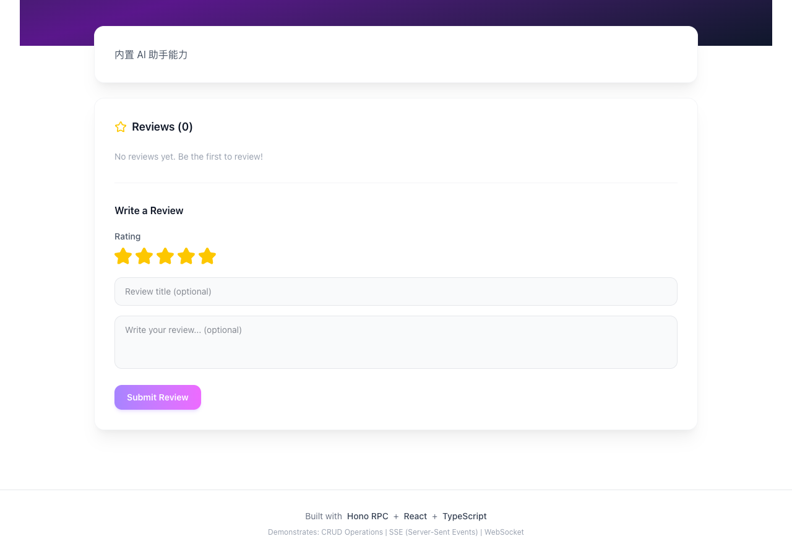

### 个人中心（逆向：硬编码 + 入口缺失）

**步骤**:

1. 访问 /profile
2. 探测 /account /me /installed /my-plugins

**验证**: ⚠ P2：profile 硬编码 Jane Doe；全站无"我的安装"页

**截图**: 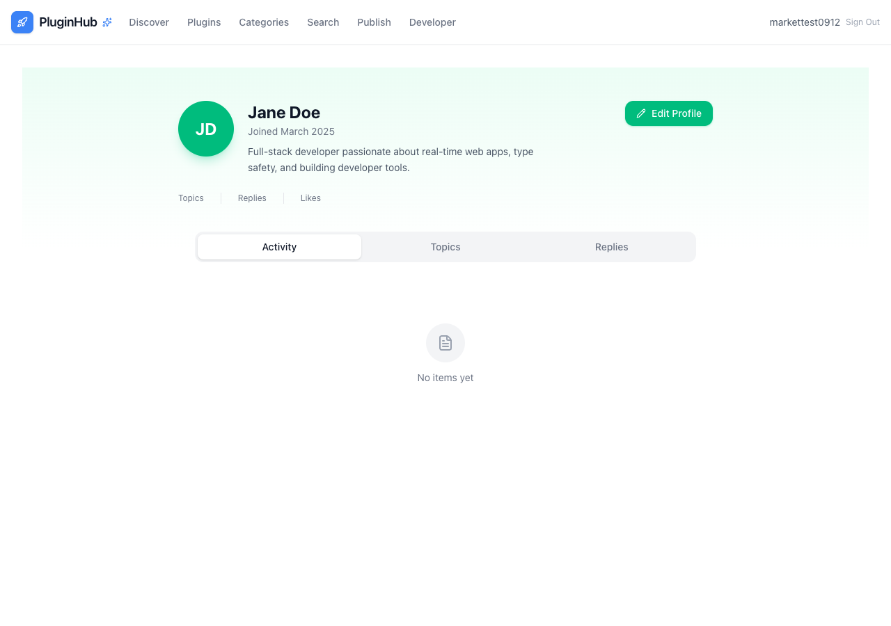

---

## 游客（未登录）

**凭据**: `无需登录`

**案例数**: 14

### 浏览插件列表

**步骤**:

1. 直接打开首页

**验证**: 插件卡片可见

**截图**: 

### 搜索（不需登录）

**步骤**:

1. 点击 Search
2. 输入关键词
3. 提交

**验证**: 搜索结果正常

**截图**: 

### 空结果态

**步骤**:

1. 搜索不存在的词 zzzqqq

**验证**: 显示 No results for zzzqqq

### 首页完整卡片墙（真实游客态，2026-09-12 补拍）

**步骤**:

1. Sign Out 后打开首页

**验证**: 卡片墙 + 分类侧栏 + Login 入口

**截图**: 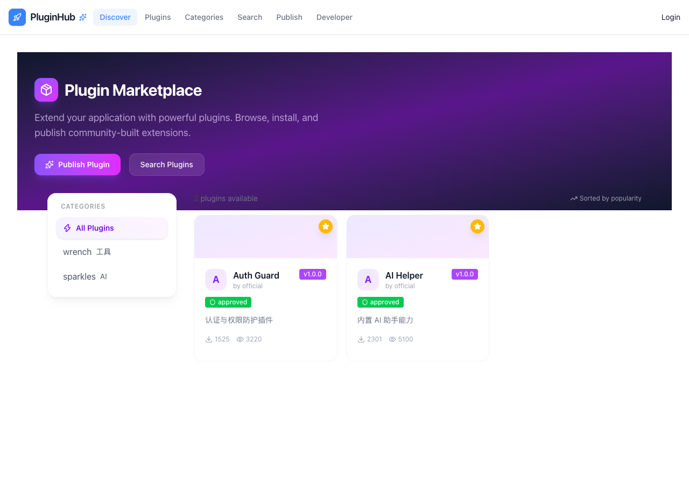

### 分类筛选（逆向：no-op）

**步骤**:

1. 点击分类侧栏"工具"

**验证**: ⚠ P1 BUG：列表不变（API payload 无 category 字段），仅 chip 高亮

**截图**: 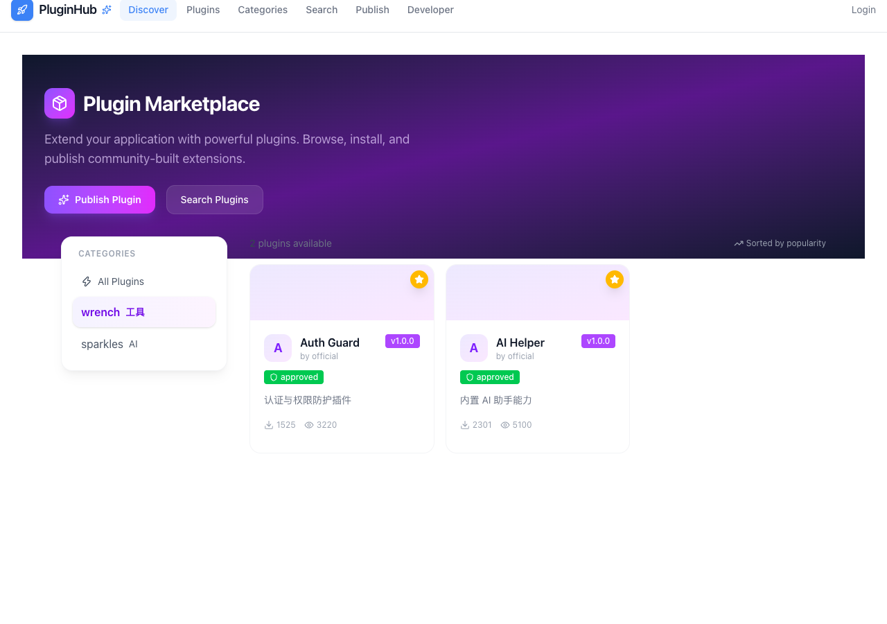

### 搜索 "ai" 结果页

**步骤**:

1. 搜索 ai

**验证**: Found 1 results → AI Helper；P3：chip 状态泄漏高亮

**截图**: 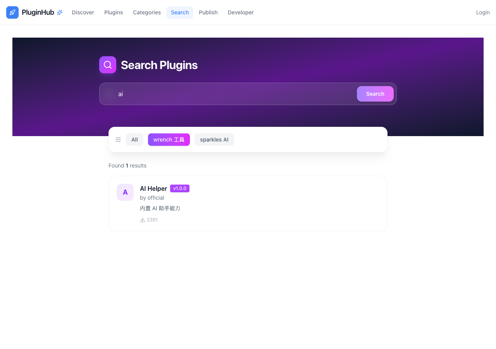

### 详情页上半部

**步骤**:

1. 打开插件详情

**验证**: 描述/评分/作者/徽章齐全；P3：发布日期 1970/1/1

**截图**: 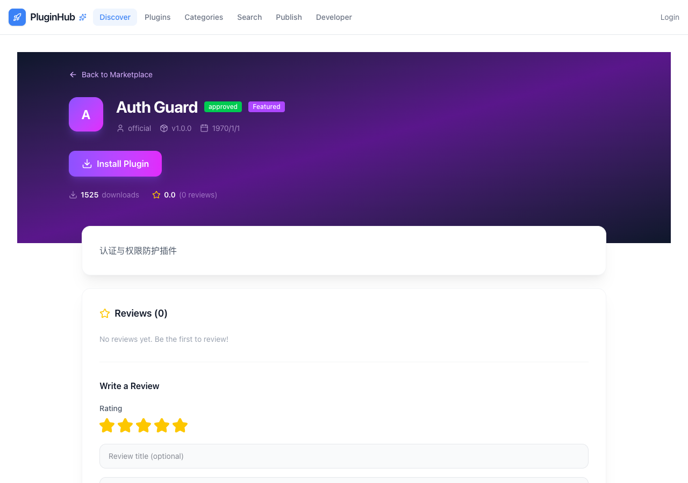

### 详情页下半部（评论区 + 版本历史探测）

**步骤**:

1. 详情页滚动到底

**验证**: Reviews(0) 空态 + 评论表单；缺口：版本历史区块不存在

**截图**: 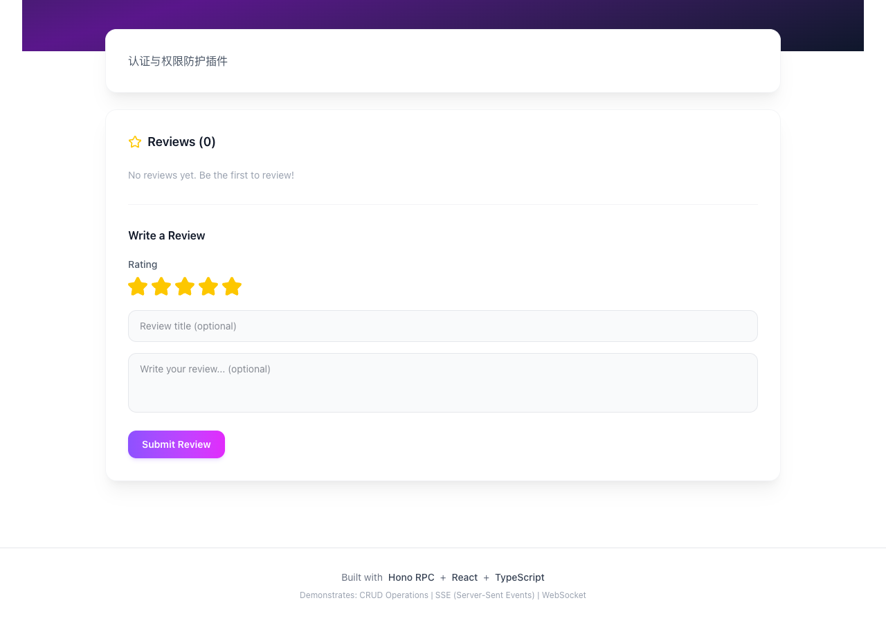

### 游客点 Install（逆向：零反馈不鉴权）

**步骤**:

1. 未登录点 Install Plugin

**验证**: ⚠ P1 BUG：无任何反应也不跳登录（URL/按钮/计数全不变）

**截图**: 

### 登录页（游客入口）

**步骤**:

1. 点导航 Login

**验证**: /login 渲染正常（预填凭据问题另案）

**截图**: 

### 移动端首页（375px）

**步骤**:

1. 切 375x812 视口打开首页

**验证**: hero/CTA/卡片/底部 tab（Discover/Plugins/Categories/Search/My）完整

**截图**: 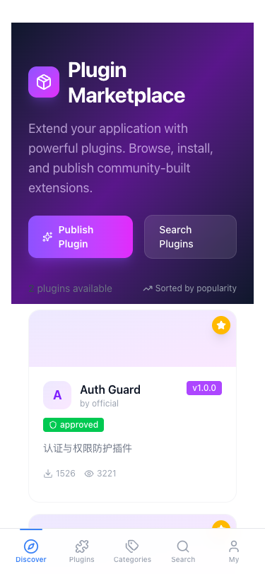

### 移动端详情页

**步骤**:

1. 375px 打开详情

**验证**: hero/Install/评分/评论表单完整

**截图**: 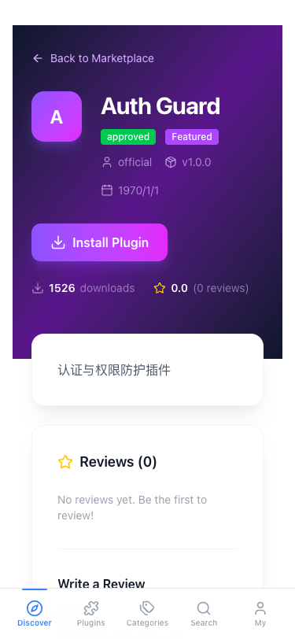

### 移动端搜索结果

**步骤**:

1. 375px 搜索 ai

**验证**: Found 1 results + Search tab 高亮

**截图**: 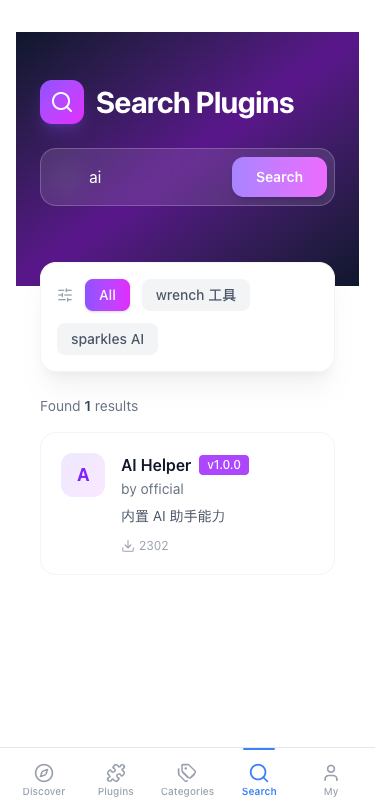

### 硬刷新详情页（边界）

**步骤**:

1. 详情页直连 URL 冷加载

**验证**: 无白屏无 hydration 错误；注意头部身份漂移怪癖（显示 Demo User）

**截图**: 

---

## 附：全部已知选择器（来自知识库）

| 键                    | 值                                                                                                                                                                                           |
| --------------------- | -------------------------------------------------------------------------------------------------------------------------------------------------------------------------------------------- |
| search_category_chips | "All \| wrench工具 \| sparklesAI chips under search box; chip state LEAKS from sidebar selection (AI chip stayed highlighted after searching auth) — chip does not appear to filter results" |
